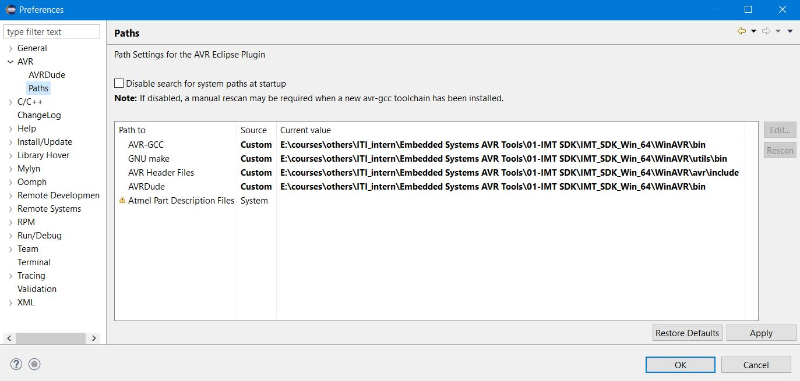
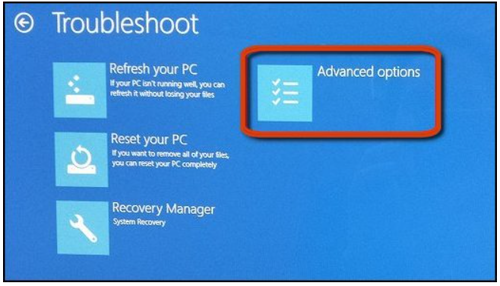
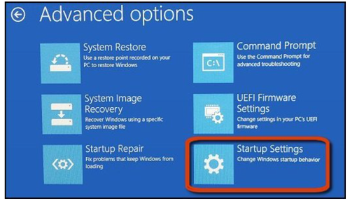
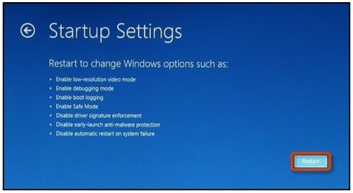
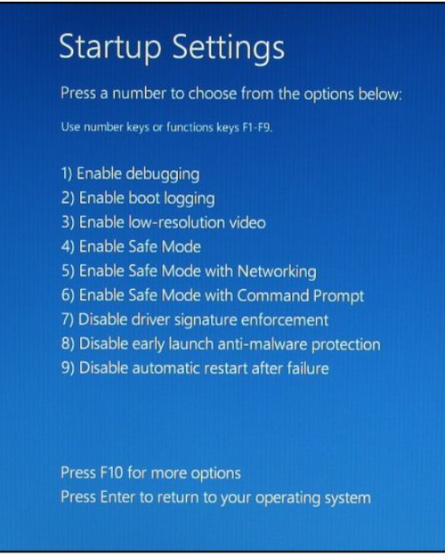
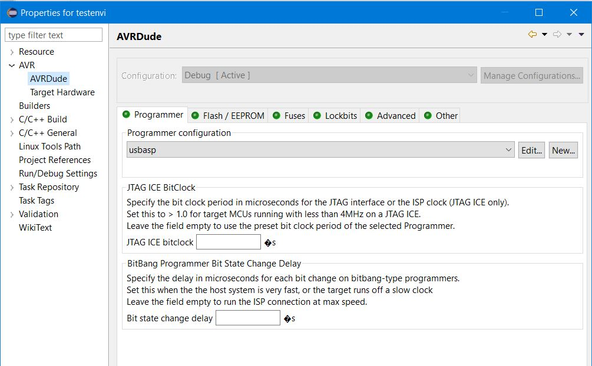

### C Environment Setup

- Windows
- Text Editor: Notepad++
- gcc for windows: MinGW

### AVR Environment Setup

==Eclipse for AVR on Windows 10==

##### IMT_SDK tools for avr, arm

- Don't choose workspace folder in C: Partition

###### Toolchain(WinAVR) Paths

- go to window -> preferences -> AVR -> paths

  - Set `AVR-GCC` ,`GNU make`, `AVR Header Files`, `AVRDude`.
  - `note`: if u change the workspace repeat this step again
  

    
  

##### usbasp programmer setup

`before installing driver`, we shall disable the "driver signature check" feature for windows 8 and 10 only to allow us to install driver correctly

###### one way to disable signature check [click](https://sps-support.honeywell.com/s/article/How-to-Disable-Driver-Signature-Enforcement-in-Windows-10)

1. `Hold down` the **shift key** while you click the "**Restart**" option in windows start menu
2. select the "Troubleshoot" title on the choose an option screen appears
   
3. select advanced options
   

4. click startup settings
   
5. click the "restart" button to restart your PC into the startup settings screen
   
6. Type "7" or F7 at the startup settings screen to activate the "Disable driver signaturte enforcement" option
   

- then check -> device manager -> other ports -> usbasp
- update the usbasp from usbasp driver manually (libusb_1.2.4.0)

###### Project Properties

- click right on project in eclipse IDE
- choose properties -> AVR -> AVRDude
  - then add usbasp and rename it usbasp or anything
    
- choose AVR -> Target Hardware -> Load from MCU

  - `MCU Type`: Atmega32 , `Freq`: 8000000

- From C/C++ Build -> setting

  - [x] generate hex file for flash memory
  - [x] print size

    

##### turn on LED

  
  

### connecting new AVR chip first time

should define its clock firstly by fuses

- project Properities
  - AVRDUDE -> Fuses
    - Direct hex value -> `FF D9`
  - after upload -> select `do not set fuze bytes` And Restore Default
    

##### clock resources

- something takes volt and gives square wave and viceversa
  [clock mcu app note](https://www.analog.com/en/resources/design-notes/microcontroller-clock-selection-options.html)
  [crystal types](https://www.siward.com/en/about/industry/Different_Types_of_Crystal_Oscillators__A_Comprehensive_Guide)
  [The Role of Oscillators in Microcontrollers](https://resources.pcb.cadence.com/blog/2022-the-role-of-oscillators-in-microcontrollers)

#### Kit

ZIF socket (Zero insertion force)

#### AVR Programming or Burning Code

There are three ways to load a program on AVR.
Parallel Programming
In-Circuit Serial Programmer
Boat Loader
Parallel Programming
In this way a device burner loads the program into the microcontroller separate from the system.
This is useful on a manufacturing floor where a gang programmer is used to program many chips at one time.
Most mainstream device burners support the AVR families: EETools is a popular one.
The device programming method is straightforward: The chip is programmed before it is inserted into the circuit.

##### usbasp socket and programmer

- one of useful usb protocol features
  - providing power to other node

###### USBasp - USB programmer for Atmel AVR controllers

USBasp is a USB in-circuit programmer for Atmel AVR controllers. It simply consists of an ATMega88 or an ATMega8 and a couple of passive components. The programmer uses a firmware-only USB driver, no special USB controller is needed.
Features
Works under multiple platforms. Linux, Mac OS X and Windows are tested.
No special controllers or smd components are needed.
Programming speed is up to 5kBytes/sec.
SCK option to support targets with low clock speed (< 1,5MHz).

[usbasp](https://www.fischl.de/usbasp/)
