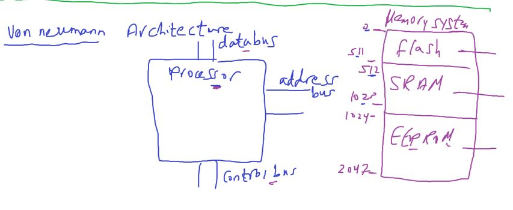

## Embedded Systems Concepts

.
.
.
.

---

- foundor of digital design science

#### Vonneumann Architecture

- processor see all memories(SRAM, FLASH, EEPROM) as one big memory from addresses perspective
  

#### Harvard Architecture

- harvard architecture added pipelining feature (fetch - decode - execute circuits operates in the same time in accessing different memory (program memory , Data Memory))
- ==Bus Set (data - address - control buses)==

#### The important disadvantage of harvard

That the memory starts with address 0 in reallity for sure, and also virtually

so for example we have address 0x1 in which memory should we access?

- in vonnuemann we have memory addresses range
- in harvard we enfored to add a new instruction set for each memory
- READ , WRITE for (PROGRAM MEM)
- LOAD, STORE for (DATA MEM)
  but this is for assembly what about C?
  The compiler by default consider reading and writing for RAM.
  if you want to access another memory use assembly

#### After adding I/O memory(Peripherals Mem)

###### 2 ways to add it

1. **memory mapped** : to add it after data memory with the same busset
2. **port mapped** : to add it seperately with a third bus set.
   - here we will add another assembly instruction set (IN/OUT)

#### what about AVR(Atmega32)

- `it a harvard archhitecture`
- `and memory mapped and port mapped`
  

- so if u want to write/read in I/O memory for example DDRA, we have 2 options
  - In assembly has address 0x3A (memory mapped) -> high speed
  - In C has address 0x1(port mapped) -> simple sw (in C)
    
- AVR Block Diagram
  

##### Examples of MCU peripherals (I/O Memory)

##### Microcontrollers Companies

##### The AVR

- The basic architecture of AVR was designed by `two students` of `Norwegian Institute of Technology (NTH)`, `Alf-Egil Bogen` and `Vegard Wollan`,
- and then was bought and developed by Atmel in 1996.
- The AVR stands for Advanced Virtual RISC, `or` Alf and Vegard RISC.
- The AVR is an 8-bit RISC single-chip microcontroller with Harvard architecture.

##### The AVR Family

##### The AVR can be classified into 4 groups: `32-Bit`, `XMega`, `Mega`, and `Tiny` AVR MCU.

##### 32-bit AVR (AT32xxxxxxx)

These are the world's most efficient 32-bit MCU.
Program memory: 16K to 512K bytes
Package: 48 to 144 pins
Operating Frequency: Up to 66 MHz
Performance: 1.5 MIPS/MHz
CPU throughput approaching one million instructions per second (MIPS) per megahertz, allowing the system designer to optimize power consumption versus processing speed.

##### XMega AVR (ATxmegaxxxx)

The Atmel AVR XMEGA A series is the most performance oriented series within its family
Program memory: 16K to 384K bytes
Package: 32 to 100 pins
Operating Frequency: Up to 32 MHz
Performance: 1.0 MIPS/MHz

##### Mega AVR (ATmegaxxxx)

These are powerful microcontrollers with more than 120 instructions and lots of different peripheral capabilities, which can be used in different designs. Some of their characteristics are as follows:
Program memory: 4K to 256K bytes
Package: 28 to 100 pins
Operating Frequency: Up to 20 MHz
Performance: 1.0 MIPS/MHz

##### Tiny AVR (ATtinyxxxx)

This group have less instructions and smaller packages in comparison to mega family. You can design systems with low costs and power consumptions using the Tiny AVRs. Some of their characteristics are as follows:
Program memory: 0.5K to 8K bytes
Package: 6 to 32 pins
Operating Frequency: Up to 20 MHz
Performance: 1.0 MIPS/MHz

#### Pinout

In ATmega32, of the 40 pins, a total of 32 are set aside for the four Ports A, B, C, and D, with their alternate functions. The rest of the pins are designated as VCC, AVCC, AREF, GND, XTAL1, XTAL2, and RESET.

- MCU clock
  - square wave with duty cycle 50%
  - clock 8 MHz
  - Note: all RISC Processors execute most instructions(assembly) set in 1 cycle
  - if cycle 1 sec so Atmega can execute 8 million instruction in 1 sec.
- ATmega32 microcontrollers can have speeds of 0 Hz to 16 MHz.

The quartz crystal oscillator connected to the XTAL1 and XTAL2 pins

- Reset Pin
  RESET(9): It is an input and is active-LOW (normally HIGH).
  When a LOW pulse is applied to this pin, the microcontroller will reset and terminate all activities.
  After applying reset, contents of all registers and SRAM locations will be cleared, all ports will be input because contents of all DDR registers are cleared. The CPU will start executing the program from run location 0x00000 after a brief delay when the RESET pin is forced low and then released.
  Figure 3-8 show three ways of connecting the RESET pin. Figure 8-3b uses a momentary switch for reset circuitry.

##### clock resources

- something takes volt and gives square wave and viceversa
  [clock mcu app note](https://www.analog.com/en/resources/design-notes/microcontroller-clock-selection-options.html)
  [crystal types](https://www.siward.com/en/about/industry/Different_Types_of_Crystal_Oscillators__A_Comprehensive_Guide)
  [The Role of Oscillators in Microcontrollers](https://resources.pcb.cadence.com/blog/2022-the-role-of-oscillators-in-microcontrollers)

#### Kit

ZIF socket (Zero insertion force)

#### AVR Programming or Burning Code

There are three ways to load a program on AVR.
Parallel Programming
In-Circuit Serial Programmer
Boat Loader
Parallel Programming
In this way a device burner loads the program into the microcontroller separate from the system.
This is useful on a manufacturing floor where a gang programmer is used to program many chips at one time.
Most mainstream device burners support the AVR families: EETools is a popular one.
The device programming method is straightforward: The chip is programmed before it is inserted into the circuit.

##### usbasp socket and programmer

- one of useful usb protocol features
  - providing power to other node

###### USBasp - USB programmer for Atmel AVR controllers

USBasp is a USB in-circuit programmer for Atmel AVR controllers. It simply consists of an ATMega88 or an ATMega8 and a couple of passive components. The programmer uses a firmware-only USB driver, no special USB controller is needed.
Features
Works under multiple platforms. Linux, Mac OS X and Windows are tested.
No special controllers or smd components are needed.
Programming speed is up to 5kBytes/sec.
SCK option to support targets with low clock speed (< 1,5MHz).

[usbasp](https://www.fischl.de/usbasp/)
