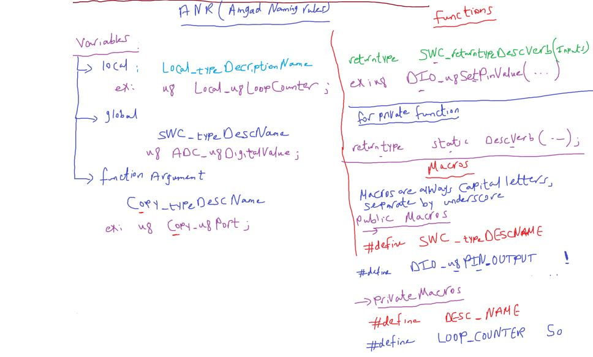

## Parrell(GPIO) Port for AVR

32 pin can be DIO (4 Ports)

- output (5V , 0V)
- input (5V , 0V)
  Each port has 3 I/O registers associated with it

1. DDRx (Data Direction),
2. PORTx(output value),
3. PINx(input value).

##### inside GPIO circuit


PINx Read only Register

DDRx Register decide pin will be in or out
using tristate buffer

- digital buffer -> makes a isolation between input and output circuits
- tristate buffer -> buffer control input to pass or not.

- I/O Synchronization feature
  - when you write on PORTA register, this data goes to pin and PIN register and you can read it

###### Led Interfacing

##### Input Output Voltage Level

##### waiting (wait to see the action)

1. busy waiting
2. Timer waiting
3. OS delay

- Busy waiting
  loop 1 Million Empty Instruction
  So it's a high power consuming

```c
for(int i = 0; i < 100000; i++)
{
  // to tell compiler to ignore this loop
  asm("NOP);
}
```

what is time consuming for this for loop?
3 ways to know

- by assembly instructions: around 300 000 assembly so 300k cycle
- using osciliscope
- using Timer

use a toolchain delay ready function

```c
#include<utils/delay.h>
_delay_ms(100);
_delay_us(100);
```

- Timer is another prepherial it will responsible for counting and give you notification(by callback) that time finished

#### ==Why while(1) is important and mandatory==

- is a Infinity Loop == Super Loop

##### Do i need while(1) even if i don't need program to repeat?

- yes, to prevent the program counter(PC) to load garbage address
- by preventing the CPU to execute out of main function
  

```c
void main()
{
  DDRA = 0xff;
  PORTA = 0xff;
  while(1); // PC register stuck here
  // some toolchain put this while(1) in startup code
  // called exit routine
}
```

but when we in computer we have OS so it know when main return

```c
int main() {
  //
  return 0;
}
```

#### Seven Segment

LED as a component

1. low cost
2. low power
3. small size

LED Matrix for advertising

- Segment Displays

1. 7 Segment
2. 14 Segment
3. 16 Segment

7 segment types

- common anode
- common cathode

##### switches interfaces

switches types

1. Mechanical
2. Electronic Switches
   1. transistors
   2. optocouples
   3. relays
   4. Darlington pairs

#### Mechanical Switches

divide to many type categories

1. momentary switches
   like car window, door bell, keyboard
2. maintained switches
   self locking
   like room light, power supply switch

- pole means input
- throw means output

##### According to \# of contacts

1. SPST (`S`ingle `P`ole `S`ingle `T`hrow)
2. SPDT
3. DPST
4. DPDT
5. multipole multithrow

##### According to \# shape, trigger, action and application

- **Tactile Push Button**
  - it a momentary switch
  - may be 2 or 4 pins
- **Self Locking Push Button**
- **paddle switch**
  - can be found as maintained switch like that in air conditioning switches
  - can be found as momentray switch as that in grinders
- **Rocker Switch**
  - can be found in SPST package or SPDT package
  - has led inside it
  - used to switch power circuits
- **Toggle Switch**
  - can be found as SPST, SPDT, DPDT
  - commonly used in light control switches, joysticks
- **DIP Switch**
  - DIP (Dual Inline Package) (same size of ICs)
- **Limit switch**
  - previous switches are used to be actuated by human interaction, however this type is designed to be actuated by a moving object or a machine part
  - can be found in SPST, SPDT packages
  - commonly used in CNC machines, car doors, fridge doors
- **Rotary Switch**
  - can be considered a multi-contact switch
  - used when controlling circuit required to have many positions
  - like a ceiling fan, a multi channal radio
- **Reed Switch** (very important but not seen)
  - electromagnetic switch in which the circuit current flow is controlled by a magnetic action
  - can be found as SPST or SPDT, its poles and throws are made of ferromagnetics materials, which means they can be affected by magnetic fields, put together in a sealed envelope.
  - commonly used in laptops,car safety belt
- **Key switch**

##### switch connection to MCU

- high
- low
- floating
- pull up , pull down
- internal pull up resistor

- Ass 1
  
- Ass 2
  

##### If DDRx = 0x00; input, and PORTx = 0xff; why LED turned on?

because this activate the pullup resistor that turns on the connected led


##### problems of temporary switches

because these switches has internal spring

- switch bouncing
  Debouncing (solution of switch bouncing)

bouncing time = ~ (200 to 250 ms)

- simplest and worset solution

```c
_delay_ms(250); // waste much time
```

- [ ] search for better debouncing techiques


###### SevenSegment Multiplexing

let's say we have 2 or more 7-seg in our projects
so we need 18 pin for only 2 7-segs

##### ==POV(Persistence of vision) قصور الرؤية==

Most humans sees less than 25 fps(frame per second)
that means we can't note changes with rate less than 40 ms(0.025 sec)

- This concept widely used in

  - Media Industry
  - Advertising (while watching film in cinima put speed frames about burgur for example)

  - Home Lighting
    is a AC Signal with Freq 50Hz(20 ms)

```c
// Real POV Test on led
while(1){
  // LED on
  _delay_ms(10); // less than 25 fps or 40ms
  // LED off
  _delay_ms(10);
  // you may see this with mobile camera
}
```

==**Best POV:** 50 to 70 hz==

- (< 50 hz): flickering
- (> 70 hz): ghosting (شبح)

for example for we choose 50hz and we have 2 SSD

for example for we choose 50hz and we have 4 SSD


but we notice with icreasing the number of 7 segments
the light intensity with decrease (as we turn for 5ms and turn off for 15ms)

##### Assignment 2 : 2 Multiplexed seven segments

1. display your birth day last 2 number
2. counting up and dowm
3. display number 50, and use sw1 to increment and sw2 to decrement
   **if we pressed for big press seven segment in/decrement faster**.

---

##### Resuable / Portable Software

```c
#include <avr/io.h>

void main(void)
{
    DDRA = 0xff;
    while(1)
    {
    	for(int i = 0; i < 10; i++) {
    	     PORTA = sevenSegNums[i];
    	     _delay_ms(1000);
    	}
    }
}
```

- This BareMetal sw is a `spachettic code`.

useful book for this topic
[resuable firmware development pdf](#)

---

##### Software Architecture

- class Model
- client / server
- layered architecture (common in embedded system)

Layers of our software

- MCAL (Microcontroller Abstraction Layer)
- HAL (Hardware Abstraction Layer)
- APP (Application Layer)

These are Virtual Layer


Each Layered has (Software Component)SWCs or called drivers

Embedded Software Engineers Positions in componies


##### Rules of Layered Architecture

1. Call direction From top to bottom
2. Abstraction concepts

service layer is may be optional


- **SWC_iterface.h** is (`exported to user`)
- the way of communication between developers

---

DIO driver

##### Register Summary in Datasheet

!remember 2 Addreses for each register one for Port map and memory map connections in AVR

we used memory map address to access it with C language - > $portMap addr(memMap Addr)

each I/O memory is 8 bit.


```c
#define DDRA *DDRA

u*DDRA =0x3f;

DDRA = value;
```

we will not create to each register a pointer in memory it's a waste of memory

> **كل # ببلاش**

```c
#define  DDRA *( (u8*) 0x3f )
```

##### volatile

keyword is directed to optimizator (`SAYS PLS DON'T Optimize here`)


But the issue the optimizater may cause problems.

- for example (caching): optimizator know that you read the PINA Register much more
  then takes it in GPRs inside processor in boost the accessing time
  bcause it doesn't change as a software it just a memory change it's not a variable
  

```c
#define DDRA *( (volatile u8*) 0x3f )
```

- [Doxygon](https://www.doxygen.nl/#google_vignette): Tool that generates a doc for your code from comments template

#### Preprocessor File Guard

##### Rules of Preprocessor File Guard

1. Don't declare any variable in header file
2. implement file guard for your header files
3. optional don't include header files in your header files

```c
#ifndef FILE_NAME_H_
#define FILE_NAME_H_

// code

#endif /*FILE_NAME_H_*/
```

#### repo naming rules

DescriptionVerb like set


#### Assignment

##### SevenSegment Driver: SSD_SWC

```c
u8 SSD_u8SetNumber(u8 Copy_u8Number, SSD_t * Copy_u16Ptr);
u8 SSD_u8Enable_SDD(SSD_t * Copy_u16Ptr);
u8 SSD_u8Disable_SDD(SSD_t * Copy_u16Ptr);
```

- **Note**: if u have many function arguments collect them in struct to avoid stack-overflow due to small stack size

````

##### SW_SWC

- Temporary or maintained
  - SelfLocking -> don't handle debouncing now (by delay)

```c
u8 SW_u8GetState(port, pin, selfLocking, pullType);
// return : pressed or not
u8 SW_u8GetState(
    u8 Copy_u8Port, u8 Copy_u8Pin, u8 Copy_u8SelfLocking, u8 Copy_u8PullType,
    u8 *Copy_pu8Value);
````

##### LED_SWC

- source and sink LED connection
  

```c
typedef struct{
  u8 Port;
  u8 Pin;
  u8 ConnType; // src, sink
} LED_t;

LED_u8TurnOn(LED_t *Copy_u16Ptr);
LED_u8TurnOff(LED_t *Copy_u16Ptr);

```

##### This a post build configuration

because we now the parameter in runtime
even we can change it in run time

```C
LED_t led1 = {...}
led1.pin = 3;
```

##### Prebuild(PreCompiled) configuration


##### so what is the best configs Prebuild or post build?

this Prebuild has small memory size
but can not change configs in runtime
and the post build is the opposites

- **note**: `it will awesome driver that provides the 2 options and developer can choose`

#### Real Automotive Example on post/pre build configs


