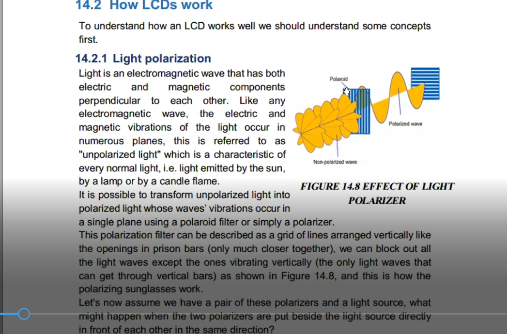

## LCD

#### Types of displays

1. LED Displays
2. Segment Display
3. LED Matrix (Dot Matrix)

##### LED Displays Disadvantages

1. High power Consumption
   for example 7 seg
   each led consume around 15 mA, 5v (75m Watt)
   so to display 1 num needs around 75m W \* 7 ~= 0.5 Watt (High Consumption)
2. #pins is big

##### LED Displays Advantages

1. Attractive
2. view angle
3. size

---

### Liquid Crystal Display

2 physics concepts

1. Light Polarization
2. Liquid Crystal



polarized allow light pass in one plane

in our case(LCD) the polarized is the liquid crystal
عشان كده مايفضلش تسيب ال lcd فتره كبيرهش شغاله عشان ما تنشفش

- Liquid Crystal
  has fluidity , also hard as solid زي الجيلي

- at normal conditions is liquid
- change its internal structure with voltage effect
  - has 2 shapes or state


#### LCD Types

1. Segment LCD
2. Alphanumeric LCD (Character LCD)
3. Graphical LCD
   1. Monochrome (1 LED source) like Nokie 5110
   2. Colored (RGP source) like TV Screens

---

LCD Module:
LED Source + Liquid Crystals + Polarizers + Panel + Microcontrollers


- Ctrl Pins
- resistance to volt (Voltage Divider)


- Enable Pin: means start reading

#### LCD Driver Configuration

no mean here to have a post build configuration
we will change hw connection in runtime

---


---

### LCD SWC

- send command


##### Datasheet 8-bit Iniialization


- Entry Mode set : advanced command doesn't matter now

C know the ASCII Table just put it in single quote like -> 'A'

- C rule: String is array of char NOT (unsigned or signed char)

##### Datasheet 4-bit Iniialization

```c
// test LCD with 4-Bit Mode
#include"STD_TYPES.h"
#include"DIO_interface.h"
#include"PORT_interface.h"
#include"CLCD_config.h"
#include"CLCD_interface.h"
#include<util/delay.h>


void main()
{
	PORT_voidInit();
	CLCD_voidInit();

	CLCD_voidClearScreen();

//	CLCD_voidSendData('A');
//	CLCD_voidSendData('H');
//	CLCD_voidSendData('M');
//	CLCD_voidSendData('E');
//	CLCD_voidSendData('D');

	CLCD_voidSendString("Ahmed");
	while(1)
	{

	}
}

```

## connecting new MCU first time

should define its clock firstly by fuses

- project Properities
  - Fuses
    - Direct hex value -> FF D9
  - after upload -> select `do not use fuze bits`

##### LCD MCU memories

##### How can we calculate the displayed position?


1. DDRAM: Data Display RAM
2. CGROM: Charachter Generator RoM
3. CGRAM: Charachter Generator RAM

- DDRAM: Data Display RAM

- why we have addtional memory not just the visible window size?

1. MCU is the same for the all LCD sizes
2. if you want to shift the visible window without deleting the data (like the real calculator)

- Virtual memory addresses diagram


```c
u8 CLCD_voidGoToXY(u8 Copy_u8XPos,u8 Copy_u8YPos);
```

- first calculate the address

- then go to datasheet to know how to send the address to LCD MCU(set DDRAM Address)
  

- LCD MCu has register called Address Counter that carry the next DDRAM Address to display and `automatically increment`
-
- one way to set pin 7 with 1
  - add 128 on calculated address

```c
u8 CLCD_voidGoToXY(u8 Copy_u8XPos,u8 Copy_u8YPos)
{
	u8 Local_u8ErrorState=0;

	u8 Local_u8Address;
	if(Copy_u8XPos == 0)
	{
		/*Location is at first line in CLCD 16*2*/
		Local_u8Address=Copy_u8YPos;
	}
	else if(Copy_u8XPos == 1)
	{
		/*Location is at Second line in CLCD 16*2*/
		Local_u8Address = Copy_u8YPos + 0x40;
	}
	else
	{
		Local_u8ErrorState = 1; // wrong pos
	}
	/*set bit number 7 for set DDRAM Address command then send the command*/
	CLCD_voidSendCommand(Local_u8Address + 128);

	return Local_u8ErrorState;
}
```

##### how LCD MCD knows the english letters and numbers?

- CGROM
  each address is alocation for 8 bytes contains a character pattern

##### How to draw custom character on LCD?

###### CGRAM

- has 8 blocks, each block is 8 bytes
- is a byte addressable


##### Let's display حرف الباء


- charcter pixels `5 * 8`

```c
void CLCD_voidWriteSpecialCharacter(u8*Copy_pu8Pattern,u8 Copy_u8PatternNumber,u8 Copy_u8XPos,u8 Copy_u8YPos);
```

[LCD Custom Character Generator](https://maxpromer.github.io/LCD-Character-Creator/)

##### to calculate the starting address

- starting address = `blockNum * 8`
- set CGRAM address command
- add 64 to set bit no.6


```c
void CLCD_voidWriteSpecialCharacter(u8*Copy_pu8Pattern,u8 Copy_u8PatternNumber,u8 Copy_u8XPos,u8 Copy_u8YPos)
{
	u8 Local_u8CGRAMAddress = 0, Local_u8Iterator;

	/*calculate the CGRAM Address whose each block is 8 bytes */
	Local_u8CGRAMAddress = Copy_u8PatternNumber * 8;

	/*send CGRAM Address command to LCD, with setting bit 6,clearing bit 7*/
	CLCD_voidSendCommand(Local_u8CGRAMAddress + 64);

	/*write pattern into CGRAM*/
	for(Local_u8Iterator=0; Local_u8Iterator < 8; Local_u8Iterator++)
	{
		CLCD_voidSendData(Copy_pu8Pattern[Local_u8Iterator]); // address counter register auto increment
	}

	/*Go back to the DDRAM to display the pattern*/
	CLCD_voidGoToXY(Copy_u8XPos, Copy_u8YPos);

	/*Display the pattern written in the CG RAM
	 * DDRAM treat with the CGRAM with location(block) number from 0 to 7*/
	CLCD_voidSendData(Copy_u8PatternNumber);
}
```

#### Assignments

1. implement Write number function

```c
void CLCD_voidWriteNumber(u32 Copy_u32Number);
```

2. Display your name in arabic in sin wave.
3. short Video about Hamoksha
   1. hello I am Hamoksha
   2. I can playfootball
   3. I can run
   4. I can dance
   5. Don't Kill me


4. Four Buttons to control hamksha position
   
