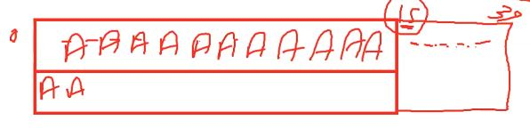
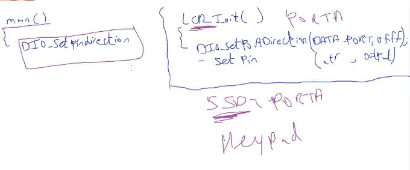
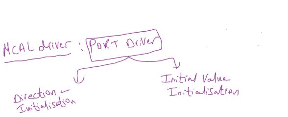
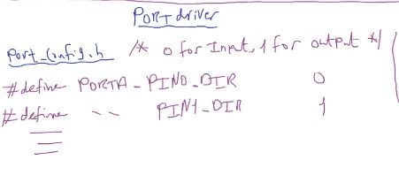
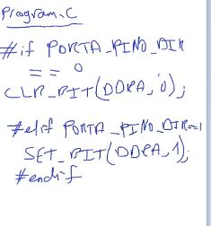
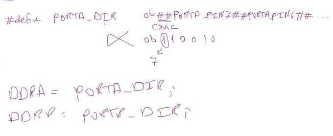
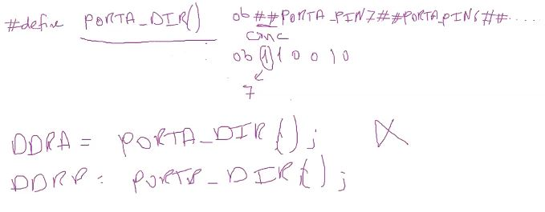
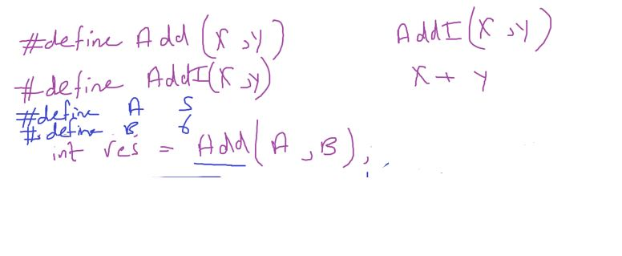
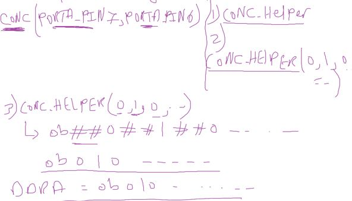

## keypad

### LCD Ass

1. complete on 2nd line when first line is filled.
   

2. LCD 4-Bit Mode feature implementation (based PreBuild Configuration)

#### How companies protect its code from customers if needed?

if sw based on postbuild configs -> send only the object files
if sw based on prebuild configs -> the uglification engineer make the code unreadable

- for example
  - rename main function
    - evey function needed should be provided in another file, startup code file who provide main

---

### PORT Driver

##### Inituation

- what is the best PIn Direction Definition in main or in each module?
  

- i think it's better to let someone define the all pins for the entire project.
- AUTOSAR define a SWC called PORT in MCAL for this task
- AUTOSAR : Automotive SW Architecture definition

##### what is PORT Driver?





- one way to implement that to write 5 line for 1 pin for just direction value
- 5 _ 32 pin _ 2 (dir val, init val) around 320 hash define
- it's a big hassl way
  

- `preprocessor` comes here

- is the advantage of function like macro than normal function
- that is allowing stringification and concatination

#### stringification (`#`)


#### ==concatination== (`##`)


- _Invalid_ because concatination only comes with function like macro
  not with normal function or with object



- invalid also but Why??
  

#### preprocessor has important rules

1. concatination with object like macro in the same line
   concatination has priority
   

so it will be meaningless

if we have object like macro and function like macro in the same line
function like macro is higher priority also

- for example
  

- a new implemetation using concatination
  
  

```c
#ifndef PORT_private_H_
#define PORT_private_H_

#define CONC(b7,b6,b5,b4,b3,b2,b1,b0)			CONC_HELPER(b7,b6,b5,b4,b3,b2,b1,b0)
#define CONC_HELPER(b7,b6,b5,b4,b3,b2,b1,b0)	0b##b7##b6##b5##b4##b3##b2##b1##b0

#define PORTA_DIR			CONC(PORTA_PIN7_DIR,PORTA_PIN6_DIR,PORTA_PIN5_DIR,PORTA_PIN4_DIR,PORTA_PIN3_DIR,PORTA_PIN2_DIR,PORTA_PIN1_DIR,PORTA_PIN0_DIR )
#define PORTB_DIR			CONC(PORTB_PIN7_DIR,PORTB_PIN6_DIR,PORTB_PIN5_DIR,PORTB_PIN4_DIR,PORTB_PIN3_DIR,PORTB_PIN2_DIR,PORTB_PIN1_DIR,PORTB_PIN0_DIR )
#define PORTC_DIR			CONC(PORTC_PIN7_DIR,PORTC_PIN6_DIR,PORTC_PIN5_DIR,PORTC_PIN4_DIR,PORTC_PIN3_DIR,PORTC_PIN2_DIR,PORTC_PIN1_DIR,PORTC_PIN0_DIR )
#define PORTD_DIR			CONC(PORTD_PIN7_DIR,PORTD_PIN6_DIR,PORTD_PIN5_DIR,PORTD_PIN4_DIR,PORTD_PIN3_DIR,PORTD_PIN2_DIR,PORTD_PIN1_DIR,PORTD_PIN0_DIR )

#define PORTA_InitVal		CONC(PORTA_PIN7_InitVal,PORTA_PIN6_InitVal,PORTA_PIN5_InitVal,PORTA_PIN4_InitVal,PORTA_PIN3_InitVal,PORTA_PIN2_InitVal,PORTA_PIN1_InitVal,PORTA_PIN0_InitVal)
#define PORTB_InitVal		CONC(PORTB_PIN7_InitVal,PORTB_PIN6_InitVal,PORTB_PIN5_InitVal,PORTB_PIN4_InitVal,PORTB_PIN3_InitVal,PORTB_PIN2_InitVal,PORTB_PIN1_InitVal,PORTB_PIN0_InitVal)
#define PORTC_InitVal		CONC(PORTC_PIN7_InitVal,PORTC_PIN6_InitVal,PORTC_PIN5_InitVal,PORTC_PIN4_InitVal,PORTC_PIN3_InitVal,PORTC_PIN2_InitVal,PORTC_PIN1_InitVal,PORTC_PIN0_InitVal)
#define PORTD_InitVal		CONC(PORTD_PIN7_InitVal,PORTD_PIN6_InitVal,PORTD_PIN5_InitVal,PORTD_PIN4_InitVal,PORTD_PIN3_InitVal,PORTD_PIN2_InitVal,PORTD_PIN1_InitVal,PORTD_PIN0_InitVal)

#endif
```

#### So function will be 8 lines instead of 320 line

```c

#include"STD_TYPES.h"

#include"PORT_config.h" // should be before private.h
#include"PORT_private.h"
#include"PORT_interface.h"
#include"PORT_register.h"


void PORT_voidInit()
{
	DDRA = PORTA_DIR;
	DDRB = PORTB_DIR;
	DDRC = PORTC_DIR;
	DDRD = PORTD_DIR;

	PORTA = PORTA_InitVal;
	PORTB = PORTB_InitVal;
	PORTC = PORTC_InitVal;
	PORTD = PORTD_InitVal;
}
```

---

### Keypad
