## Electrical Switches

### LCD & KeyPad Assignments

1. 3 Buttons Calculator
2. Complete Calculator
3. Stop Watch

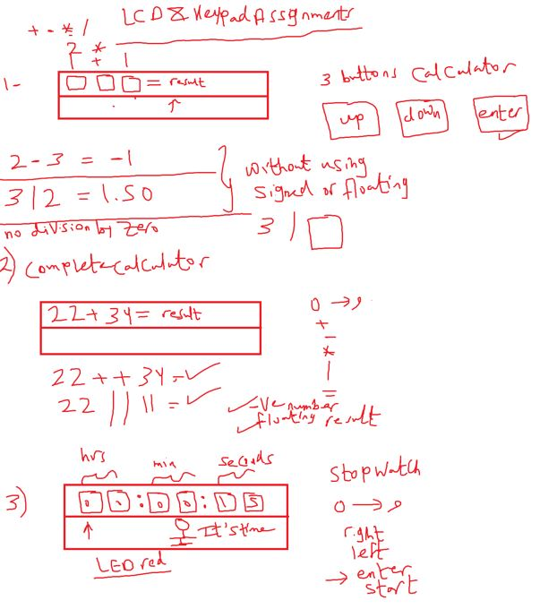

#### TypesSwitches

##### inituation for electrical switches

- recommended current can be provided be atmega32 20mA
- max current cab be provided be atmega32 40mA
- min current for small motor around 100mA

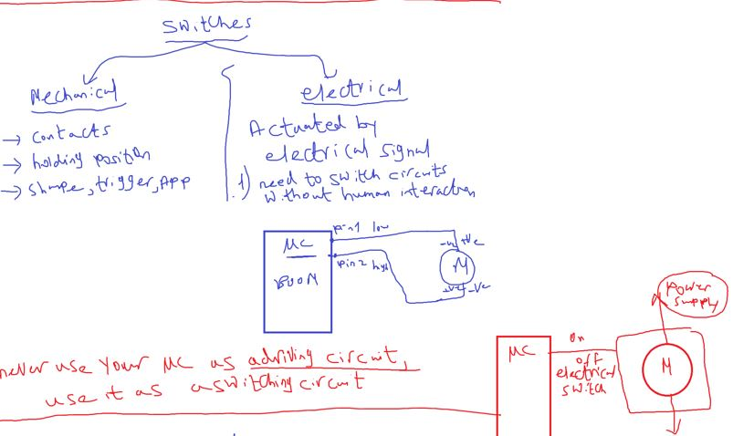

- so why we didn't use a driving circuit with lEDs and Seven Segment?
  - because it consume alittle bit power, but it will be better to use

#### electronis or physics behind the electrical switches

##### PN-junction

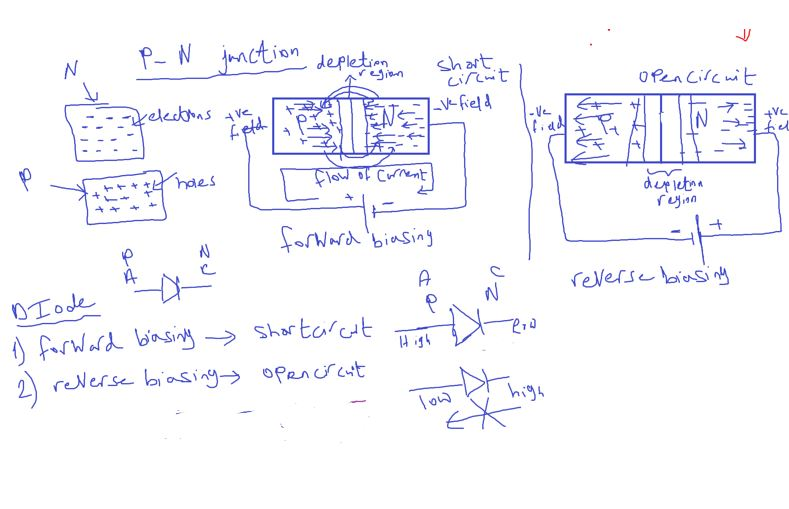

##### NPN , PNP

- Th goal is to pass electrons from E to C (Emiiter to Base)

- case1 (cutoff): reverse biasing on emitter and base

  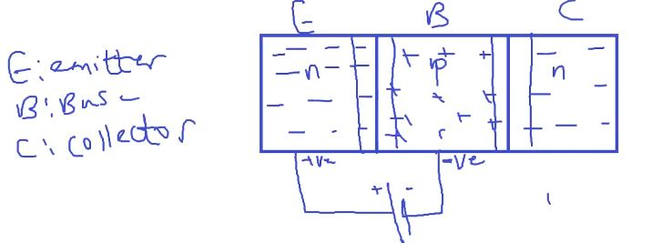

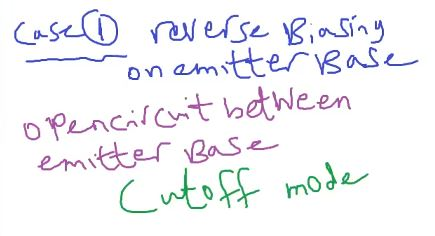

- case 2(Saturation):

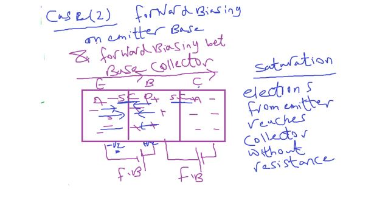

- case 3(Active Mode):
  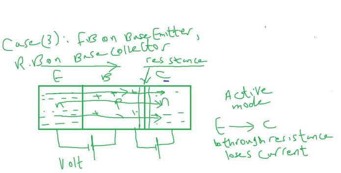

##### this is the trasistor

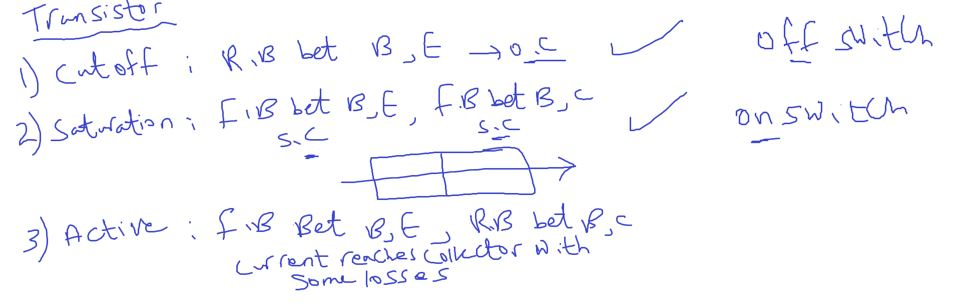

- CutOFF Circuit

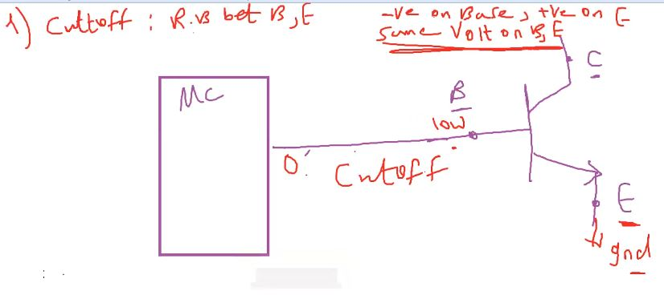

- Saturation Circuit

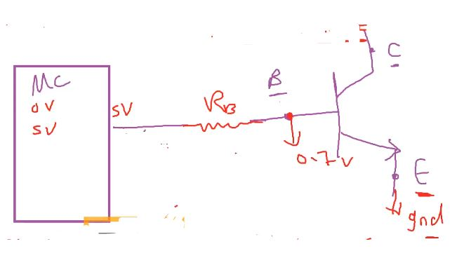

- How to calculate the R~B~
- Onhm Law
- I~B~ from differ from each transistor
- V~B~ around 0.7V

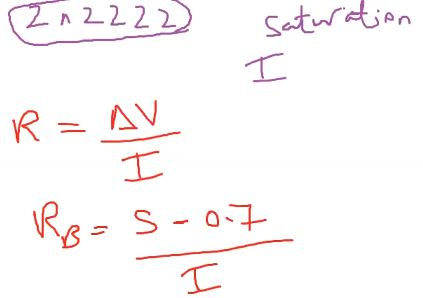

- option2 not avaialable on atmega32 due to current limitiation from MCU so(MAX current is 40mA)

  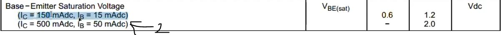

- 270 and 330 ohm only available in Market
- 330 Not valid because V~B~ will be less than 0.6V
  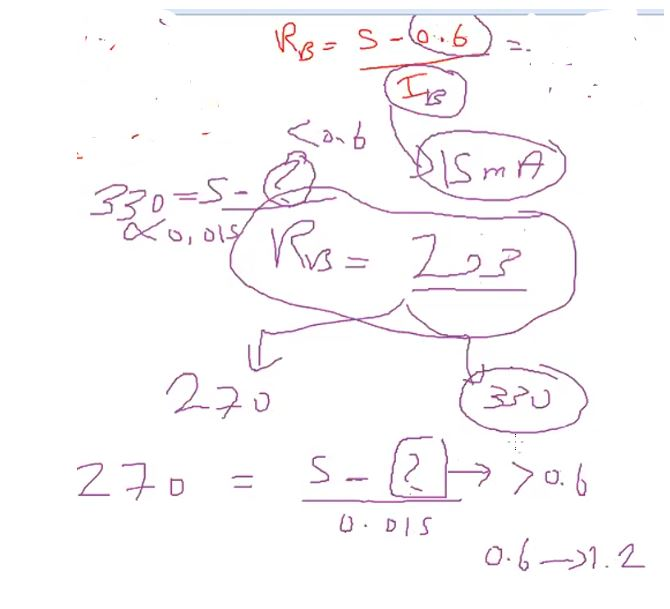

- control motor through electrical switch
  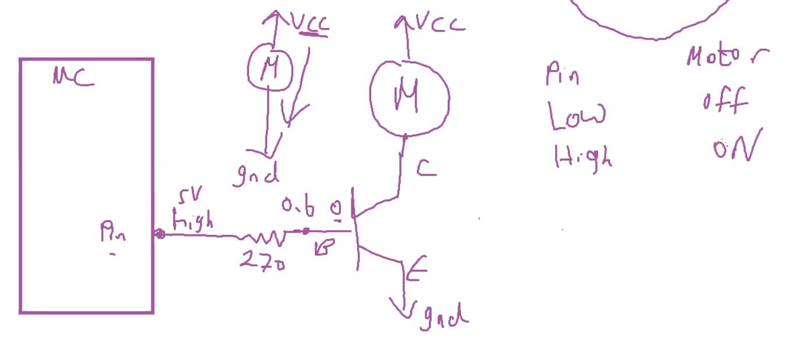

---

##### DC Motor working Principle

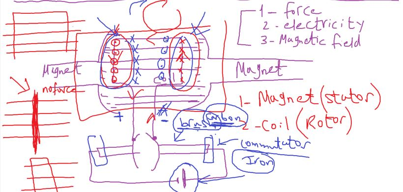

- add more coils

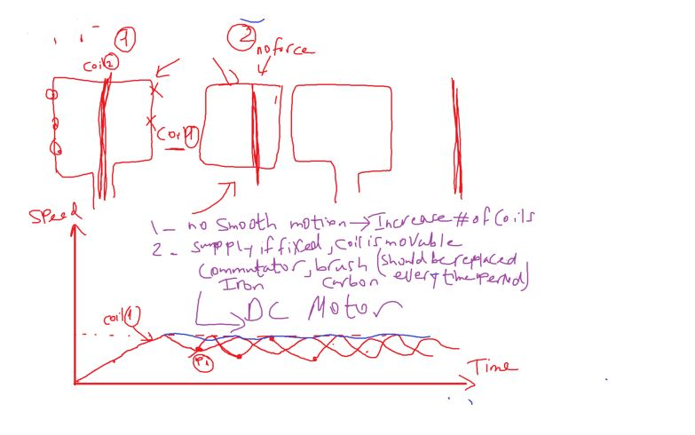

- Advantages of DC Motor

1. Simple in H/W
2. simple in SW
3. Lower power consumption
4. smallest size

##### How to control DC Motor direction

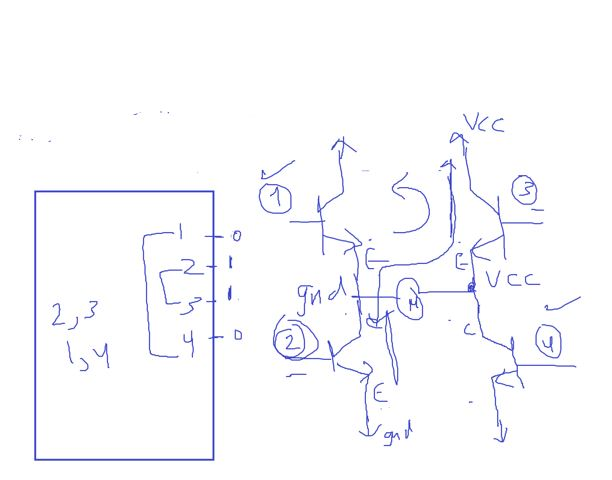

##### our own H-bridge connection Issue

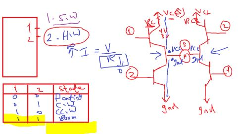

- 2 ways to solve this by software

  - to prevent this case

- **but if we call these 2 functions after each other
  short circuit (BOOM) will happened**

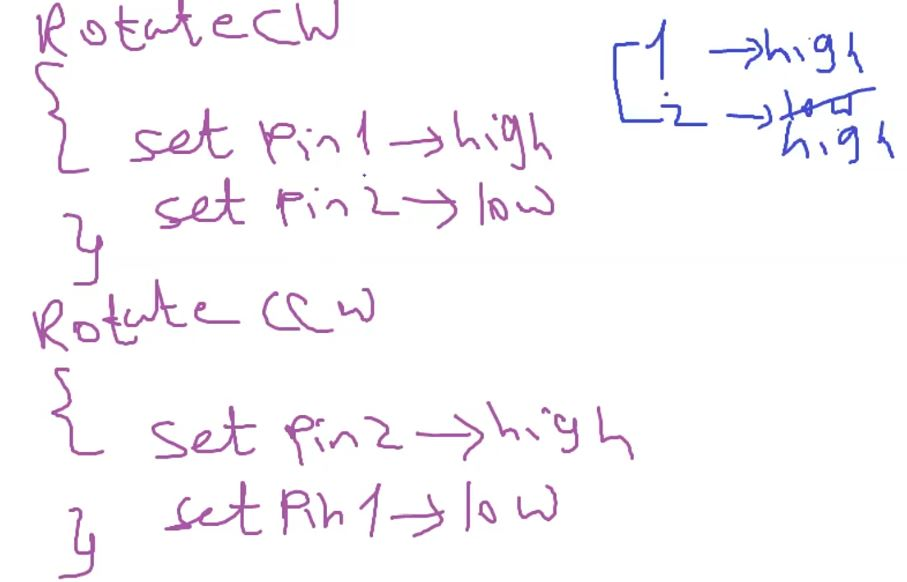

- **JUST replace lines of code**
  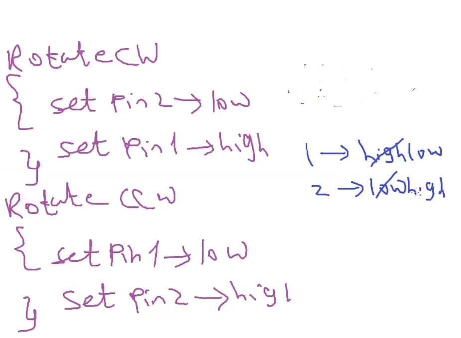

- **second way to solve this issue by hardware**

- change the mapping of H-Bridge connection

- for solution to add NOT Gate

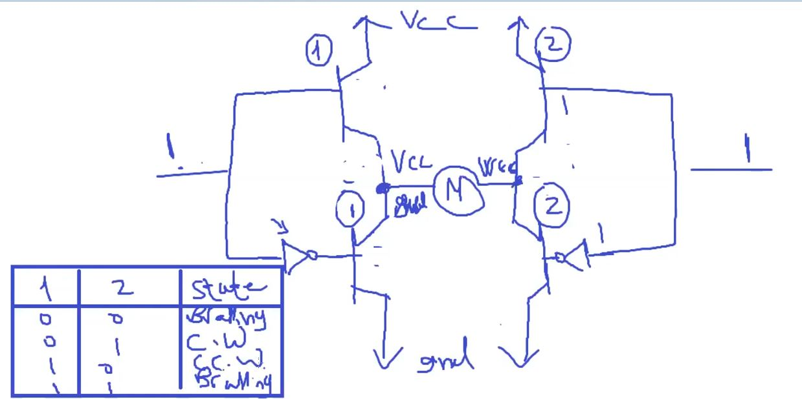

- or to change the npn to pnp transistor
- and this is the solution in the H-bridge IC
  and with diodes the prevent the BEMF by motor coils
- 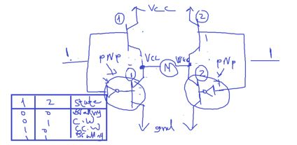

###### Assignments

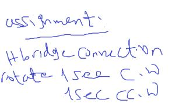

- transistor disadvantage (No Complete Isolation)
- MCU current I~B~ goes with current of power circuit I~C~

from Kirchoff Volt Law : I~E~ = I~C~ + I~B~

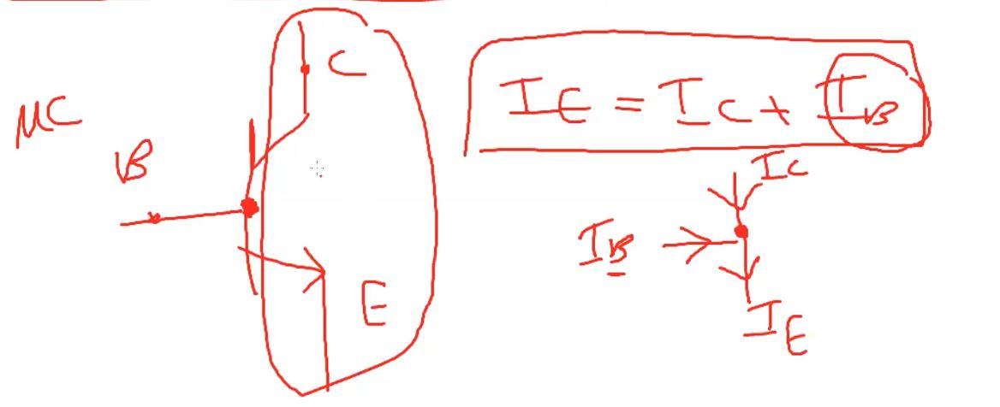
That means no complete isolation may be MCU effected by motor BEMF

##### transistor adv and disadv

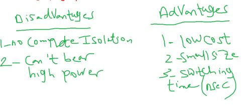

##### Optocoupler (Complete Isolation)

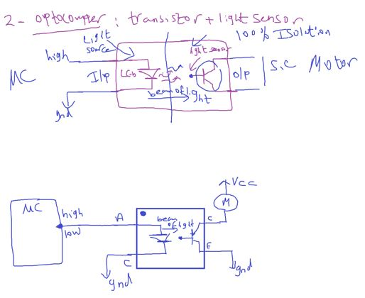
