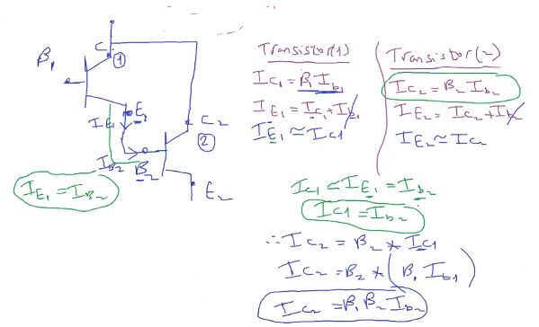

## Electrical Switches

### LCD & KeyPad Assignments

1. 3 Buttons Calculator
2. Complete Calculator
3. Stop Watch

#### TypesSwitches

##### inituation for electrical switches

- recommended current can be provided be atmega32 20mA
- max current cab be provided be atmega32 40mA
- min current for small motor around 100mA

- so why we didn't use a driving circuit with lEDs and Seven Segment?
  - because it consume alittle bit power, but it will be better to use

#### electronis or physics behind the electrical switches

##### PN-junction

##### NPN , PNP

- Th goal is to pass electrons from E to C (Emiiter to Base)

- case1 (cutoff): reverse biasing on emitter and base

  

- case 2(Saturation):

- case 3(Active Mode):
  

##### this is the trasistor

- CutOFF Circuit

- Saturation Circuit

- How to calculate the R~B~
- Onhm Law
- I~B~ from differ from each transistor
- V~B~ around 0.7V

- option2 not avaialable on atmega32 due to current limitiation from MCU so(MAX current is 40mA)

  

- 270 and 330 ohm only available in Market
- 330 Not valid because V~B~ will be less than 0.6V
  

- control motor through electrical switch
  

---

##### DC Motor working Principle

- add more coils

- Advantages of DC Motor

1. Simple in H/W
2. simple in SW
3. Lower power consumption
4. smallest size

##### How to control DC Motor direction

##### our own H-bridge connection Issue

- 2 ways to solve this by software

  - to prevent this case

- **but if we call these 2 functions after each other
  short circuit (BOOM) will happened**

- **JUST replace lines of code**
  

- **second way to solve this issue by hardware**

- change the mapping of H-Bridge connection

- for solution to add NOT Gate

- or to change the npn to pnp transistor
- and this is the solution in the H-bridge IC
  and with diodes the prevent the BEMF by motor coils
- 

###### Assignments

- transistor disadvantage (No Complete Isolation)
- MCU current I~B~ goes with current of power circuit I~C~

from Kirchoff Volt Law : I~E~ = I~C~ + I~B~

That means no complete isolation may be MCU effected by motor BEMF

##### transistor adv and disadv

##### Optocoupler (Complete Isolation)

---

- **USB to TTL**
  convert from uart to usb protocols to allow interfacing between MCU and Computer

---

##### Relay (Electromechanical switch)

- coil is a source to electric magnetism
- switch is made of ferromagnetic material like iron, ..

###### advantages

- complete power isolation
- high power delivery
- `control AC load`
  - in smart homes,
  - automotive such as (كتاوت) come from cutout word

###### disadvantages

- low frequency (Mechanical action)
  - switching time more than 50ms
- low life endurrance
- high cost
- big size
- very high consumed power
  - more than 30mA
- high noise
- back emf

###### Relay types

- SPST ريلي 2 طرف عشان الملف ثابت دايما
  

- SPDT
  
- DPST
  
- DPDT
  

###### NO , NC

bottom side

###### motor connc

use a switching circuit (transistor) with the relay because the coil may burn the MCU

##### how we can control motor direction with relays

## 

#### Darlington pair

intuation: to solve the minimum current delivery
TRANSISTOR Law:

- I~C~ = Beta \* I~B~

## 

acording to this law we can increase the current with this circuit or connection

## 

## 

- IC contains 7 darlington pairs (ULN2003)

###### It doesn't make sense to generate high to base to get low on collector

## 

## 

## 

we will use it as controller to stepper motor

##### DC Motor

###### Disadvantages

- Can't be controlled without extra hardware
  - the given RPM @ no load and specific voltage

##### Encoder

- types: optical and magnetic
  

#### Stepper Motor

- according to flamng right hand rule
- observation: when current CW put N inside and S outside
  

###### Stepper motor operation theory

- activate coil one then deactivate it and activate next coil

#### stepper motor types

- 4 coils
  
- 2 coils stepper motor called ==Bipolar== bcause we want to change polarity on each coil
  
- how many transistors needed to control stepper motor direction?

  - each coil has H_bridge(4 transistor) to change the polarity on it like dc motor(1 coil)

- 2 types for 2coil stepper motor
  - bipolar
  - unipolar

##### unipolar (because we don't change polarity)

- here we need just for 4 transistors
  

###### Unipolar vs Bipolar

- **note**: unipolar be can used as bipolar if u neglect the pin no.5

###### stepping

For high resolotion

- full step: one coil activatation at a time
- half step: 2 coils activatation at some time
  
- Microstepping
  - added voltage control paramter
    

##### is the step is 90 deg

- they repeat the 4 coils serveral times and connected them together to decrease the deg per step
- to know resoution or stride angle(deg/step)
  - look in datasheet of the motor
- most famous stepper motors `nema`: its resolution 1.8 deg

#### Additional Resources

[switches](https://www.ermicro.com/blog/?p=423)
[encoder](https://automaticaddison.com/calculate-pulses-per-revolution-for-a-dc-motor-with-encoder/)

[encoder](https://deepbluembedded.com/arduino-motor-encoder-optical-encoder-interfacing/)
