## External Interrupt

- Assignment: Dashboard App
  

---

###### Determinism

knowing what happening at every point in timeline


- each super loop apps is high dertimistic

###### Responisvensess

How fast you can respond to external events


##### 1- Super loop system


- minimal H.W resources because (no additional peripheral operate)
- high power consumption (because always while(1) has code and working)
  - if while(1) is empty it will be low power consumption just jump instruction no ALU or other peripherals

###### 2- Foreground background system


- so ISR write should be as small as possible
- it increase the determisitim

---

### Interrupts (Exception)

- common error: exeception means internal interrupt
- **intuation**
  

- I don't have control to enable on this event (where it comes)
  
- so the peripheral should ==talk me== through memory (==PIF==)

  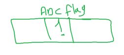

##### How Interrupts is handled


###### 1- Vectorable


- INT in processor: for interrupt happened
- send Interrupt ID on data bus

###### how does it know where peripheral ISR?

- flash starts with vector table memory section in AVR
  - but in ARM vector table in RAM
- flash location is 2 bytes
- but vector table location is 4 bytes

- each loaction has a jump address instruction
- 

  - address of the first line of peripheral ISR

- ابطي هاردوير اسرع من اسرع سوفتوير

- H/W priority
  - imagine 2 interrupts happened in the same time
  - who is handled first ?
    - on the first pin

###### 2- Flexible Priority

- you will resonsible to know which interrupt happened now
  
  

- you should check with if not else if
  - may be more than condition true
- here is just GIE
  - SIE by software put ISR or not

#### ARM

- NVIC
  is a vectorable with sw priority feature (through memory)
  if 2 interrupt happended in the same time check in sw priority if exist

#### NESTING

means ISR itself can be interrupted by another ISR (higher priority)


- AVR doesn't support nesting feature because it doesn't check priority.
- by disabling the GIE automatically by H.W when interrupt happened
  

- what if i forecd nesting by enabling GIE inside any ISR?
  

#### Interrupt Types

##### Interrupt Types based on Position


- AVR doesn't support any internal interrupts called ==traps==

##### what happens when interrupt happens(fires)(Interrupt Context Switching)


##### context switching


##### Interrupt Types based on maskablility

can't be ignored or Not


- **ISR of the Reset Interrupt** is the ==startup code==.
- in AVR we just have one non-maskable interrupt (RESET)

##### Interrupt Latency

- **interrupt latency**: is the time between `interrupt fires` and `ISR execution`.
- differ for each MCU
- also may differ for each MCU peripherials
  

- response time is the time of context switching execution
  - is fixed fixed for each MCU Peripherial

---

### DIO Interrupt (or called External Interrupt)


- Atmega support for events for external Interrupt

  - low level
  - rising edge
  - falling edge
  - on change
    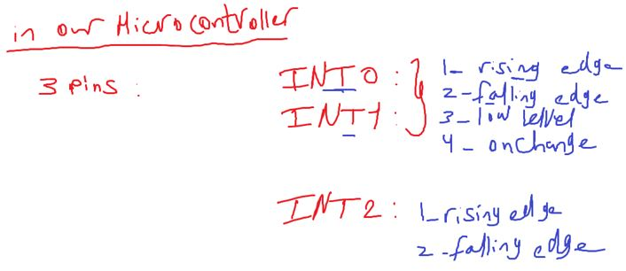
    

- Interrupt Sense control
- SIE
- PIF registers

##### Clearing Flag

why this flag is NOT Read Only


- should be clear the flag to prevent regenerating the interrupt again

- clearing flag can be done by

  - write 1 (handling event by polling)
  - auto clear (when enabling interrupt in other words if you will handle event by ISR)

- in AVR all flags cleared by writing one except one TWI flag

##### Event Handling


- polling (تخيل انت مستني مكالمه وسماعه الموبيل بايظه فكل شويه ترن السماعه تشوف حد رن ولا لسه)

- Each Toolchain define a specific name for ISR Address


- Interrupt ID or no = `vector No. - 1`
  

- GIE
  

### EXTI test APP


- can't be low event here because i want to generate only one interrupt

  

- we will make a separate driver for the Global Interrupt GIE
  - because all peripherals will use it

```c
// code
#include "STD_TYPES.h"
#include "DIO_interface.h"
#include "PORT_interface.h"
#include "EXTI_interface.h"
#include "GIE_interface.h"
#include "LED_interface.h"
#include <util/delay.h>


LED_t led_red = {DIO_u8PORTC, DIO_u8PIN0, LED_CONN_SRC};

void main(void)
{
	PORT_voidInit();
	GIE_voidEnable();
	EXTI_voidInt0Init();

	EXTI_u8IntEnable(INT0);


	while(1)
	{
		LED_u8TurnOff(&led_red);
	}

}

void __vector_1(void) __attribute__((signal));
void __vector_1(void){
	LED_u8TurnOn(&led_red);
	_delay_ms(1000);
}

```

- ROM is read only for the processor but can write in it in runtime for permenant data by flash driver

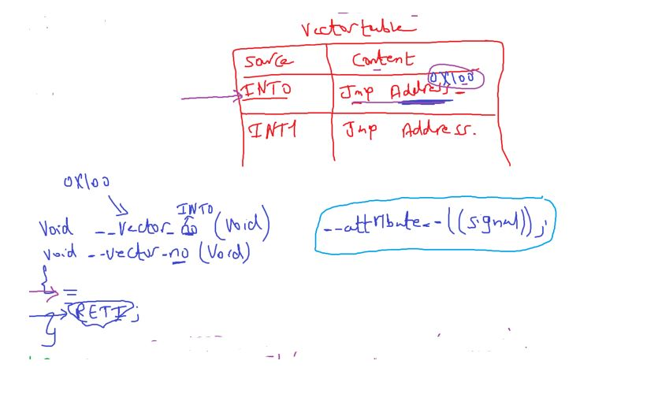

- ISR ends with assembly instruction called return interrupt `RETI`.

##### Optimizer

- what is the attribute and signal in ISR template?
- Optimizar tool in Toolchain
- can be in compiler and linker
  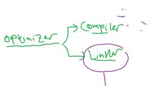

for example the ==compiler optimizer== can optimize code like this

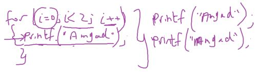

for example the ==linker optimizer== can optimize:

- unused function in code
  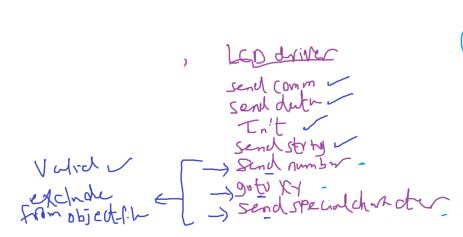
- what if this function is ISR?
  - actually it's not called by software
    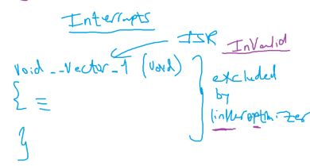

so i have to say to linker don't optimize this code:
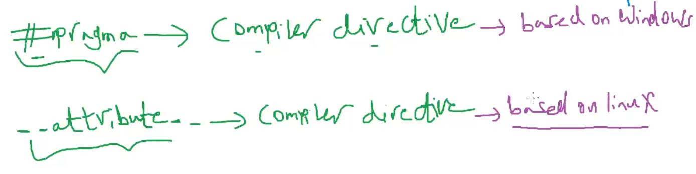
but this is a compiler directive but i talk to linker through compiler
i don't have a way to talk directly to linker
linker script is like a set of configuration not a way of communication

- we have the #progma and **attribute** because we use MinGW (Min GNU For Windows)
- why we write the \_\_vector\_\_no () 2 times
- it's NOT A function prototype just attribute should ended with ;

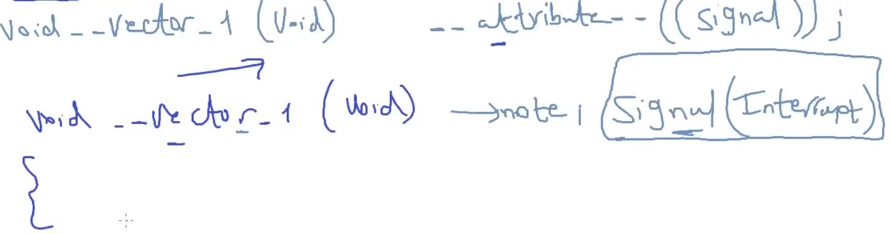

#### Configuration Types

`what is the time of setting the configuration?`

1. **Prebuild / Precompiled configs**
   

2. **Link configs**
   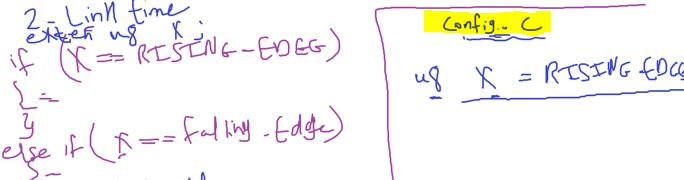
3. **Postbuild configs**

- SSD_PORT, SSD_COM_TYPE these are configs
  may change if i have a 2 different types of 7segment

- link time configs similar to post build configs
- post build much used because AUTOSAR use it

#### prebuild vs post build

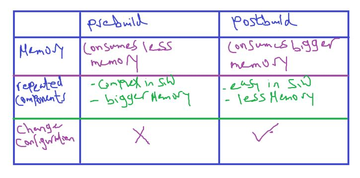

##### when i decide to develop the drivers with post build or prebuild configs?

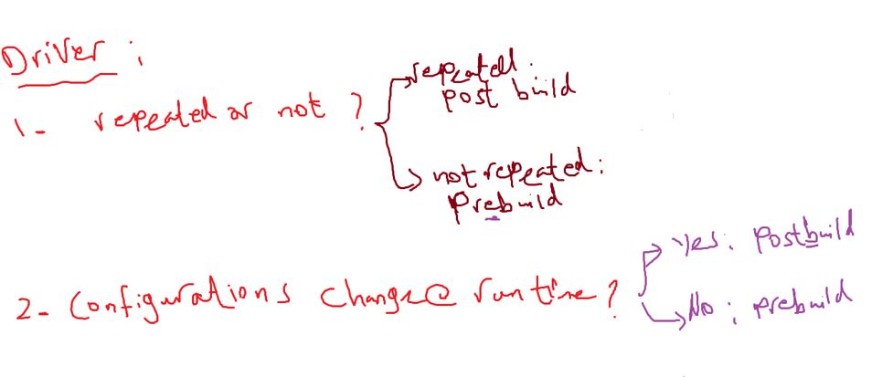

- repeated such as LEDs, Switches, SSD, ..
- Not Repeated such as KEYPAD,...
- BUT let's the driver component is
  - NOT Repeated
  - configs changes at runtime
- Provide the 2 options in the driver

#### EXTI SWC


- Rule: NEVER use 0 as a configuration option

```c
#define  LOW_LEVEL		0
```

- because if you make mistake in choosing from the available options we consider it as 0

```c
/* Options:
			1-LOW_LEVEL
			2-ON_CHANGE
			3-FALLING_EDGE
			4-RISING_EDGE
							  */

#define INT0_SENSE			ANY_THING_ELSE
// this will be LOW_LEVEL

```

```c
// Start from 1
#define  LOW_LEVEL		1
```

##### who and where the ISR should write?


- Application dependent ISR body changes from app to another
- writing ISR template is MCAL developer job

`SO sol is callback`: خلاص اكتبها في الابليكشن واديني بوينتر ليها

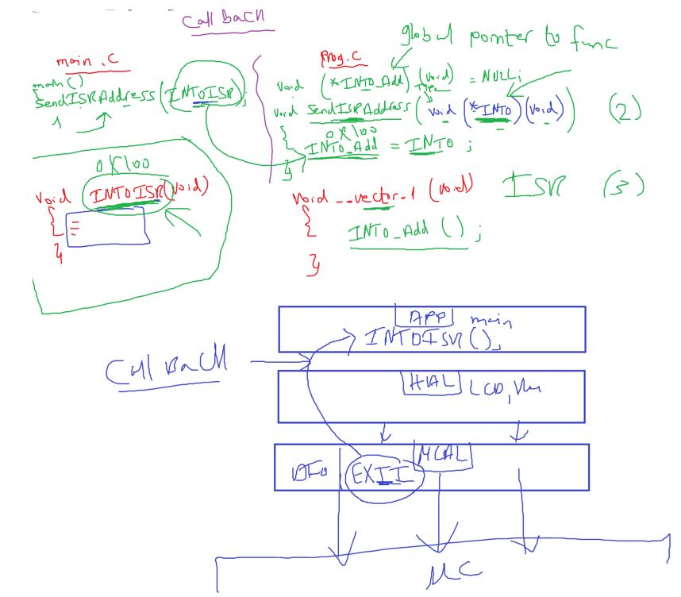

```c
// EXTI code with callback

#include "STD_TYPES.h"
#include "DIO_interface.h"
#include "PORT_interface.h"
#include "EXTI_interface.h"
#include "GIE_interface.h"
#include "LED_interface.h"
#include <util/delay.h>

LED_t led_red = {DIO_u8PORTC, DIO_u8PIN0, LED_CONN_SRC};

void ISR_INT0(void);

void main(void)
{
	PORT_voidInit();
	GIE_voidEnable();
	EXTI_voidInt0Init();

	EXTI_u8IntEnable(INT0);

	EXTI_u8Int0SetCallBack(ISR_INT0);

	while(1)
	{
		LED_u8TurnOff(&led_red);
	}
}

void ISR_INT0(void) {
	LED_u8TurnOn(&led_red);
	_delay_ms(2000);
}
```

#### Assignment

- EXTI Driver
- Ping Pong

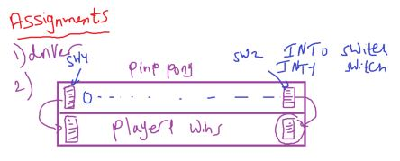
0b00000111,0b00000111,0b00000011,0b00000011,0b00000011,0b00000011,0b00000011,0b00000111,0b00000000
