## ADC (Analog To Digital Converter)

#### Examples on Analog signal

- Light
- Sound
- Temperature
- Speed
- Distance
- Pressure

#### Analog signal Characteristics

- continious
- infinity possibilities

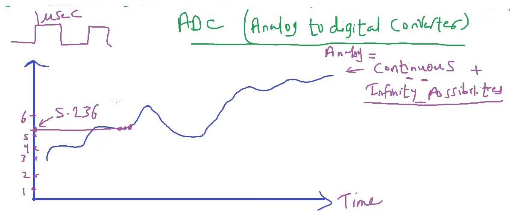

- As digital world for MCU
  - we define a fixed clk cycle
  - 2 possibilities (0, 1)
- 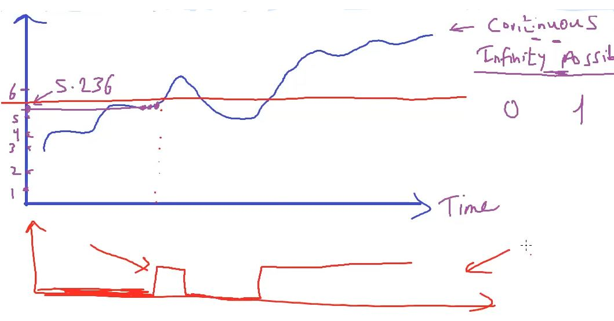

### So ADC comes to make MCU understand analog world

#### Digitalization Process

##### 1- sampling

like a screenshoots at specific rate

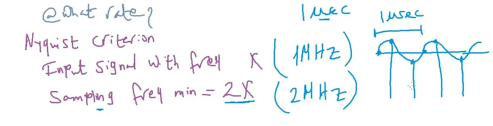

- sampling and hold (S/H)
  hold the previous sample value as same as for the next sample value
  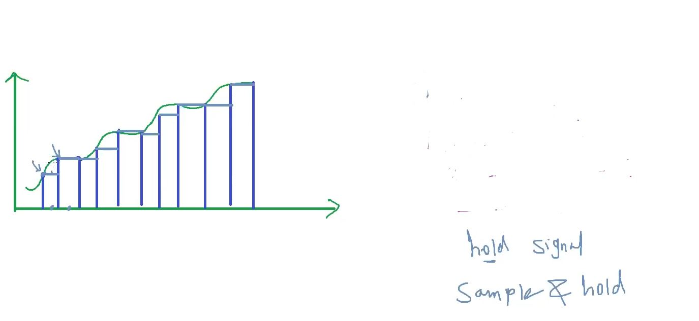

holding the signal can be done by capacitors

##### 1- Quantization

change to digital value

convert the signal to be discrete (Not Continuous) and defined possibilities
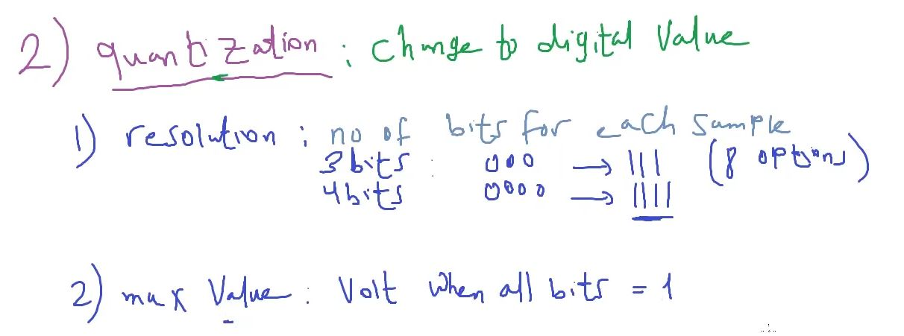

- **Note**: ALL ADCs measures voltage convert all physical signals (Temperature) to voltage firstly

- example: convert from digital to analog
  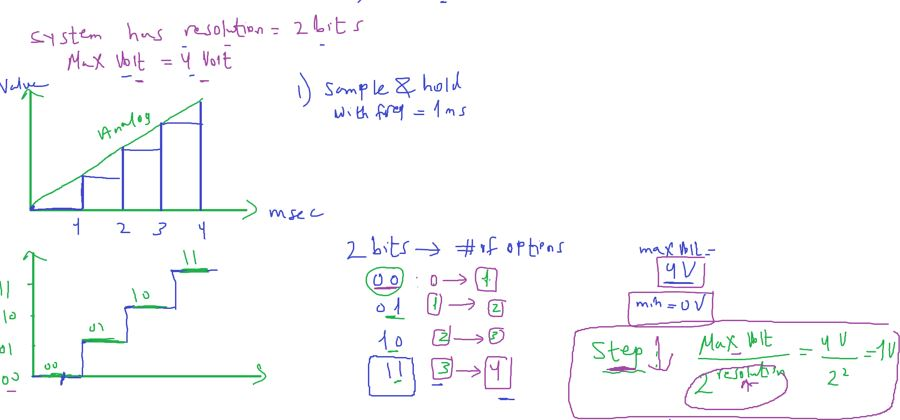

- example: convert from analog to digital
  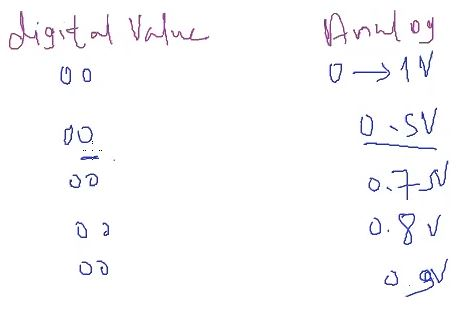

##### Quantization Error

to decrease it

1. increase resolution
2. decrease the max voltage
   

#### what if signal > 4v (max volt for previous example) or when saturation(all bits becomes 1s) happen

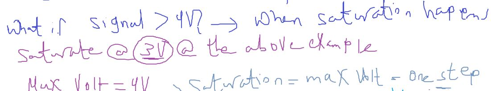

- another example
  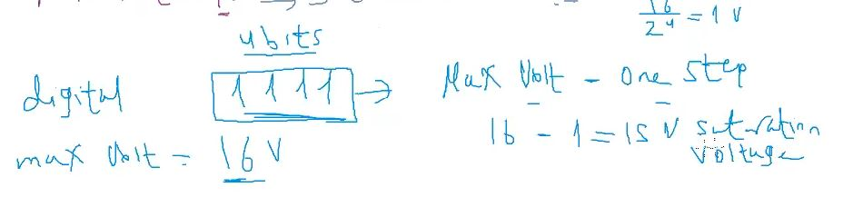

##### Conversion Quality

For example recording for 1 sec

- shikha freq: 3000 hz
  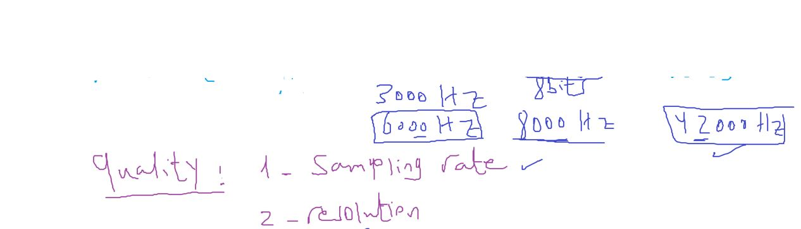

when sampling rate increase qualilty increase but need more memory
for example

- we choose 42000 hz sampling rate
- and resolution is 8 bit (1 Byte) so each sample stored in 1 byte
- we will consume 42 KB ~ 4 MB for just 1 sec

---

- ADC contains DAC
  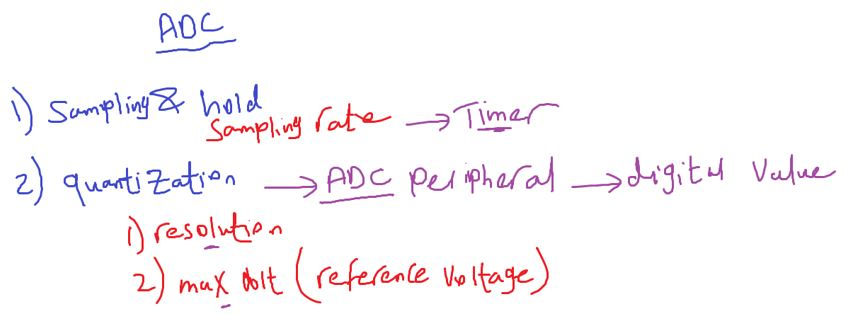
- `max volt == reference volt`

#### DAC

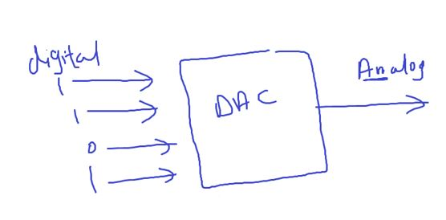
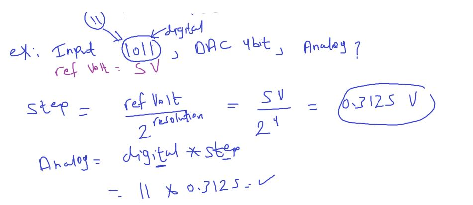

- famous DAC circuits is `R2R`, `Weighted Resistor`.

##### R2R (Resistor, 2 Resistor)

كل ماتحب تزود بتايه زود ار نايمه و تو ار قايمه

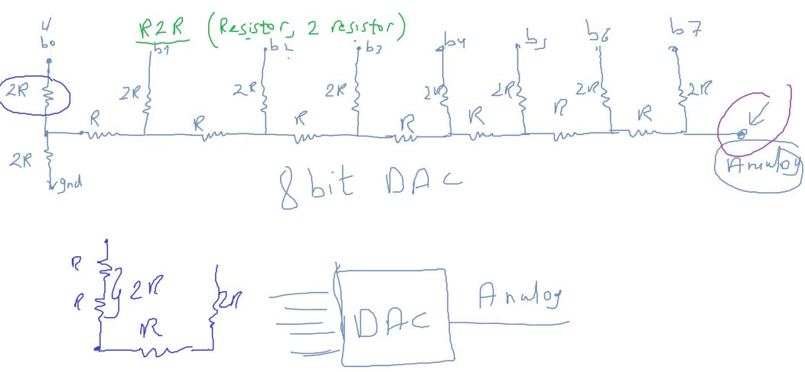

- so DAC can use to control motor speed

###### How to generate this wave using DAC

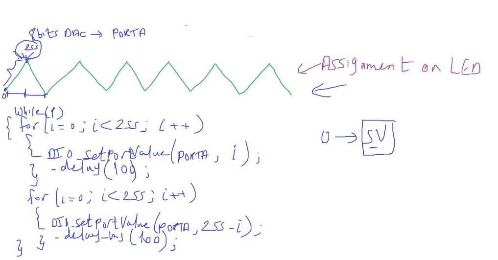

- Assignment: control motor using DAC with externel power

### ADC

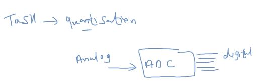

#### RAMP ADC

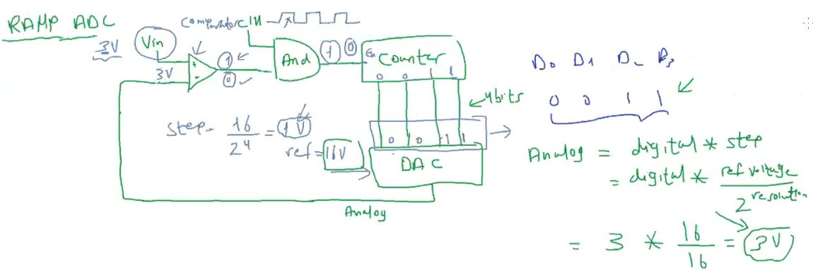

- atmega32 ADC example
  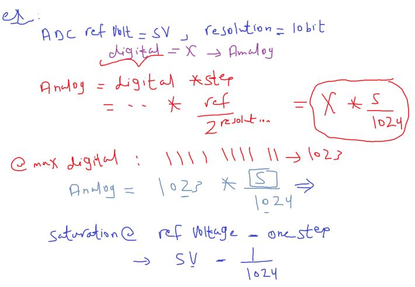

##### some important parameters

###### 1- conversion time (T~c~)

Time to know what volt the signal has

- T~c~min: 1 `*` Clock Cycle Time
- T~c~max: 2^n^ `*` Clock Cycle Time, n: resolution

###### conversion time vs sampling Freq

No relationship
but conversion time should be <= to sampling time

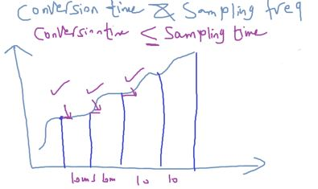

- conversion time is variable
- sampling time is constant

##### Big disadvantage

That the conversion time is variable depend on input signal

##### 2- Errors

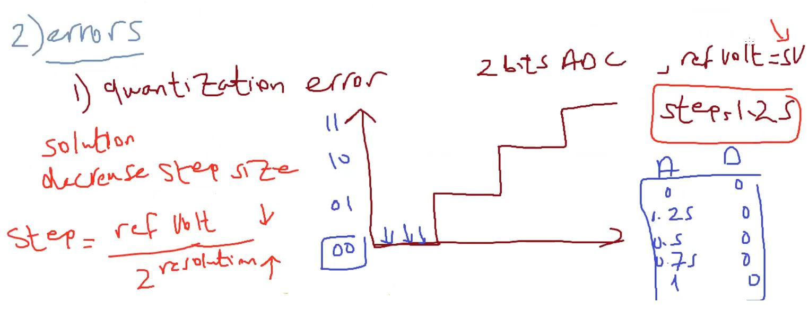

1- Quantization Error

- decreasing the ref volt to reduce step is not applicable if often want all range from 0 to 5v

2- Propagation Error
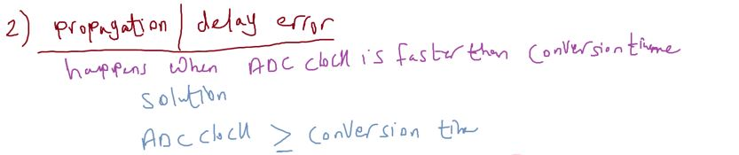

#### SAR ADC

Successive Approximation Register

- Like the RAMP circuit with a different counter
- SAR Counter initially starts with 1
- DAC Output or analog signal = Digital signal `*` Step
- DAC INPUT
  - 0 : Put 0 in current and 1 in next Bit
  - 1 : Put 1 in next Bit of current Bit

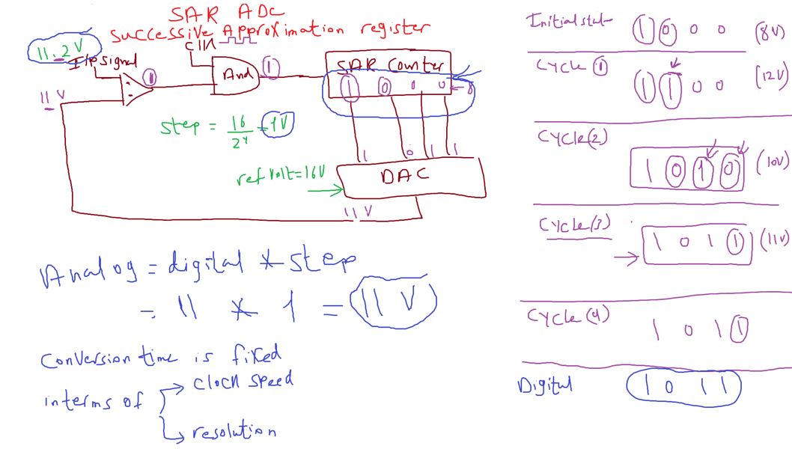

- ADC Features
  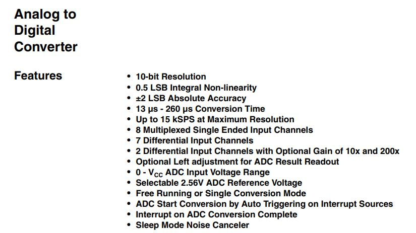

- LSB == STEP
  step changes in conversions due to H/W disability
  حجم الاستب متفير كمشكله طبيعيه للهادوير
- `+or- 2 كه Adc مجموع الايروز لل `
- Coversion time is constant but in terms of i/p clk cycle
- KSPS : `k`ilo `s`ample `p`er `s`econd
  - 1/65 = 15k freq bit/sec
- 8 Multiplexed Signle Ended Input channels
  

###### Single Ended vs Differential

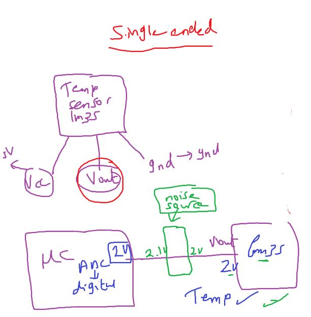
we need to neglect the noise on signal because because each volt has a different temperature

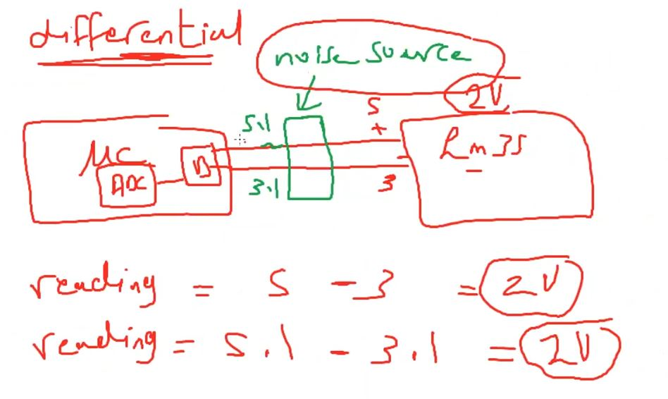

- ADC is 8 Multiplexed Signle Ended Input channels
- 7 differebtial Input channels

- 2 Differential Input Channels with Optional Gain of 10x and 200x

if the input signal is very small
may be less than ADC resolution

ADC provide a Gain circuit (10 or 200) to maxmize this input signal to able to read it

and after reading the analog signal divide it to 10 or 200

- **use case**: Measuring the noise value
  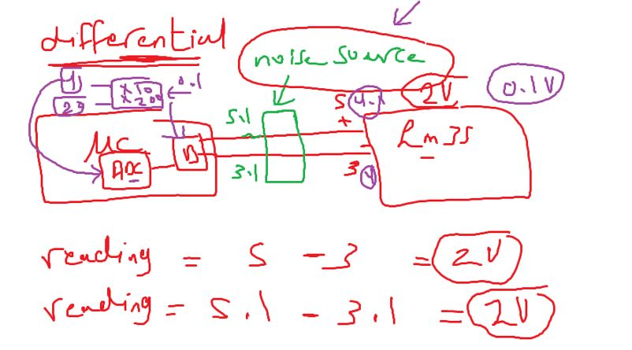

- Selectable 2.56V ADC Reference Voltage
  - can provide interal power 2.56v

ADC Reference voltage == Max Voltage

The only peripheral that take external power
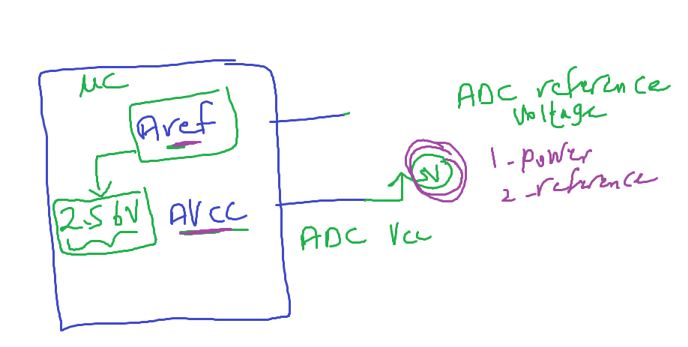

- Free Running or Single Conversion Mode

Single coversion مود البورطه
مابيعملش conversion الا لما تقوله وبعدها يقعد مستني لخد ماتقوله تاني

free running
بتقوله مره واحده وهو بيفضل شغال

ADC Start Conversion by Auto Triggering on Interrupt Sources

interrupt sources the famous ones External Interrupt and Timer

---

###### ADC Registers

- ADMUX
  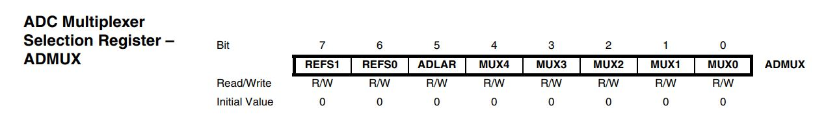
  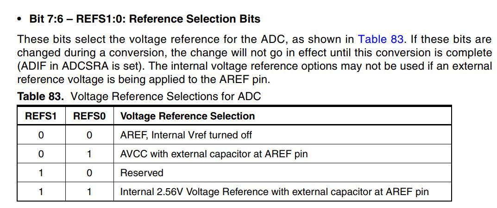
  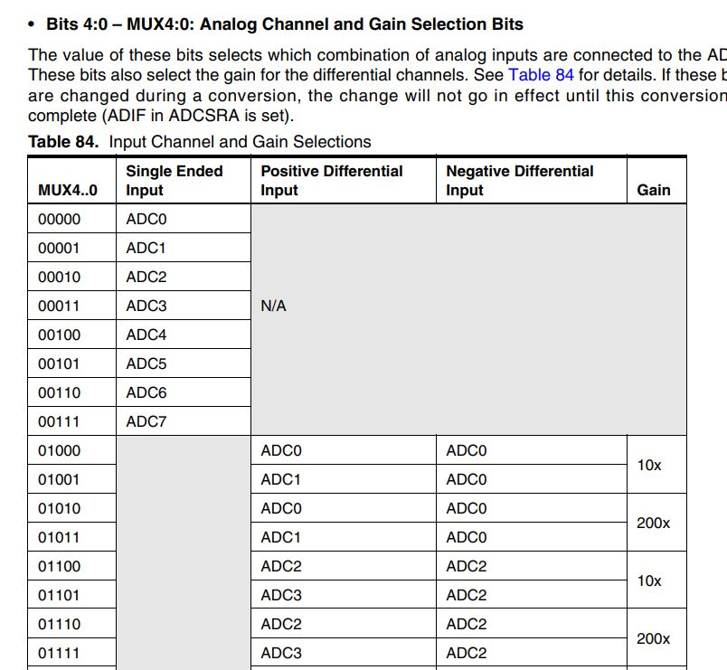
- How positive and negative pin as same as
  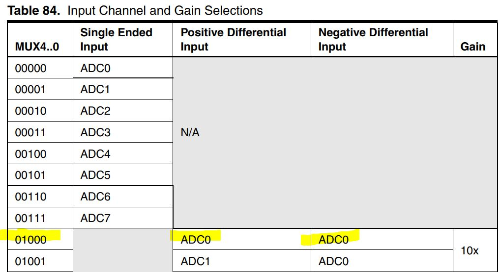
- these modes for special pusposes

  - measuring noise
  - testing ADC circuit
    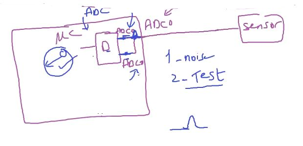
    the 2 signals are around the same value
    so the difference should be zero if not zero
    the ADC doesn't do a right coversion

- ADCSRA
  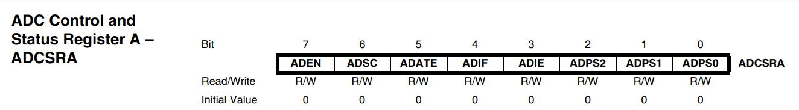
  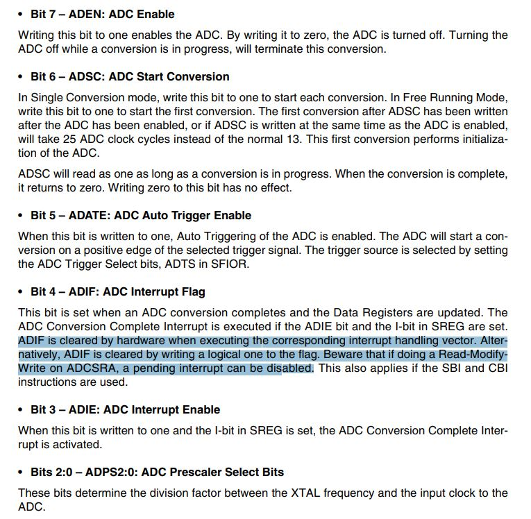

##### Remember Flag Clearing based on handling event

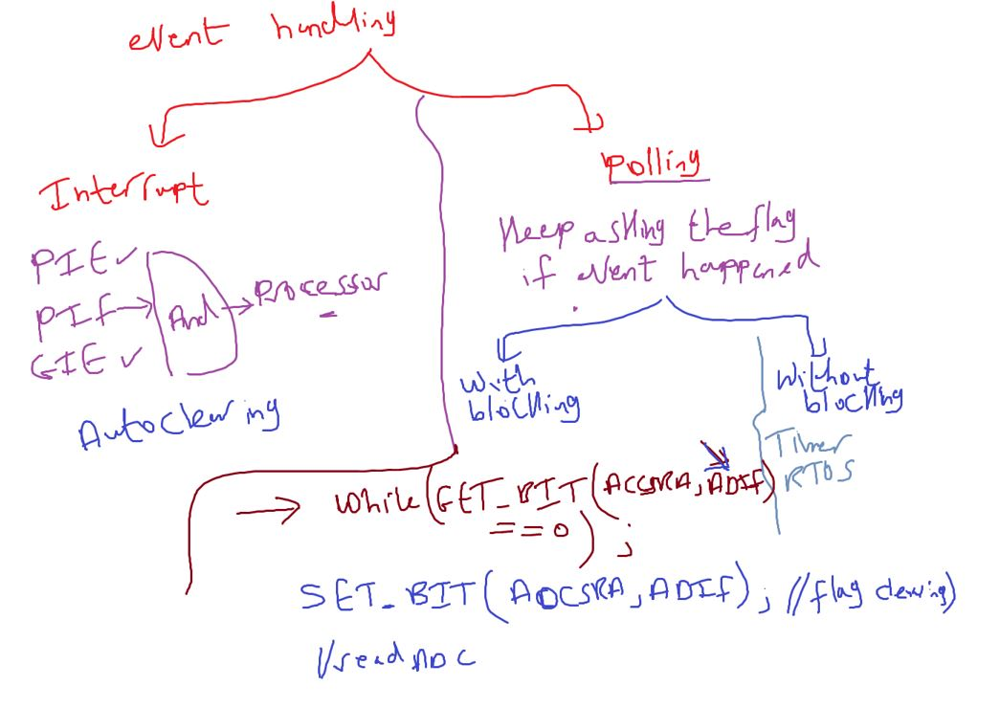

- after the event happened for conversion complete and flag raised
- you have to clear the flag

note: ISR == Interrupt handling vector == Interrupt handler

- Prescaller
  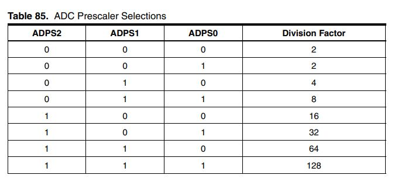

ADC peripheral doesn't a seperate clock it uses the MCU clock like other peripherals

- if u use a external clock the ADC will note provide the division factor(prescaler)

##### The ADC Data Register – ADCL and ADCH

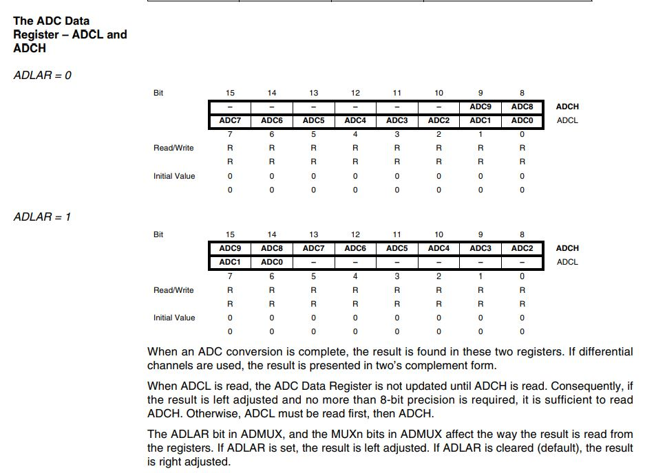

- ADC data register is 10 Bits
- and size of I/O memory is 8 bits
- so we need 2 memory locations to store these data
- so we have 2 options to store these 10 bits in 2 locations
  

- if we are interested in only 8 bits ?
- we will ignore the first 2 bits because have least values
- and we will choose the left adjust storing option to read only 1 location

- LEFT Adjust storing ADC data option in ADMUX Register
  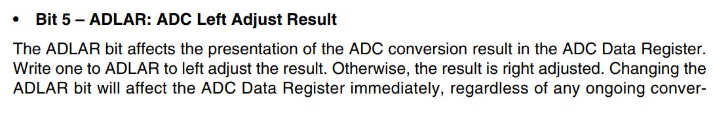

###### Special FunctionIO Register – SFIOR

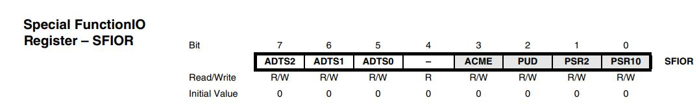

- select ADC trigger interrupt source
  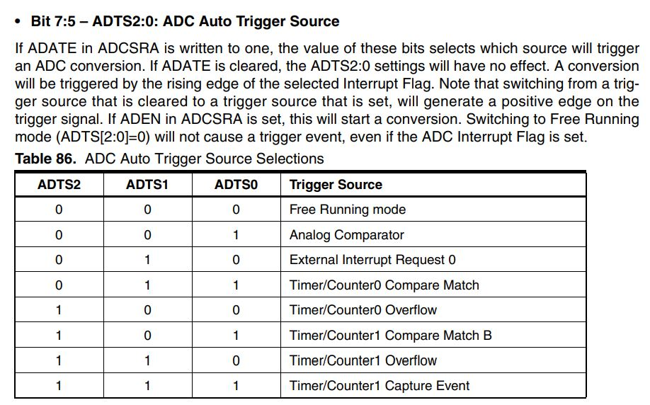

- APP for ADC
  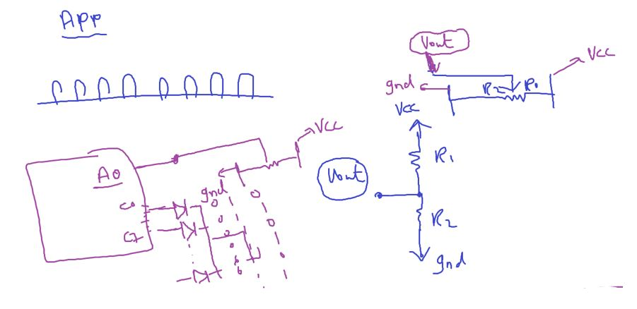

```c
// always put enable at end of the function
void ADC_voidInit(void);
void ADC_voidInit(void) {

}
```

// prescaler if you are not interest in speed choose lowest clock to reduce power consumption

###### Bit Masking

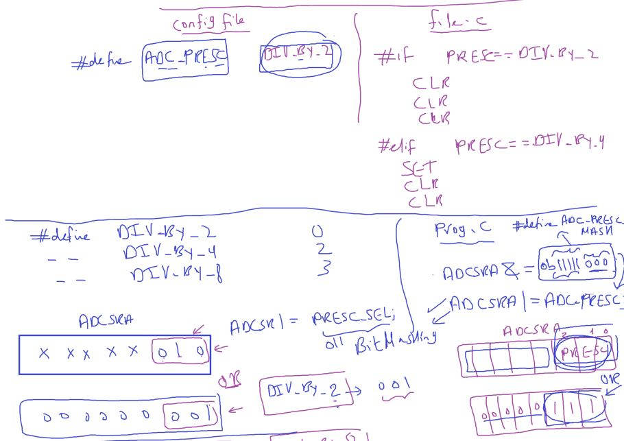

- but you have to clear bits first before bit masking
- for example bits contains this value 0bxxxx010
- and you config div_by_2 0bxxxxx001
- the register will conatin 0bxxxxx011 , note this is div_by_8 so we must clear prescaler bits firsts
  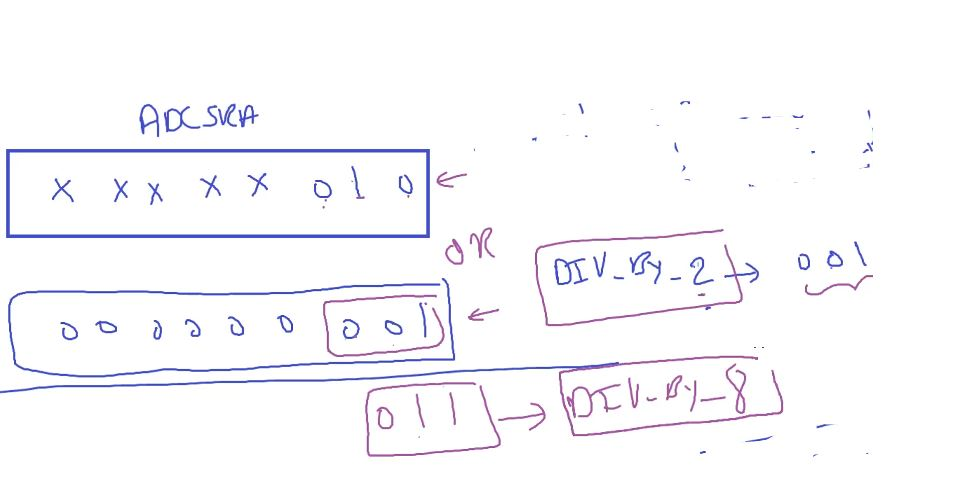

###### what if we want to read 10 bits

- one way
  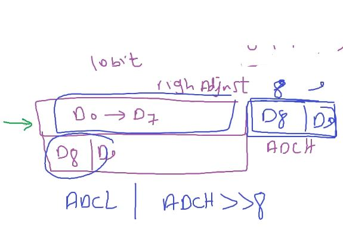
- second way to point on one of them with pointer to 16 bit
  - because they are after each other
    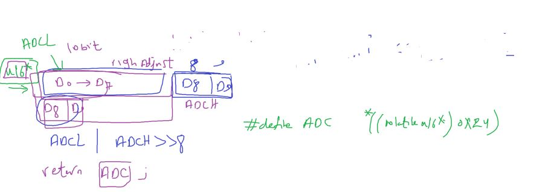

```c

#include "STD_TYPES.h"
#include "DIO_interface.h"
#include "PORT_interface.h"
#include "GIE_interface.h"
#include "ADC_interface.h"
#include "LED_interface.h"
#include "ADC_register.h"
#include "BIT_MATH.h"

u8 ADC_u8GetReading(u8 Copy_u8Channel) {
	ADMUX &= 0b11111000; // clear bits
	ADMUX |= Copy_u8Channel; // select the channel
	// start conversion
	SET_BIT(ADCSRA, ADCSRA_ADSC);
	// Polling until flag raised
	while(GET_BIT(ADCSRA, ADCSRA_ADIF) == 0);
	// clear flag
	SET_BIT(ADCSRA, ADCSRA_ADIF);
	// return reading
	return ADCH;
  }

void main()
{
	PORT_voidInit();
	ADC_voidInit();

	u8 PotValue ;
	while(1)
	{
		PotValue = ADC_u8GetReading(SINGLE_ENDED_ADC0);
		DIO_u8SetPortValue(DIO_u8PORTB, PotValue);
	}
}

```

---

#### Transducers

- we knows that ADCs only measures VOLT as an analog signal

- What if i want to measures analog signal neither than volt like temperature and etc.
  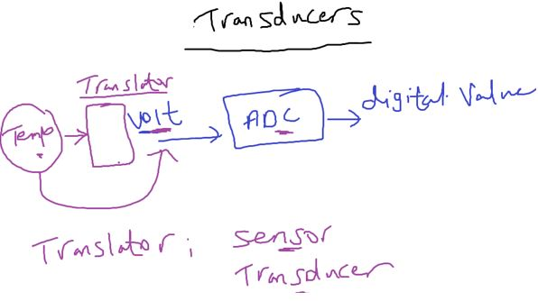

##### Temperature Sensing

- Thermistor (Thermal Resistor)
- عندنا ماده في الطبيعه ربنا خلقها بتتغير بتغير درجه الحراره
- Thermistor Types
  - NTC FOR Measuing Ordinary Range
  - PTC FOR Measuing Extreme Range
    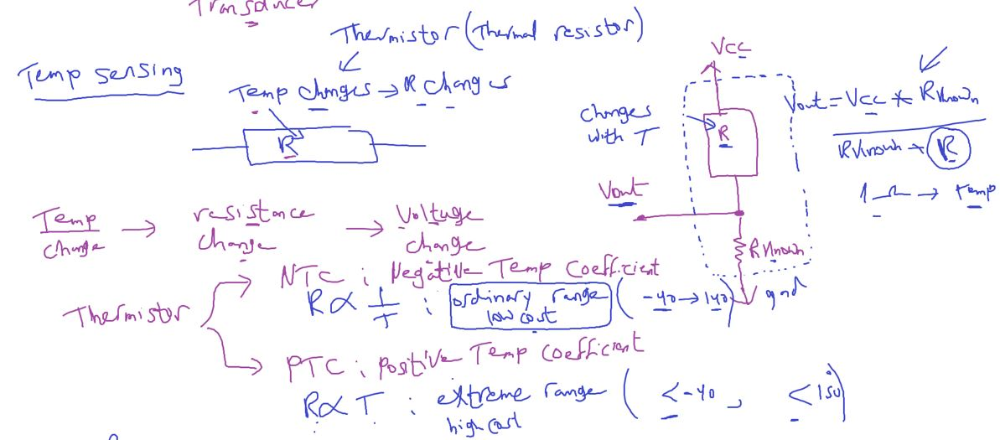

##### LM35 Temperature Sensor

- single ended sensor
- 0 v means 0^o^c
- 10 mv means 1^o^c

  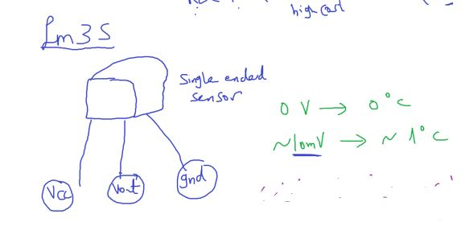

###### LM35 Interfacing

```c
// return digital value from 0 to 255 (8 bit resolution)
// in other words these return digital value that stored in ADC register ADCH and ADCL
GetChannelReading();
```

###### To Get the analog value

- take care to write a correct formula

  - overflow
  - precendence

- analog volt = digital \* step
- analog volt = digital \* Vref / 2 ^res^

**note**: if Vref / 2 ^res^ calculated first always result will be zero

```c
// analog volt = digital * step
```

- casting a constant number like 5 to u32

```c
5UL
```

```c
u8 Volt = (( (u32)digital * 5UL ) / 256UL )
// but this always with integer number
```

```c
u16 MiliVolt = (u16) (( (u32)digital * 5000UL ) / 256UL )
// but this always with integer number
```

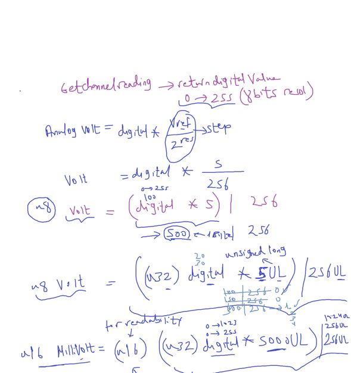

```c
// if resolution is 10 Bits
u16 MiliVolt = (u16) (( (u32)digital * 5000UL ) / 1024UL )
```

###### calculate the temperature

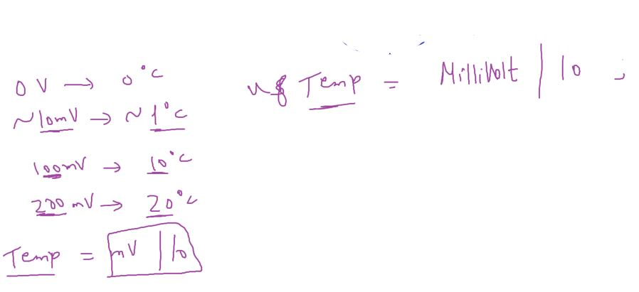

##### what about temperature negative reading LM35(-40 TO 140)

....
bad in lm35

**Obersvation**: if we choose 10 bit resolution and Vref = 5v
step = 5 / 1024 = 19 mv
so min temperature can read is 2^o^c because
1^o^c is 10 mv

```c
// display temperature on LCD
#include "STD_TYPES.h"
#include "DIO_interface.h"
#include "PORT_interface.h"
#include "ADC_interface.h"
#include "CLCD_interface.h"
#include <util/delay.h>
#include "ADC_register.h"
#include "BIT_MATH.h"

u8 ADC_u8GetReading(u8 Copy_u8Channel) {
	ADMUX &= 0b11111000; // clear bits
	ADMUX |= Copy_u8Channel; // select the channel
	// start conversion
	SET_BIT(ADCSRA, ADCSRA_ADSC);
	// Polling until flag raised
	while(GET_BIT(ADCSRA, ADCSRA_ADIF) == 0);
	// clear flag
	SET_BIT(ADCSRA, ADCSRA_ADIF);
	// return reading
	return ADCH;
}

void main()
{
	PORT_voidInit();
	CLCD_voidInit();
	ADC_voidInit();

	u16 miliVolt;

//	u16 * Local_pu8digitalVal = NULL;
	u16 Local_u8digitalVal ;

	while(1)
	{
//		ADC_u8StartConversionSynch(SINGLE_ENDED_ADC0, digitalVal);
//		u16 miliVolt = (u16)(((u32)*digitalVal * 5000UL) / 256UL);

		Local_u8digitalVal = ADC_u8GetReading(SINGLE_ENDED_ADC0);
		u16 miliVolt = (u16)(((u32)Local_u8digitalVal * 5000UL) / 256UL);

		u8 temp = miliVolt / 10;

		CLCD_voidWriteNumber(temp);
		CLCD_voidSendString(" C");
		_delay_ms(200);
		CLCD_voidClearScreen();
	}
}
```

---

#### LDR_interface

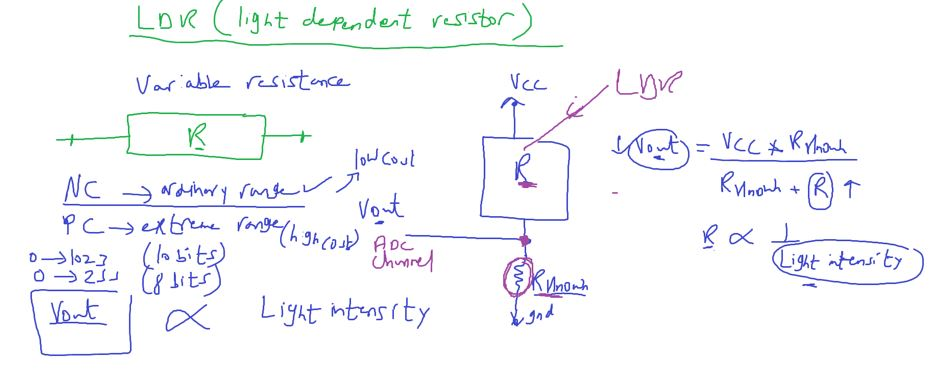

- LDR reading Map with leds app
  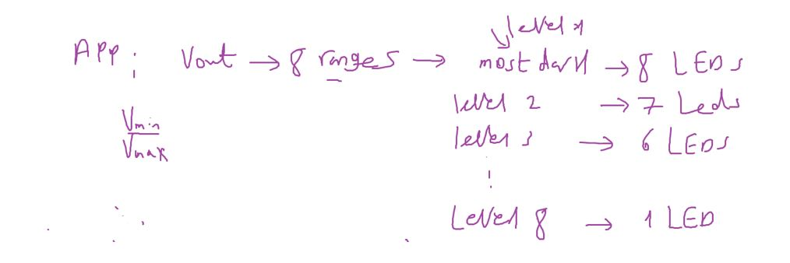

```c
#include "STD_TYPES.h"
#include "DIO_interface.h"
#include "PORT_interface.h"
#include "ADC_interface.h"
#include "CLCD_interface.h"
#include <util/delay.h>

#include "ADC_register.h"
#include "BIT_MATH.h"

u8 ADC_u8GetReading(u8 Copy_u8Channel) {
	ADMUX &= 0b11111000; // clear bits
	ADMUX |= Copy_u8Channel; // select the channel
	// start conversion
	SET_BIT(ADCSRA, ADCSRA_ADSC);
	// Polling until flag raised
	while(GET_BIT(ADCSRA, ADCSRA_ADIF) == 0);
	// clear flag
	SET_BIT(ADCSRA, ADCSRA_ADIF);

	// return reading
#if ADC_RESOLUTION == EIGHT_BIT_RESOLUTION
		return ADCH;
#elif	ADC_RESOLUTION == TEN_BIT_RESOLUTION
	return ADC;
#endif
}

s32 map(s32 Input_min, s32 Input_max, s32 Output_min, s32 Output_max, s32 Input_x)
{
    return (((Output_max - Output_min) * (Input_x - Input_min)) / (Input_max - Input_min)) + Output_min;
}
void main(void)
{
	PORT_voidInit();
	ADC_voidInit();


	while(1)
	{
		u8 Local_u8ADCReading = ADC_u8GetReading(SINGLE_ENDED_ADC0);

		u16 Local_u16LRDMiliVolt = (u16) (( (u32)Local_u8ADCReading * 5000UL) / 256UL);

		u8 output = map(0, 5000, 1, 8, Local_u16LRDMiliVolt);

		switch (output)
		{
			case 1: DIO_u8SetPortValue(DIO_u8PORTB, 0b00000001); break;
			case 2: DIO_u8SetPortValue(DIO_u8PORTB, 0b00000011); break;
			case 3: DIO_u8SetPortValue(DIO_u8PORTB, 0b00000111); break;
			case 4: DIO_u8SetPortValue(DIO_u8PORTB, 0b00001111); break;
			case 5: DIO_u8SetPortValue(DIO_u8PORTB, 0b00011111); break;
			case 6: DIO_u8SetPortValue(DIO_u8PORTB, 0b00111111); break;
			case 7: DIO_u8SetPortValue(DIO_u8PORTB, 0b01111111); break;
			case 8: DIO_u8SetPortValue(DIO_u8PORTB, 0b11111111); break;
			default: DIO_u8SetPortValue(DIO_u8PORTB, 0b00000000); break;
		}

	}
}

```

- Mapping Concept
  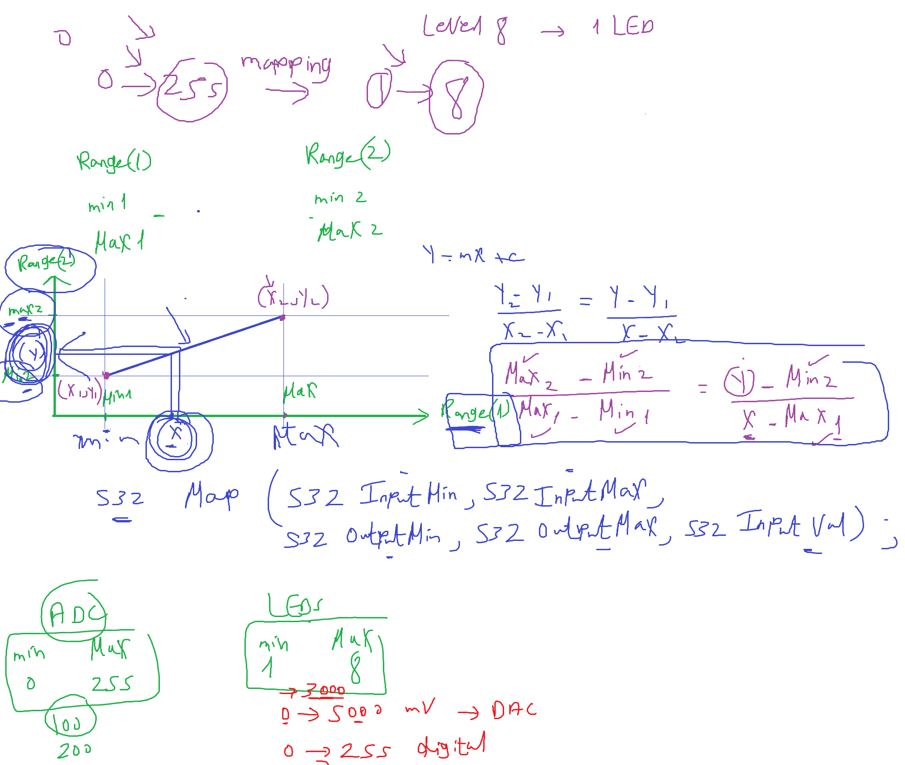

- حل هندسي

  

- حل جبري بانك تجيب معادله الخط المستقيم
  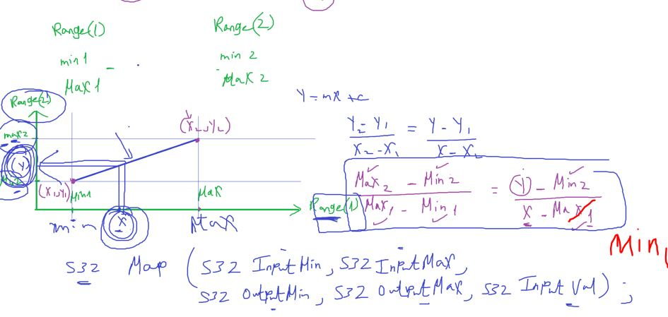

```c
s32 my_map(s32 Input_min, s32 Input_max, s32 Output_min, s32 Output_max, s32 Input_x)
{
    return (((Output_max - Output_min) * (Input_x - Input_min)) / (Input_max - Input_min)) + Output_min;
}
```

---

### ADC Design Concepts

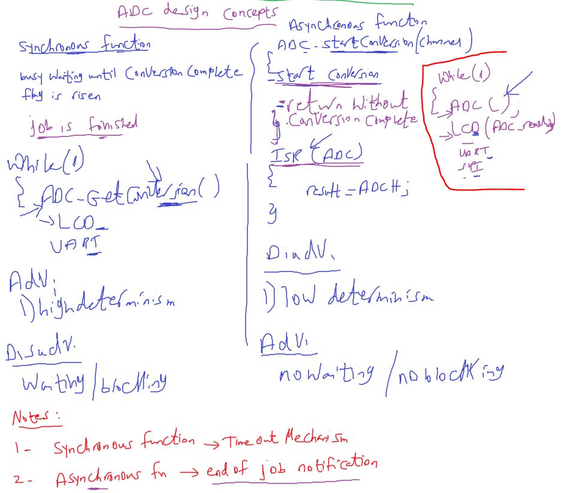

#### Synchronous vs Asynchronous

what if i use asych and send reading to LCD.

- waiting == blocking code to do any thing in this time

**Notes**:

- **Synchronous**: Timeout Mechanism

  - we will not waiting until flag raised
  - may be ADC lates for any reason for example hardware issue

  ```c
  // may be has blocking or NOT
  // this is a synchronous function
  int add(int x , int y)
  {
  	return x + y;
  }
  ```

  - There are different ways to calculate TIMEOUT

  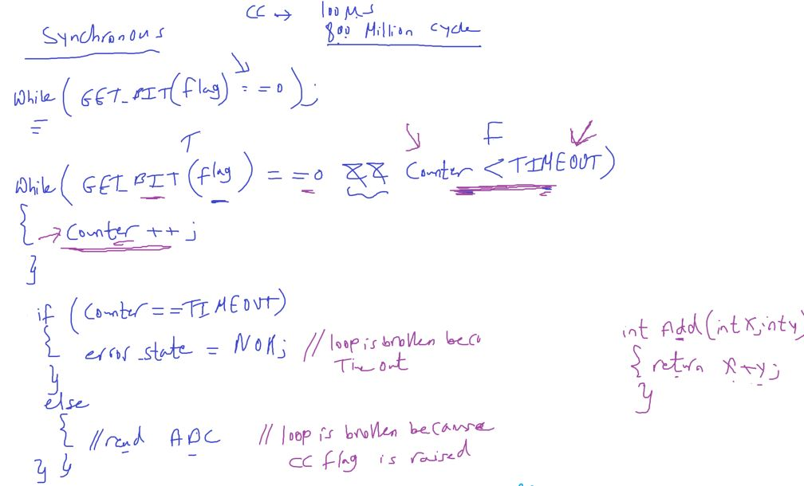

- **Asynchronous**: End of Job Notification

- Interrupt complete the job

Note: software safety : how to notify the user with any software issue can happen

what if we use a Asynchronous function and ADC issue happened the remaining software will continue but we will not know and ISR Will not executed

- Auto Trigger vs Conversion Complete Interrupt
  Auto triiger choose a interrupt source that trigger ADC to make a conversion based on interrupt source event (its flag raised for example EXTI falling edge)

  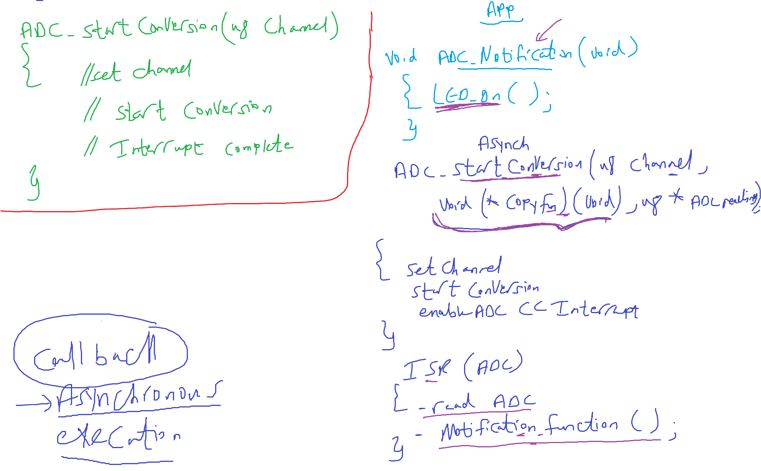

#### What's Better?

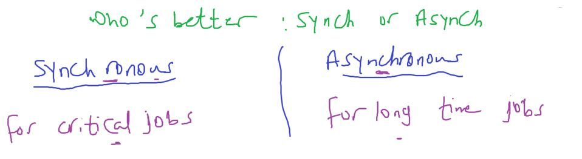
