### Acuoustic Elements

الحاجات اللي بتعمل صوت

#### 1- Speaker

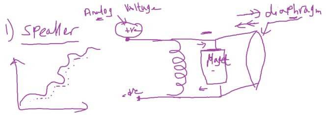

#### 2- Buzzer

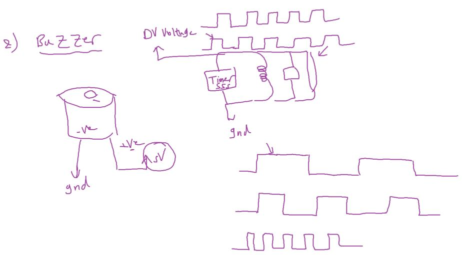
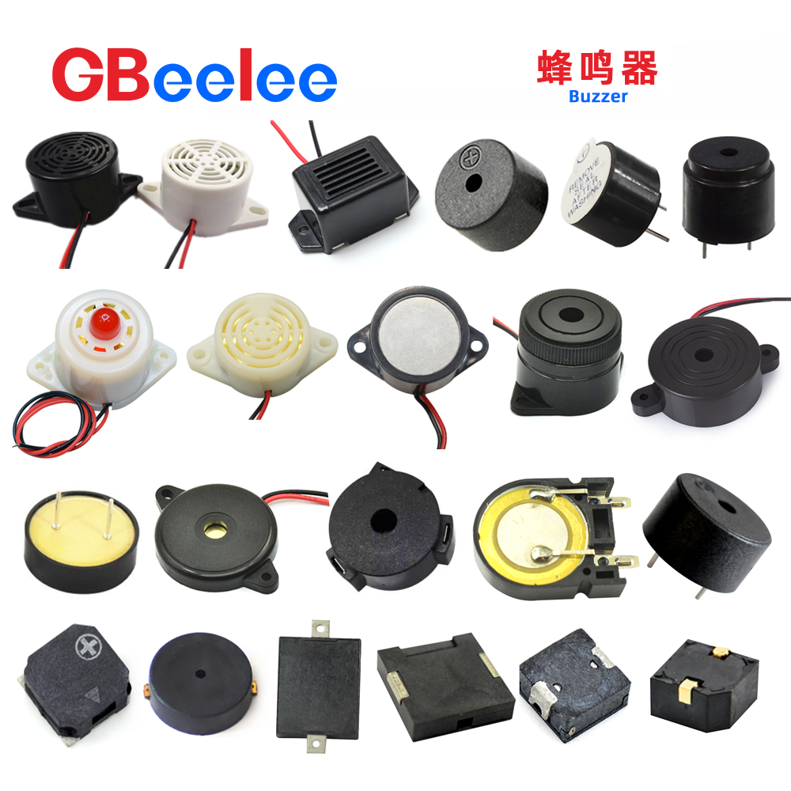

- just one tone with different frequency
- A buzzer is ==a type of transducer== that converts electrical energy into sound waves. It consists of a coil of wire, a magnet, and a diaphragm or a plate. When an electrical signal is applied to the coil, it creates a magnetic field that attracts or repels the magnet, causing the diaphragm to vibrate and produce sound waves.

##### Buzzer Tone Test

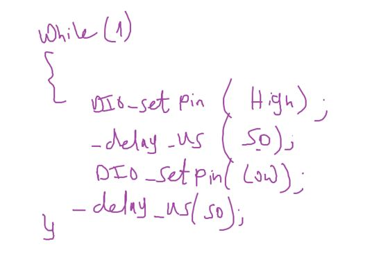

```c
// Nokia 3310 ring
#include "STD_TYPES.h"
#include "DIO_interface.h"
#include "PORT_interface.h"
#include <util/delay.h>

void main()
{
	PORT_voidInit();
	while(1)
	{
		for (u8 i = 0 ; i < 200; i++)
		{
			DIO_u8SetPinValue(DIO_u8PORTC, DIO_u8PIN5, DIO_u8PIN_HIGH);
			_delay_us(100);
			DIO_u8SetPinValue(DIO_u8PORTC, DIO_u8PIN5, DIO_u8PIN_LOW);
			_delay_us(100);
		}
		for (u8 i = 0 ; i < 200; i++)
		{
			DIO_u8SetPinValue(DIO_u8PORTC, DIO_u8PIN5, DIO_u8PIN_HIGH);
			_delay_us(80);
			DIO_u8SetPinValue(DIO_u8PORTC, DIO_u8PIN5, DIO_u8PIN_LOW);
			_delay_us(80);
		}
		for (u8 i = 0 ; i < 200; i++)
		{
			DIO_u8SetPinValue(DIO_u8PORTC, DIO_u8PIN5, DIO_u8PIN_HIGH);
			_delay_us(50);
			DIO_u8SetPinValue(DIO_u8PORTC, DIO_u8PIN5, DIO_u8PIN_LOW);
			_delay_us(50);
		}
	}
}
```

#### Assignment 2


##### Additional Resources

- [Arduino Tone Lib](https://github.com/bhagman/Tone?tab=readme-ov-file#ugly-details)
- [Buzzer vs speaker](https://www.abcomponents.co.uk/buzzer-vs-speaker/)

- [voice recording module](https://www.ram-e-shop.com/shop/kit-isd1820-voice-isd1820-voice-recording-module-speaker-7159?search=speaker&order=name+asc)
- [Buzzer Basics - Technologies, Tones, and Drive Circuits](https://www.sameskydevices.com/blog/buzzer-basics-technologies-tones-and-driving-circuits)

---

## Timers

#### Clock

- Clock is the unit of time for processor
- Period time == clock cycle
- Clock for example is 8 MHz
- means 8 Million clock cycle in second
- 1/8 000 000 = 0.125 usec (زي الثانيه عندنا كده)

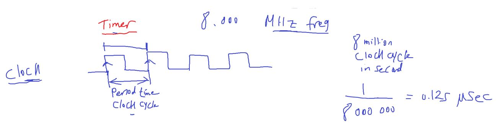

- processor instructions

  - fetch
  - decode
  - execute
  - check interrupt
  - right back
    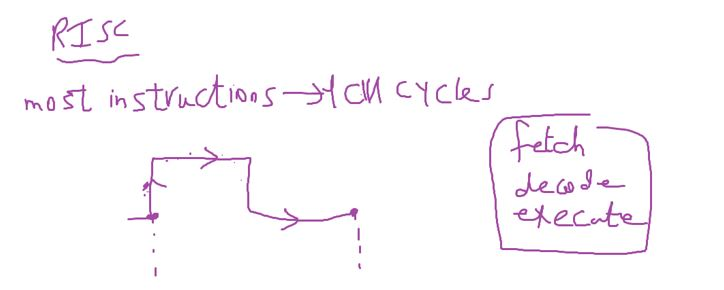
    

#### delay 1 sec

- to make a delay for 1 sec we need to translate this human unit time to no. of clock cycles
  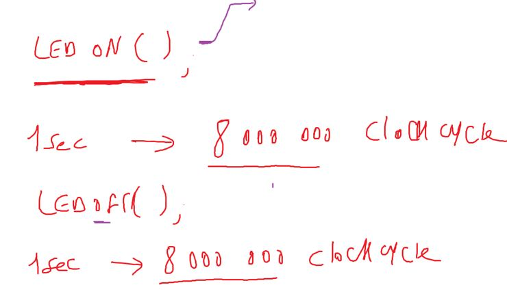

```c
_delay_ms(1000);
_delay_us(1000000);
// these functions help us in this conversion
```

This is a busy waiting way

##### Busy Waiting vs Timer Waiting

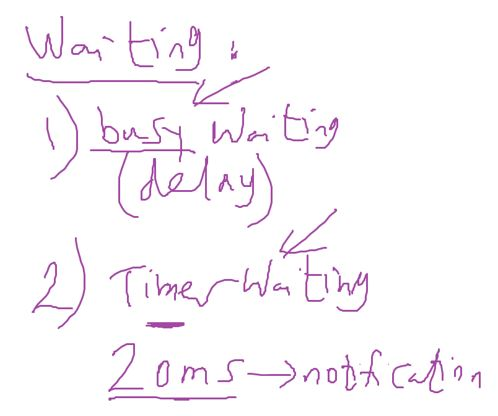

##### Timer(timer counter)

- Counter Mode: value indicates for counts for example no. of switch presses

  - provide a pin to connect the input device for non periodic event counting

- Timer Mode: value indcates for time because it counts clock cycles and we know clock cycle time


- ATmega32 define system clock the external not the internal

---

#### Some Definitions to understand how timer works

overflow inituation : timer has a for example 8 bits register so it counts until 255 and will overflow after that
at overflow event timer peripheral can generate interrupt called overflow interrupt

#### 1- Tick Time

it is the time unit of the timer

#### 2- Overflow Time


#### 3- Required Time

has 3 cases
1- Equal to overflow time
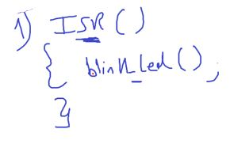
2- Greater than overflow time
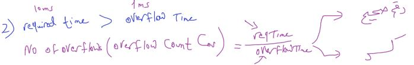

- no of overflow count (C~ov~)
- C~ov~ can be integer
  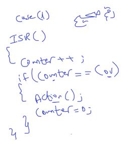

- C~ov~ can be decimal or float

  - Perload value
    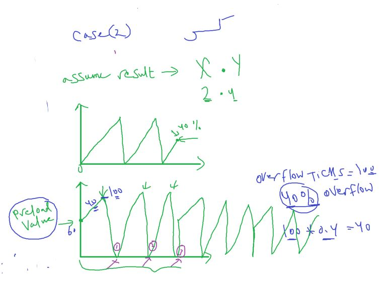
    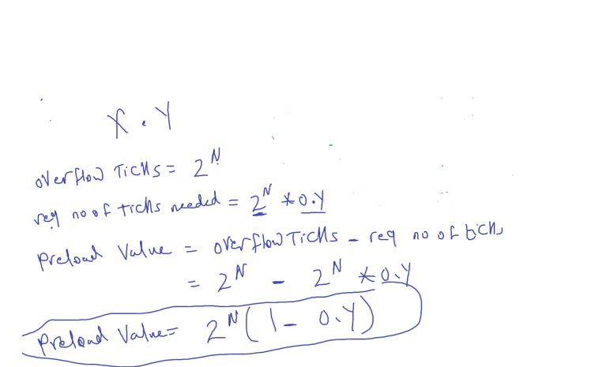

- so ISR

  - load preload value in timer register
    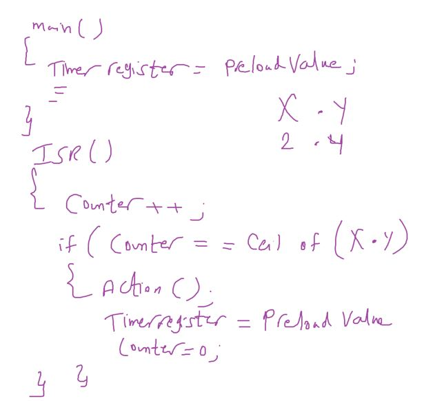

###### Example1

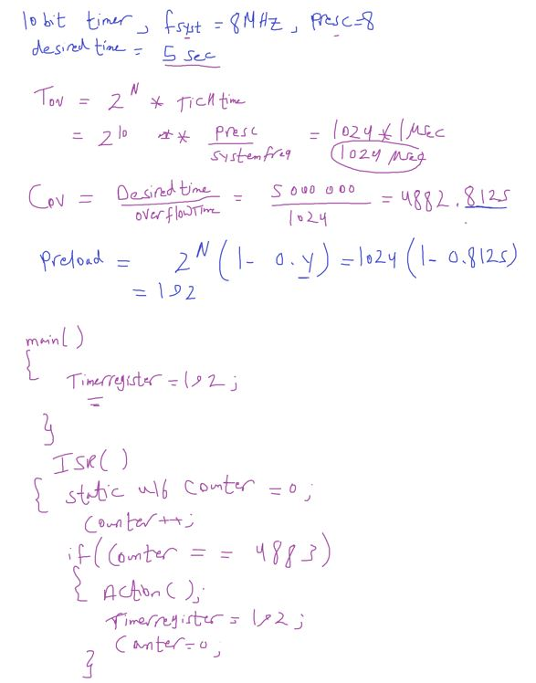

###### Example2

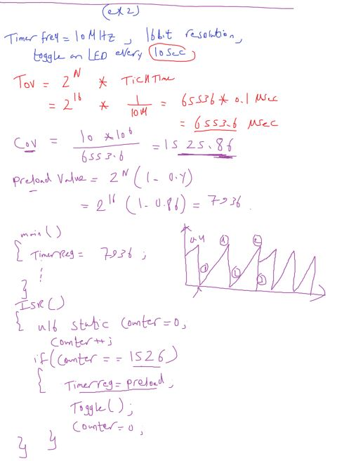

3- Less than overflow time
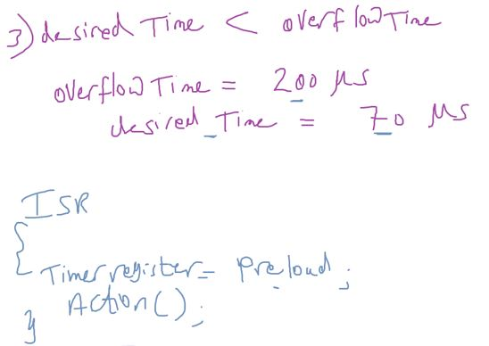

---

#### Timers Types

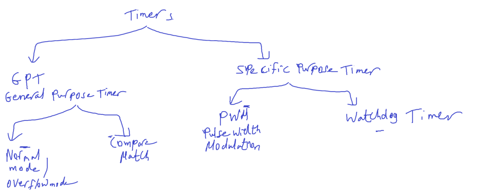

##### Normal / Overflow Mode

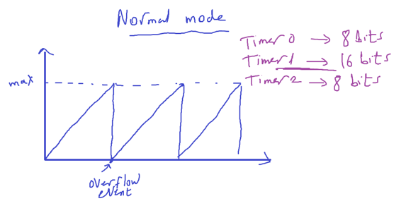

Timer/Counter Control
Register – TCCR0

- WGM01, WGM00 Waveform Generation Mode
- CS02, CSM01, CSM00 Clock source

Last 2 options for counter mode

##### Compare Match Mode

Intuition: make calculations easier by neglecting preload value calculation but also decrease time of ISR or Interrupt fires

- compare match value is a configurable value
  and timer generates Interrupt at this event

- But MCUs have different behaviors after compare match event occurs, some MCUs continue after Compare Match and others MCUs clears at Compare Match.

- In ATMega32 we have 2 behavious in diferent modes
  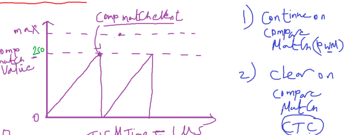

###### At the compare match event

1. Interrupt
2. Action on OC0 pin
   1. set (high)
   2. clear (low)
   3. toggle (flip)

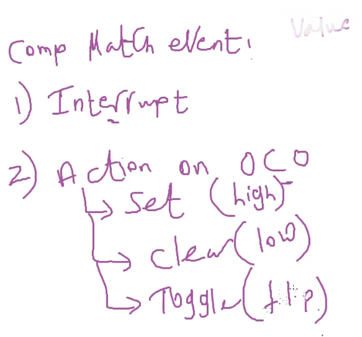

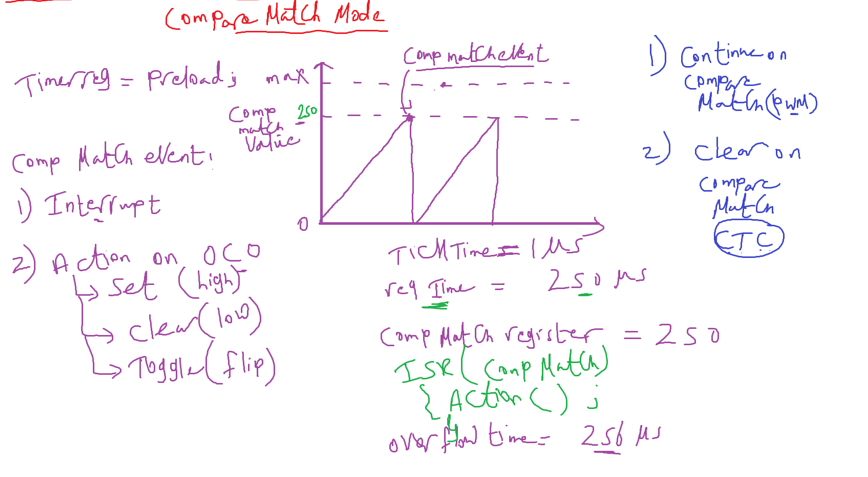

###### Example

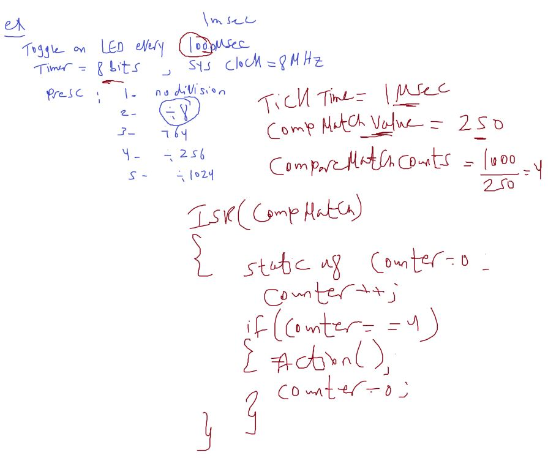

Note: here is we write Compare match value only once in its register, Not every time (after counter clears) like normal mode we rewrite preload value in ISR

- FOC0 Bit Force Output Compare
- make compare match event now by software
- uses for testing

###### App

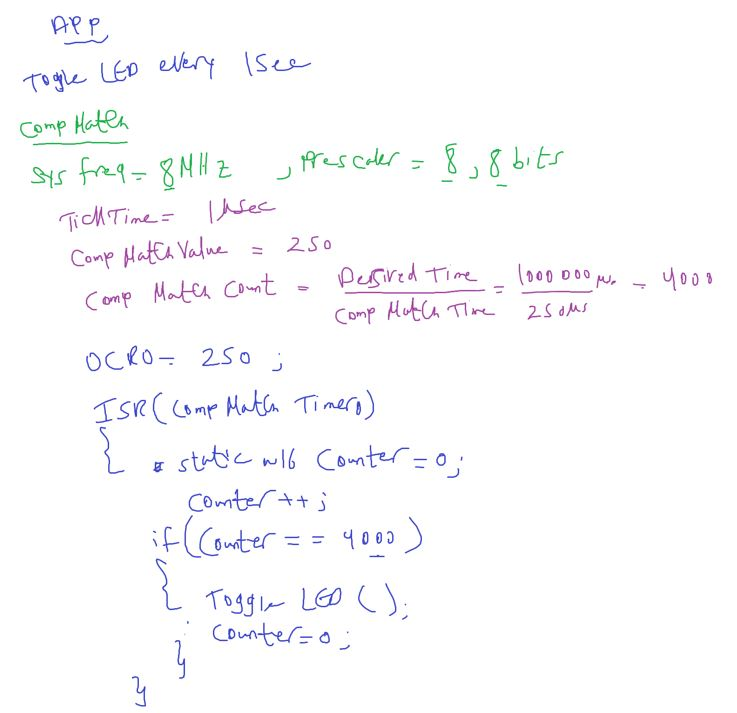

- Observation: It's better to minimize the counter value
  - for example: choose another prescaler like 64
- 4000 is too much and will not make system determinstic
- or system enters in interrupt saturation

```
لو التايم بتاع اللي بيجي في الايفينت قليل مثلا 1ميكرو السيستم هيقعد ينفذ في الاياسار  طول عمره
```

- **Observation**: in ATMega32 for Timer0 has more than interrupt source overflow or compare match
  each interrupt source in the same peripheral has its own ISR

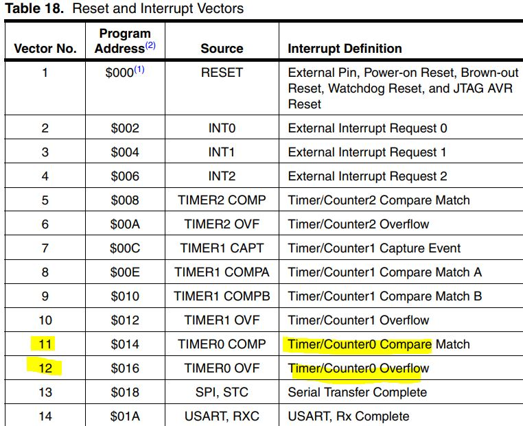

```c
// toggle led by timer waiting

#include "STD_TYPES.h"
#include "DIO_interface.h"
#include "PORT_interface.h"
#include "GIE_interface.h"
#include "TIMER_interface.h"
#include "LED_interface.h"

LED_t Local_led_tRedLed = {DIO_u8PORTC, DIO_u8PIN0, LED_CONN_SRC};

void TIMER0_ISR(void);

void main(void)
{
	PORT_voidInit();

	TIMER0_voidInit();
	TIMER0_u8SetCallBack(&TIMER0_ISR);
	TIMER0_voidSetCompMatchValue(250);

	GIE_voidEnable();
	while(1)
	{
	}
}

void TIMER0_ISR(void)
{
	static u16 counter = 0;
	if(counter == 4000)
	{
		LED_u8Toggle(&Local_led_tRedLed);
		counter = 0;
	}
	counter ++;
}
```

##### Assignment

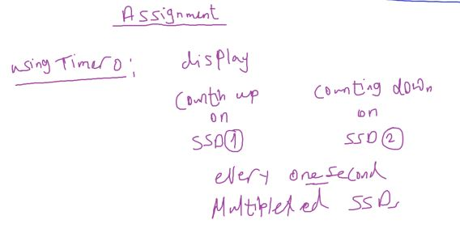

- use Timer0 to generate frequency of opening / closing 7-segs
- and also to increment or decrement every 1 sec

---

#### ADC Chain Conversion Implementation

```c
u8 ADC_u8StartChainConversionAsynch(){

}
```

---

#### Reentrant vs Non-Reentrant

```
هل الفانكشن دي لو اتقطعت `اكيد من انترابت` واتنادت من اللي قطعها هل الفانكشن هتشتغل مظبوط ولا لا ؟
```
