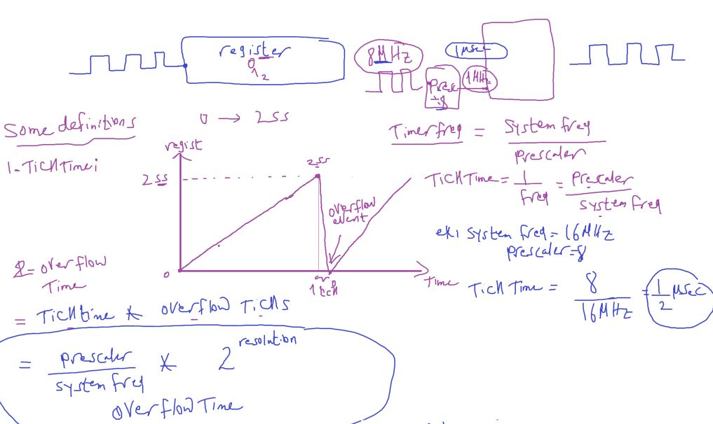

### Acuoustic Elements

الحاجات اللي بتعمل صوت

#### 1- Speaker


#### 2- Buzzer


- just one tone with different frequency
- A buzzer is ==a type of transducer== that converts electrical energy into sound waves. It consists of a coil of wire, a magnet, and a diaphragm or a plate. When an electrical signal is applied to the coil, it creates a magnetic field that attracts or repels the magnet, causing the diaphragm to vibrate and produce sound waves.

##### Buzzer Tone Test


```c
// Nokia 3310 ring
#include "STD_TYPES.h"
#include "DIO_interface.h"
#include "PORT_interface.h"
#include <util/delay.h>

void main()
{
	PORT_voidInit();
	while(1)
	{
		for (u8 i = 0 ; i < 200; i++)
		{
			DIO_u8SetPinValue(DIO_u8PORTC, DIO_u8PIN5, DIO_u8PIN_HIGH);
			_delay_us(100);
			DIO_u8SetPinValue(DIO_u8PORTC, DIO_u8PIN5, DIO_u8PIN_LOW);
			_delay_us(100);
		}
		for (u8 i = 0 ; i < 200; i++)
		{
			DIO_u8SetPinValue(DIO_u8PORTC, DIO_u8PIN5, DIO_u8PIN_HIGH);
			_delay_us(80);
			DIO_u8SetPinValue(DIO_u8PORTC, DIO_u8PIN5, DIO_u8PIN_LOW);
			_delay_us(80);
		}
		for (u8 i = 0 ; i < 200; i++)
		{
			DIO_u8SetPinValue(DIO_u8PORTC, DIO_u8PIN5, DIO_u8PIN_HIGH);
			_delay_us(50);
			DIO_u8SetPinValue(DIO_u8PORTC, DIO_u8PIN5, DIO_u8PIN_LOW);
			_delay_us(50);
		}
	}
}
```

#### Assignment 2


##### Additional Resources

- [Arduino Tone Lib](https://github.com/bhagman/Tone?tab=readme-ov-file#ugly-details)
- [Buzzer vs speaker](https://www.abcomponents.co.uk/buzzer-vs-speaker/)

- [voice recording module](https://www.ram-e-shop.com/shop/kit-isd1820-voice-isd1820-voice-recording-module-speaker-7159?search=speaker&order=name+asc)
- [Buzzer Basics - Technologies, Tones, and Drive Circuits](https://www.sameskydevices.com/blog/buzzer-basics-technologies-tones-and-driving-circuits)

---

## Timers

#### Clock

- Clock is the unit of time for processor
- Period time == clock cycle
- Clock for example is 8 MHz
- means 8 Million clock cycle in second
- 1/8 000 000 = 0.125 usec (زي الثانيه عندنا كده)


- processor instructions

  - fetch
  - decode
  - execute
  - check interrupt
  - right back
    
    

#### delay 1 sec

- to make a delay for 1 sec we need to translate this human unit time to no. of clock cycles
  

```c
_delay_ms(1000);
_delay_us(1000000);
// these functions help us in this conversion
```

This is a busy waiting way

##### Busy Waiting vs Timer Waiting


##### Timer(timer counter)

- Counter Mode: value indicates for counts for example no. of switch presses

  - provide a pin to connect the input device for non periodic event counting

- Timer Mode: value indcates for time because it counts clock cycles and we know clock cycle time


- ATmega32 define system clock the external not the internal

---

#### Some Definitions to understand how timer works

overflow inituation : timer has a for example 8 bits register so it counts until 255 and will overflow after that
at overflow event timer peripheral can generate interrupt called overflow interrupt

#### 1- Tick Time

it is the time unit of the timer

#### 2- Overflow Time



#### 3- Required Time

has 3 cases
1- Equal to overflow time

2- Greater than overflow time


- no of overflow count (C~ov~)
- C~ov~ can be integer
  

- C~ov~ can be decimal or float

  - Perload value
    
    

- so ISR

  - load preload value in timer register
    

###### Example1


###### Example2


3- Less than overflow time


---

#### Timers Types


##### Normal / Overflow Mode


Timer/Counter Control
Register – TCCR0

- WGM01, WGM00 Waveform Generation Mode
- CS02, CSM01, CSM00 Clock source

Last 2 options for counter mode

##### Compare Match Mode

Intuition: make calculations easier by neglecting preload value calculation but also decrease time of ISR or Interrupt fires

- compare match value is a configurable value
  and timer generates Interrupt at this event

- But MCUs have different behaviors after compare match event occurs, some MCUs continue after Compare Match and others MCUs clears at Compare Match.

- In ATMega32 we have 2 behavious in diferent modes
  

###### At the compare match event

1. Interrupt
2. Action on OC0 pin
   1. set (high)
   2. clear (low)
   3. toggle (flip)


###### Example


Note: here is we write Compare match value only once in its register, Not every time (after counter clears) like normal mode we rewrite preload value in ISR

- FOC0 Bit Force Output Compare
- make compare match event now by software
- uses for testing

###### App


- Observation: It's better to minimize the counter value
  - for example: choose another prescaler like 64
- 4000 is too much and will not make system determinstic
- or system enters in interrupt saturation

```
لو التايم بتاع اللي بيجي في الايفينت قليل مثلا 1ميكرو السيستم هيقعد ينفذ في الاياسار  طول عمره
```

- **Observation**: in ATMega32 for Timer0 has more than interrupt source overflow or compare match
  each interrupt source in the same peripheral has its own ISR


```c
// toggle led by timer waiting

#include "STD_TYPES.h"
#include "DIO_interface.h"
#include "PORT_interface.h"
#include "GIE_interface.h"
#include "TIMER_interface.h"
#include "LED_interface.h"

LED_t Local_led_tRedLed = {DIO_u8PORTC, DIO_u8PIN0, LED_CONN_SRC};

void TIMER0_ISR(void);

void main(void)
{
	PORT_voidInit();

	TIMER0_voidInit();
	TIMER0_u8SetCallBack(&TIMER0_ISR);
	TIMER0_voidSetCompMatchValue(250);

	GIE_voidEnable();
	while(1)
	{
	}
}

void TIMER0_ISR(void)
{
	static u16 counter = 0;
	if(counter == 4000)
	{
		LED_u8Toggle(&Local_led_tRedLed);
		counter = 0;
	}
	counter ++;
}
```

##### Assignment


- use Timer0 to generate frequency of opening / closing 7-segs
- and also to increment or decrement every 1 sec

---

- Timer 2 session

#### ADC Chain Conversion Implementation

```c
u8 ADC_u8StartChainConversionAsynch() {

}
```

- this concept also in communication protocols
  like sending array or buffer as Asynch way

---

#### Reentrant vs Non-Reentrant

```
هل الفانكشن دي لو اتقطعت `اكيد من انترابت` واتنادت من اللي قطعها هل الفانكشن هتشتغل مظبوط ولا لا ؟
```


- Non-reentrant Example: Function changes a global var
  - Read(Load) Modify Write Assembly operations

```c
int GVAR = 5;

void main()
{
	func();
	// interupted after laod or add or store instruction, will not read the new data as changed by func called within ISR
	// because it always read from its stored GPRs
	// always be 15 even if changed with func called within ISR
}

void func()
{
	GVAR += 10;
}

ISR()
{
	func();
}
```


###### NON-REENTRANT FUNCTIONS

- any function access a global var is non-reentrant
  - Global variable in SW
  - global in HW called shared resource
    - for example in ADC_startChainConversion if we not added busy concept it will be non-reentrant
- any function call a non-reentrant function is non-reentrant

---

#### Timer Types


- general because can be used in any application

#### SPT `->` Watch dog

بيفضل نايم كده لو حد جه جمبه بيهوهو او اسف يرسيت

#### PWM (Pulse Width Modulation)

###### Intuation, Why do we need PWM?

- LED intensity control or motor control, etc
  - DAC peripheral or external circuit
  - control signal duty cycle (PWM) similiar POV(Persistence of vision) concept with Mux-SevenSegement
    - ويكأننا بنطلع انالوج فولت


##### Square Wave Parameters

- Amplitude:
- Period Time:
- Frequency
- On Time, Off Time
- Duty Cycle
- RMS (Effective Power): `Amplitude * sqrt(Duty Cycle)`
  

#### Functions of PWM

1- Load Control
2- Away of communication

- Communication Protocols(UART,etc)

  - ICU (Input Capture Unit) read message by reading signal Duty Cycle, Frequency
  - DC Coverters(Buck , Boost, Buck Boost, etc)
  - Stepper Motor drivers - Servo Motor

  

#### How can we generate PWM Signal from our MCU?

2 ways to generete PWM


1. SW
   1. Busy waiting
   2. GPT: Normal Mode or Compare Match Mode
2. HW
   1. IC Timer 555, with a specific resistor and capacitor to specify the freq and Duty cycle
   2. Timer has PWM mode: just set the parameters and peripheral generate the PWM signal

#### WHAT is Better? SW PWM or HW PWM


- LOW Accurracy due to interrupt latency

#### SW PWM

- Example: out this signal to led
  - POV range: 50Hz to 70Hz
  - so we will NOT notice that led turn off
    

```
Compare Match Time = Tick Time * Compare Match value(Ticks) or OCR0
```

- I need ISR to come every 5ms (5000us)
- Let's check if i possible
- compare match value = 50000 us/ 8us = 625
- OCR0 is 8bit
- Let's try 1 ms because 5ms is divisable by 1
- compare match value = 1000 us/ 8us = 125
- done it's valid

#### solution


- Lab: generate 3 PWM waves on 3 different Red LEd with resistor to reduce Power
  - to be able to see LED intenisty
    

#### HW PWM

here is we tell MCU signal paramters (Frequency, Duty Cycle) and MCU gener the signal on Timer Pin(OC`x`)

2 ways to generate a HW PWM signal

1. Fast PWM
2. Phase Correct

##### 1- Fast PWM

here we continue on Comapare Match Not Clear and also generate event at MAX value called Top event


##### Two Actions can happened on Timer Pin at these 2 events

###### 1- Clear(Pin Low) on Top, Set on compare (Inverted Mode)


- `Observation`: changing **period time** effected only by prescaler

###### 2- Set on Top, Clear on compare(Non-Inverted Mode)


###### Lab:

- generte a PWM signal by HW(Fast PWM, Non-inverted Mode)


---

##### 2- Phase Correct
