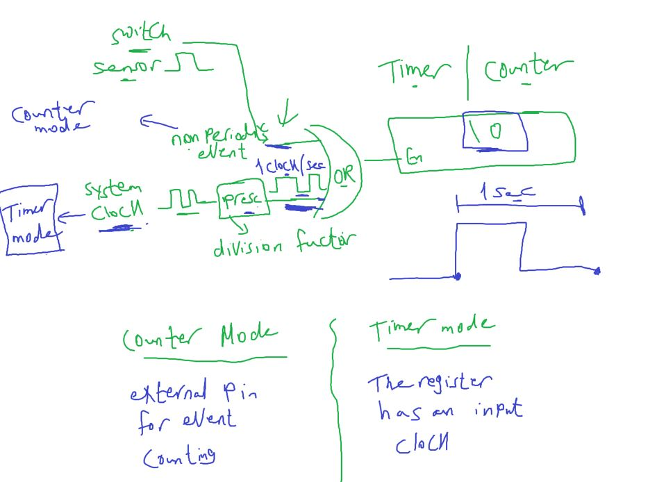
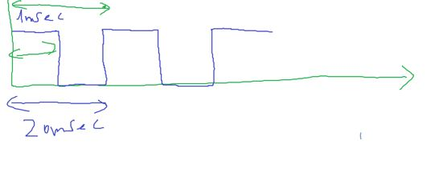
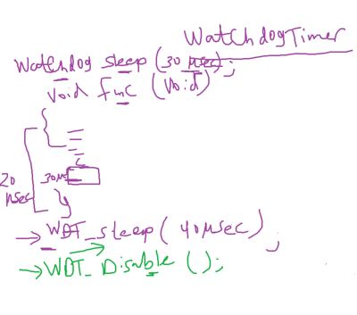
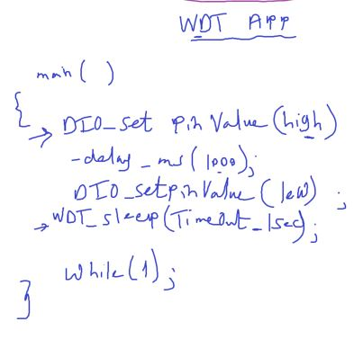

### Acuoustic Elements

الحاجات اللي بتعمل صوت

#### 1- Speaker


#### 2- Buzzer


- just one tone with different frequency
- A buzzer is ==a type of transducer== that converts electrical energy into sound waves. It consists of a coil of wire, a magnet, and a diaphragm or a plate. When an electrical signal is applied to the coil, it creates a magnetic field that attracts or repels the magnet, causing the diaphragm to vibrate and produce sound waves.

##### Buzzer Tone Test


```c
// Nokia 3310 ring
#include "STD_TYPES.h"
#include "DIO_interface.h"
#include "PORT_interface.h"
#include <util/delay.h>

void main()
{
	PORT_voidInit();
	while(1)
	{
		for (u8 i = 0 ; i < 200; i++)
		{
			DIO_u8SetPinValue(DIO_u8PORTC, DIO_u8PIN5, DIO_u8PIN_HIGH);
			_delay_us(100);
			DIO_u8SetPinValue(DIO_u8PORTC, DIO_u8PIN5, DIO_u8PIN_LOW);
			_delay_us(100);
		}
		for (u8 i = 0 ; i < 200; i++)
		{
			DIO_u8SetPinValue(DIO_u8PORTC, DIO_u8PIN5, DIO_u8PIN_HIGH);
			_delay_us(80);
			DIO_u8SetPinValue(DIO_u8PORTC, DIO_u8PIN5, DIO_u8PIN_LOW);
			_delay_us(80);
		}
		for (u8 i = 0 ; i < 200; i++)
		{
			DIO_u8SetPinValue(DIO_u8PORTC, DIO_u8PIN5, DIO_u8PIN_HIGH);
			_delay_us(50);
			DIO_u8SetPinValue(DIO_u8PORTC, DIO_u8PIN5, DIO_u8PIN_LOW);
			_delay_us(50);
		}
	}
}
```

#### Assignment 2


##### Additional Resources

- [Arduino Tone Lib](https://github.com/bhagman/Tone?tab=readme-ov-file#ugly-details)
- [Buzzer vs speaker](https://www.abcomponents.co.uk/buzzer-vs-speaker/)

- [voice recording module](https://www.ram-e-shop.com/shop/kit-isd1820-voice-isd1820-voice-recording-module-speaker-7159?search=speaker&order=name+asc)
- [Buzzer Basics - Technologies, Tones, and Drive Circuits](https://www.sameskydevices.com/blog/buzzer-basics-technologies-tones-and-driving-circuits)

---

## Timers

#### Clock

- Clock is the unit of time for processor
- Period time == clock cycle
- Clock for example is 8 MHz
- means 8 Million clock cycle in second
- 1/8 000 000 = 0.125 usec (زي الثانيه عندنا كده)


- processor instructions

  - fetch
  - decode
  - execute
  - check interrupt
  - right back
    
    

#### delay 1 sec

- to make a delay for 1 sec we need to translate this human unit time to no. of clock cycles
  

```c
_delay_ms(1000);
_delay_us(1000000);
// these functions help us in this conversion
```

This is a busy waiting way

##### Busy Waiting vs Timer Waiting


##### Timer(timer counter)

- Counter Mode: value indicates for counts for example no. of switch presses

  - provide a pin to connect the input device for non periodic event counting

- Timer Mode: value indcates for time because it counts clock cycles and we know clock cycle time



- ATmega32 define system clock the external not the internal

---

#### Some Definitions to understand how timer works

overflow inituation : timer has a for example 8 bits register so it counts until 255 and will overflow after that
at overflow event timer peripheral can generate interrupt called overflow interrupt

#### 1- Tick Time

it is the time unit of the timer

#### 2- Overflow Time


#### 3- Required Time

has 3 cases
1- Equal to overflow time

2- Greater than overflow time


- no of overflow count (C~ov~)
- C~ov~ can be integer
  

- C~ov~ can be decimal or float

  - Perload value
    
    

- so ISR

  - load preload value in timer register
    

###### Example1


###### Example2


3- Less than overflow time


---

#### Timers Types


##### Normal / Overflow Mode


Timer/Counter Control
Register – TCCR0

- WGM01, WGM00 Waveform Generation Mode
- CS02, CSM01, CSM00 Clock source

Last 2 options for counter mode

##### Compare Match Mode

Intuition: make calculations easier by neglecting preload value calculation but also decrease time of ISR or Interrupt fires

- compare match value is a configurable value
  and timer generates Interrupt at this event

- But MCUs have different behaviors after compare match event occurs, some MCUs continue after Compare Match and others MCUs clears at Compare Match.

- In ATMega32 we have 2 behavious in diferent modes
  

###### At the compare match event

1. Interrupt
2. Action on OC0 pin
   1. set (high)
   2. clear (low)
   3. toggle (flip)


###### Example


Note: here is we write Compare match value only once in its register, Not every time (after counter clears) like normal mode we rewrite preload value in ISR

- FOC0 Bit Force Output Compare
- make compare match event now by software
- uses for testing

###### App


- Observation: It's better to minimize the counter value
  - for example: choose another prescaler like 64
- 4000 is too much and will not make system determinstic
- or system enters in interrupt saturation

```
لو التايم بتاع اللي بيجي في الايفينت قليل مثلا 1ميكرو السيستم هيقعد ينفذ في الاياسار  طول عمره
```

- **Observation**: in ATMega32 for Timer0 has more than interrupt source overflow or compare match
  each interrupt source in the same peripheral has its own ISR


```c
// toggle led by timer waiting

#include "STD_TYPES.h"
#include "DIO_interface.h"
#include "PORT_interface.h"
#include "GIE_interface.h"
#include "TIMER_interface.h"
#include "LED_interface.h"

LED_t Local_led_tRedLed = {DIO_u8PORTC, DIO_u8PIN0, LED_CONN_SRC};

void TIMER0_ISR(void);

void main(void)
{
	PORT_voidInit();

	TIMER0_voidInit();
	TIMER0_u8SetCallBack(&TIMER0_ISR);
	TIMER0_voidSetCompMatchValue(250);

	GIE_voidEnable();
	while(1)
	{
	}
}

void TIMER0_ISR(void)
{
	static u16 counter = 0;
	if(counter == 4000)
	{
		LED_u8Toggle(&Local_led_tRedLed);
		counter = 0;
	}
	counter ++;
}
```

##### Assignment


- use Timer0 to generate frequency of opening / closing 7-segs
- and also to increment or decrement every 1 sec

---

- Timer 2 session

#### ADC Chain Conversion Implementation

```c
u8 ADC_u8StartChainConversionAsynch() {

}
```

- this concept also in communication protocols
  like sending array or buffer as Asynch way

---

#### Reentrant vs Non-Reentrant

```
هل الفانكشن دي لو اتقطعت `اكيد من انترابت` واتنادت من اللي قطعها هل الفانكشن هتشتغل مظبوط ولا لا ؟
```


- Non-reentrant Example: Function changes a global var
  - Read(Load) Modify Write Assembly operations

```c
int GVAR = 5;

void main()
{
	func();
	// interupted after laod or add or store instruction, will not read the new data as changed by func called within ISR
	// because it always read from its stored GPRs
	// always be 15 even if changed with func called within ISR
}

void func()
{
	GVAR += 10;
}

ISR()
{
	func();
}
```


###### NON-REENTRANT FUNCTIONS

- any function access a global var is non-reentrant
  - Global variable in SW
  - global in HW called shared resource
    - for example in ADC_startChainConversion if we not added busy concept it will be non-reentrant
- any function call a non-reentrant function is non-reentrant

---

#### Timer Types


- general because can be used in any application

#### SPT `->` Watch dog

بيفضل نايم كده لو حد جه جمبه بيهوهو او اسف يرسيت

#### PWM (Pulse Width Modulation)

###### Intuation, Why do we need PWM?

- LED intensity control or motor control, etc
  - DAC peripheral or external circuit
  - control signal duty cycle (PWM) similiar POV(Persistence of vision) concept with Mux-SevenSegement
    - ويكأننا بنطلع انالوج فولت


##### Square Wave Parameters

- Amplitude:
- Period Time:
- Frequency
- On Time, Off Time
- Duty Cycle
- RMS (Effective Power): `Amplitude * sqrt(Duty Cycle)`
  

#### Functions of PWM

1- Load Control
2- Away of communication

- Communication Protocols(UART,etc)

  - ICU (Input Capture Unit) read message by reading signal Duty Cycle, Frequency
  - DC Coverters(Buck , Boost, Buck Boost, etc)
  - Stepper Motor drivers - Servo Motor

  

#### How can we generate PWM Signal from our MCU?

2 ways to generete PWM


1. SW
   1. Busy waiting
   2. GPT: Normal Mode or Compare Match Mode
2. HW
   1. IC Timer 555, with a specific resistor and capacitor to specify the freq and Duty cycle
   2. Timer has PWM mode: just set the parameters and peripheral generate the PWM signal

#### WHAT is Better? SW PWM or HW PWM


- LOW Accurracy due to interrupt latency

#### SW PWM

- Example: out this signal to led
  - POV range: 50Hz to 70Hz
  - so we will NOT notice that led turn off
    

```
Compare Match Time = Tick Time * Compare Match value(Ticks) or OCR0
```

- I need ISR to come every 5ms (5000us)
- Let's check if i possible
- compare match value = 50000 us/ 8us = 625
- OCR0 is 8bit
- Let's try 1 ms because 5ms is divisable by 1
- compare match value = 1000 us/ 8us = 125
- done it's valid

#### solution


- Lab: generate 3 PWM waves on 3 different Red LEd with resistor to reduce Power
  - to be able to see LED intenisty
    

#### HW PWM

here is we tell MCU signal paramters (Frequency, Duty Cycle) and MCU gener the signal on Timer Pin(OC`x`)

2 ways to generate a HW PWM signal

1. Fast PWM
2. Phase Correct

##### 1- Fast PWM

here we continue on Comapare Match Not Clear and also generate event at MAX value called Top event


##### Two Actions can happened on Timer Pin at these 2 events

###### 1- Clear(Pin Low) on Top, Set on compare (Inverted Mode)


- `Observation`: changing **period time** effected only by prescaler

###### 2- Set on Top, Clear on compare(Non-Inverted Mode)


###### Lab:

- generte a PWM signal by HW(Fast PWM, Non-inverted Mode)


- overflow time = tick time `*` overflow ticks(255)
  - 255 NOT 256 because the tick through clearing counter between 255 and 0

---

#### 2- Phase Correct

- at top timer downcounting
  

- 2 actions on timer pin OCx
- 1 - set on comp match at up counting, clear on comp match at down counting
- 2 - clear on comp match at up counting, set on comp match at down counting

  
  

- observation: phase correct mode for low speed signals

---

### PWM as a way of communication

#### SERVO Motor

- DC Motor uncontrolable with extra HW
- Stepper Motor: High power consuming
  - Does't have feedback
- adding feedback element: encoder or potentiometer
  
  
- error correction circuit: can be comparater

- servo motor is just a motor(DC/Stepper) has internal feedback element or circuit:

- Note: servo == Feedback
- SERVO Operating principle
  

- SERVO Types
- Limiting
  - has piece of iron that limit it to rotate more than 180
  - also working principle prevent it
- No Angle Control (in direct way)
- Absolute position (so if u want motor goes to 20 deg give it 20 even if motor in any position)

#### Limitng Interface


- Apply signal continous to get breaking feature

#### Continious servo Interface

## 

- Limiting Servo use pot with ADC
  - more accurate
  - but limited angle 180 deg
  - pot is cheaper
- Continious Servo uses encoder
  - continous range

#### SERVO VS STEPPER VS DC MOTOR


---

#### Generating PWM Signal to Limiting Servo

- Req: Period Time: 20ms
  On Time: 1 to 2ms
  1ms for 0 deg, 2ms for 180 deg
  

- **Try1**
- generating PWM can be by SW or HW
- Let's try SW way using Timer0 Compare Match Mode(CTC)
- we know the ON time is (1 -2)ms
- Let's choose ISR to come every 0.5ms
  - but this makes resolution to 90 deg, only able to go to Angles: 0 , 90, 180 deg
- this lead us to reduce time ISR comes to 1us and this causes an interrupt saturation

- **Try2**: Fast PWM mode for Timer 0r Timer2 (8bit)
- 1- period time = overflow time = 20ms
- select a prescaller to achieve this period time
- option 1: NO Division
  - `overflow time = prescaler/ system clock `\*` overflow ticks`
  - overflow time = 1/8us `*` 255 = 32us -> So Invalid
- option 2: Division by 8
  - overflow time = 1us `*` 255 = 0.25 ms -> So Invalid
- option 3: Division by 64
  - overflow time = 8us `*` 255 = 2 ms -> So Invalid
- option 4: Division by 256
  - overflow time = 32us `*` 255 = 8 ms -> So Invalid
- option 5: Division by 1024

  - overflow time = 128us `*` 255 = 32ms -> So Invalid

- **Try3**: Fast PWM mode for Timer1 (16 bit)
- 1- period time = overflow time = 20ms
- select a prescaller to achieve this period time
- option 1: NO Division
  - `overflow time = prescaler/ system clock `\*` overflow ticks`
  - overflow time = 1/8us `*` 65536 = 8ms -> So Invalid
- option1: Division by 8
  - overflow time = 1us `*` 65536 = 65ms -> So Invalid
- and so on we will be invalid

- **Try4**: also phase correct mode will be invalid
  - because period time = 2 `*` overflow time

##### Solution of SERVO PWM Signal with period time = 20ms


- that we have a mode in Timer1 called FAST PWM Mode, The Top value is variable (ICR1 Register)
- so assume prescaller div by 8
- Top time = tick time `*` Top ticks(ICR1)
- 20ms = 1us `*` ICR1
- so ICR1 = 20000
- what about on time or duty cycle
- let's choose non-inverted Mode, comp time = tick time
- comp match time = tick time `*` comp match value
- 1000 to 2000 us = 1us `*` OCR1
- so OCR1 = 1000 to 2000

- here is PWM by HW action happened auto on pin , NO ISR
- tick time = 1us
- so resoluton is 180/ 1000 = 0.18 deg

## 

## 

- Practical values: 750us t0 2500us


- ICR1 is 16 bit  
  

```C
#define ICR1 		*((volatile u16*)0x46)
```


```C

void TIMER1_voidInit()
{
	/*Compare Output Mode, fast PWM, non inverted
		*/
		SET_BIT(TCCR1A,TCCR1A_COM1A1);
		CLR_BIT(TCCR1A,TCCR1A_COM1A0);

		/*Waveform generation mode , Fast PWM */
		CLR_BIT(TCCR1A,TCCR1A_WGM10);
		SET_BIT(TCCR1A,TCCR1A_WGM11);
		SET_BIT(TCCR1B,TCCR1B_WGM12);
		SET_BIT(TCCR1B,TCCR1B_WGM13);

		/*Prescaler */
		TCCR1B &=TIMER_PRESC_MASK;
		TCCR1B |= DIVIDE_BY_8;
}

void TIMER1_voidSetICR(u16 Copy_u16TopValue)
{
	ICR1 = Copy_u16TopValue;
}
void TIMER1_voidSetChannelACompMatch(u16 Copy_u16ChannelACompMatch)
{
	OCR1A=Copy_u16ChannelACompMatch;
}
```

- SERVO Pinout
  

```C
// servo app test rotation
#include "STD_TYPES.h"
#include "DIO_interface.h"
#include "PORT_interface.h"
#include "TIMER_interface.h"
#include "Servo_interface.h"
#include <util/delay.h>

void main(void)
{
	PORT_voidInit();
	TIMER1_voidInit();

	TIMER1_voidSetICR(20000);
	while(1)
	{
		for(u16 i = 750; i< 2500; i++)
		{
			TIMER1_voidSetChannelACompMatch(i);
			_delay_ms(10);
		}

	}
}
```

#### Lab2

```c
// map pot to servo
#include "STD_TYPES.h"
#include "DIO_interface.h"
#include "PORT_interface.h"
#include "TIMER_interface.h"
#include "ADC_interface.h"
#include "Servo_interface.h"
#include <util/delay.h>


void main(void)
{
	PORT_voidInit();
	TIMER1_voidInit();
	ADC_voidInit();
	TIMER1_voidSetICR(20000);

	u8 Local_u8Angle = 0;
	u16 Local_u16ADCReading;
	u16 Local_u16ONTime = 1000;

	while(1)
	{
		ADC_u8StartConversionSynch(SINGLE_ENDED_ADC0, &Local_u16ADCReading);
//		Local_u8Angle = map2(0, 255, 0, 180, Local_u16ADCReading);
//		Local_u16ONTime = map2(0, 180, 750, 2500, Local_u8Angle);

		// or
		Local_u16ONTime = map(0, 255, 750, 2500, Local_u16ADCReading);

		TIMER1_voidSetChannelACompMatch(Local_u16ONTime);
	}
}
```

---

- FOC Bit
- Force output compare bit

```c
SET_BIT(foc); // this will generate Compare Match action by sw on OCx pin, and will not make interrupt
// used for test
```

---

## ICU (Input Capture Unit)

- Intuation, How servo undersatnd this signal
  

- ICU -> caputure (screenshoot) the rising and falling edge and tell timer to calculate time between them
- Period time = time between rising and next rising edge
- On time = time between rising and next falling edge.

#### 2 Ways to calculate PWM signal

1. ICU_SW
   1. EXTI + Timer
2. ICU_HW
   1. External Timer Normal
   2. Interal Timer has ICU Mode

### ICU_SW

EXTI + Timer


##### SW ICU CODE TEST


#### Design this system


#### 1- Timer 0

- Timer0_init
  
- FAST PWM Way, Non Inverted Mode
  

#### 2- Timer 1


- Timer1_init
  - normal mode(overflow)
  - prescaler div by 8

```C
void TIMER1_voidInit()
{
	/*Initialize TIMER1 normal Mode, By default is normal 000*/

	/*Compare Output Mode, fast PWM, non inverted
	SET_BIT(TCCR1A,TCCR1A_COM1A1);
	CLR_BIT(TCCR1A,TCCR1A_COM1A0);
	 * */

	/* Waveform generation mode , Fast PWM
	CLR_BIT(TCCR1A,TCCR1A_WGM10);
	SET_BIT(TCCR1A,TCCR1A_WGM11);
	SET_BIT(TCCR1B,TCCR1B_WGM12);
	SET_BIT(TCCR1B,TCCR1B_WGM13);
	 * */

	/* Prescaler */
	TCCR1B &=TIMER_PRESC_MASK;
	TCCR1B |= DIVIDE_BY_8;
}

void TIMER1_voidSetTimerValue(u16 Copy_u16Value)
{
	TCNT1 = Copy_u16Value;
}

u16 TIMER1_u16ReadTimerValue()
{
	return TCNT1;
}
```

#### 3- EXTI SWC


- why we made a dis/enable EXTI function
  - After we know period time, and Duty from just one cycle, we finished and will Not need this system

#### 4- SW_ICU state machine


```C
void ICU_SW_ISR_INT0(void)
{
	static u8 Local_u8Counter = 0;
	static 	u16 Local_u16PeriodTicks;
	static 	u16 Local_u16OnTimeTicks;

	Local_u8Counter++;
	if(Local_u8Counter == 1)
	{
		// clear timer
		TIMER1_voidSetTimerValue(0);
	}
	else if(Local_u8Counter == 2)
	{
		Local_u16PeriodTicks = TIMER1_u16ReadTimerValue();
		App_u16PeriodTime =Local_u16PeriodTicks * 1 ; // 1us is tick time
		EXTI_u8Int0SetSenseControl(FALLING_EDGE);
	}
	else if(Local_u8Counter == 3)
	{
		Local_u16OnTimeTicks = TIMER1_u16ReadTimerValue() - Local_u16PeriodTicks;
		App_u16ONTime = Local_u16OnTimeTicks * 1;

		// disable Interrupt
		EXTI_u8IntDisable(INT0);
	}
}

```

```c
// ICU by SW app
#include "STD_TYPES.h"
#include "DIO_interface.h"
#include "PORT_interface.h"
#include "GIE_interface.h"
#include "EXTI_interface.h"
#include "TIMER_interface.h"
#include "CLCD_interface.h"
#include <util/delay.h>

void ICU_SW_ISR_INT0(void);

u16 App_u16PeriodTime = 0;
u16 App_u16ONTime = 0;

void main(void)
{
	PORT_voidInit();
	CLCD_voidInit();
	GIE_voidEnable();
	EXTI_voidInt0Init();
	TIMER0_voidInit();
	TIMER0_voidSetCompMatchValue(64);
	TIMER1_voidInit();
	EXTI_u8Int0SetCallBack(&ICU_SW_ISR_INT0);

	while(1)
	{
		// wait until signal captured(period time, on time meaured)
		while(App_u16PeriodTime == 0);
		CLCD_voidGoToXY(0,0);
		CLCD_voidSendString("Period Time:");
		CLCD_voidWriteNumber(App_u16PeriodTime);
		CLCD_voidSendString("us");

		CLCD_voidGoToXY(1,0);
		CLCD_voidSendString("ON Time: ");
		CLCD_voidWriteNumber(App_u16ONTime);
		CLCD_voidSendString("us");
	}
}

// notification or callback
void ICU_SW_ISR_INT0(void)
{
	static u8 Local_u8Counter = 0;
	static 	u16 Local_u16PeriodTicks;
	static 	u16 Local_u16OnTimeTicks;

	Local_u8Counter ++;
	if(Local_u8Counter == 1)
	{
		// clear timer
		TIMER1_voidSetTimerValue(0);
	}
	else if(Local_u8Counter == 2)
	{
		Local_u16PeriodTicks = TIMER1_u16ReadTimerValue();
		App_u16PeriodTime =Local_u16PeriodTicks * 1 ; // 1us is tick time
		EXTI_u8Int0SetSenseControl(FALLING_EDGE);
	}
	else if(Local_u8Counter == 3)
	{
		Local_u16OnTimeTicks = TIMER1_u16ReadTimerValue() - Local_u16PeriodTicks;
		App_u16ONTime = Local_u16OnTimeTicks * 1;

		// disable Interrupt
		EXTI_u8IntDisable(INT0);
	}
}
```

### ICU By Hardware

- ICU mode in our Timer 1
- ICU by hardware is more accurate than ICU by software due to interrupt latency waiting
- in this way Hardware stores reading TCNT1 in ICR1 until you come to read it
  
- when event (FALLING/RAISING Edge) hardware capture(screenshoot) reading from TCNT1 to ICR1
- now we don't need EXTI

  
  
  

##### ICU By Hardware System Design


```c
// funcs
```


- after falling edge change sense to falling edge

```c
// ICU_HW_ISR

// notification or callback
void ICU_HW_ISR(void)
{
	static u8 Local_u8Counter = 0;
	static u16 Reading1, Reading2, Reading3;
	static u16 Local_u16PeriodTicks, Local_u16OnTicks;
	Local_u8Counter++;

	if(Local_u8Counter == 1)
	{
		Reading1 =  ICU_u16ReadInputCaputure();
	}
	else if(Local_u8Counter == 2)
	{
		Reading2 =  ICU_u16ReadInputCaputure();
		Local_u16PeriodTicks = Reading2 - Reading1;
		ICU_u8SetTriggerEdge(ICU_FALLING_EDGE);
		App_u16PeriodTime = Local_u16PeriodTicks * 1; // 1us is tick time
	}
	else if(Local_u8Counter == 3)
	{
		Reading3 =  ICU_u16ReadInputCaputure();
		Local_u16OnTicks = Reading3 - Reading2;
		App_u16ONTime = Local_u16OnTicks * 1; // 1us is tick time
		// disable interrupt
		ICU_voidDisableInterrupt();
	}
}
```

```c
// HW ICU APP
#include "STD_TYPES.h"
#include "DIO_interface.h"
#include "PORT_interface.h"
#include "GIE_interface.h"

#include "TIMER_interface.h"
#include "CLCD_interface.h"
#include <util/delay.h>

void ICU_HW_ISR(void);

u16 App_u16PeriodTime = 0;
u16 App_u16ONTime = 0;

int main(void)
{
	PORT_voidInit();

	CLCD_voidInit();

	// Counter
//	ICU_u8SetCallBack(&ICU_HW_ISR);
	TIMER_voidSetCallBack(&ICU_HW_ISR,5); // 5 is TIMER1_CAPT
	ICU_voidInit();

	TIMER1_voidInit();

	// generate PWM Signal
	TIMER0_voidInit();
	TIMER0_voidSetCompMatchValue(64);
	GIE_voidEnable();

	while(1)
	{
		// wait until signal captured(period time, on time measured)
//		while(App_u16PeriodTime == 0 && App_u16ONTime == 0);
		while(App_u16PeriodTime == 0);

		CLCD_voidGoToXY(0,0);
		CLCD_voidSendString("Period:");
		CLCD_voidWriteNumber(App_u16PeriodTime);
		CLCD_voidSendString("us");

		CLCD_voidGoToXY(1,0);
		CLCD_voidSendString("ON Time: ");
		CLCD_voidWriteNumber(App_u16ONTime);
		CLCD_voidSendString("us");
	}
}

// notification or callback
void ICU_HW_ISR(void)
{
	static u8 Local_u8Counter = 0;
	static u16 Reading1, Reading2, Reading3;
	static u16 Local_u16PeriodTicks, Local_u16OnTicks;
	Local_u8Counter++;

	if(Local_u8Counter == 1)
	{
		Reading1 =  ICU_u16ReadInputCaputure();
	}
	else if(Local_u8Counter == 2)
	{
		Reading2 =  ICU_u16ReadInputCaputure();
		Local_u16PeriodTicks = Reading2 - Reading1;
		ICU_u8SetTriggerEdge(ICU_FALLING_EDGE);
		App_u16PeriodTime = Local_u16PeriodTicks * 1; // 1us is tick time
	}
	else if(Local_u8Counter == 3)
	{
		Reading3 =  ICU_u16ReadInputCaputure();
		Local_u16OnTicks = Reading3 - Reading2;
		App_u16ONTime = Local_u16OnTicks * 1; // 1us is tick time
		// disable interrupt
		ICU_voidDisableInterrupt();
	}
}

```

#### Assignments

##### Generic ICU (Introduction To digital Oscilliscope)

digital Oscilliscope has interal MCU

to be able to measure Low speed Signals also

##### Timer delay feature

```c
TimerSchedule(delayTime_us, void(*ptrToFunc)(void), PeriodicOrOnce)
```


## WatchDog SWC

- Intuation
  
- 2 condition in watchDog in any MCU
  
- How we know exact execution time of piece of code
  

- Watch Dog Test App
  

```c
#include "STD_TYPES.h"
#include "DIO_interface.h"
#include "PORT_interface.h"
#include "WatchDog_interface.h"
#include "GIE_interface.h"
#include "LED_interface.h"
#include "CLCD_interface.h"
#include <util/delay.h>


void main()
{
	PORT_voidInit();
	CLCD_voidInit();

	LED_t Led1 = {DIO_u8PORTC, DIO_u8PIN0, LED_CONN_SRC};
	CLCD_voidGoToXY(0,0);
	CLCD_voidSendString("Watch Dog");
	CLCD_voidGoToXY(1,0);
	CLCD_voidSendString("Reset each 1sec");

	LED_u8TurnOn(&Led1);
	_delay_ms(1000);
	LED_u8TurnOff(&Led1);
	_delay_ms(1000);

	GIE_voidEnable();
	WatchDog_voidSleep(WDT_1_sec);
//	WatchDog_voidDisable();

	while(1);
}

```

---

##### Additional Resources

[AVR TIMERS](https://www.electronicwings.com/avr-atmega/atmega1632-pwm)
