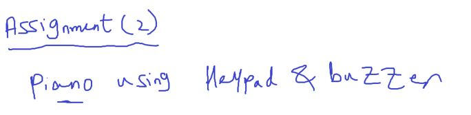

### Acuoustic Elements

الحاجات اللي بتعمل صوت

#### 1- Speaker


#### 2- Buzzer


- just one tone with different frequency
- A buzzer is ==a type of transducer== that converts electrical energy into sound waves. It consists of a coil of wire, a magnet, and a diaphragm or a plate. When an electrical signal is applied to the coil, it creates a magnetic field that attracts or repels the magnet, causing the diaphragm to vibrate and produce sound waves.

##### Buzzer Tone Test


```c
// Nokia 3310 ring
#include "STD_TYPES.h"
#include "DIO_interface.h"
#include "PORT_interface.h"
#include <util/delay.h>

void main()
{
	PORT_voidInit();
	while(1)
	{
		for (u8 i = 0 ; i < 200; i++)
		{
			DIO_u8SetPinValue(DIO_u8PORTC, DIO_u8PIN5, DIO_u8PIN_HIGH);
			_delay_us(100);
			DIO_u8SetPinValue(DIO_u8PORTC, DIO_u8PIN5, DIO_u8PIN_LOW);
			_delay_us(100);
		}
		for (u8 i = 0 ; i < 200; i++)
		{
			DIO_u8SetPinValue(DIO_u8PORTC, DIO_u8PIN5, DIO_u8PIN_HIGH);
			_delay_us(80);
			DIO_u8SetPinValue(DIO_u8PORTC, DIO_u8PIN5, DIO_u8PIN_LOW);
			_delay_us(80);
		}
		for (u8 i = 0 ; i < 200; i++)
		{
			DIO_u8SetPinValue(DIO_u8PORTC, DIO_u8PIN5, DIO_u8PIN_HIGH);
			_delay_us(50);
			DIO_u8SetPinValue(DIO_u8PORTC, DIO_u8PIN5, DIO_u8PIN_LOW);
			_delay_us(50);
		}
	}
}
```

#### Assignment 2



##### Additional Resources

- [Arduino Tone Lib](https://github.com/bhagman/Tone?tab=readme-ov-file#ugly-details)
- [Buzzer vs speaker](https://www.abcomponents.co.uk/buzzer-vs-speaker/)

- [voice recording module](https://www.ram-e-shop.com/shop/kit-isd1820-voice-isd1820-voice-recording-module-speaker-7159?search=speaker&order=name+asc)
- [Buzzer Basics - Technologies, Tones, and Drive Circuits](https://www.sameskydevices.com/blog/buzzer-basics-technologies-tones-and-driving-circuits)

---

### Timers

#### Clock

- Clock is the unit of time for processor
- Period time == clock cycle
- Clock for example is 8 MHz
- means 8 Million clock cycle in second
- 1/8 000 000 = 0.125 usec (زي الثانيه عندنا كده)


- processor instructions

  - fetch
  - decode
  - execute
  - check interrupt
  - right back
    
    

#### delay 1 sec

- to make a delay for 1 sec we need to translate this human unit time to no. of clock cycles
  

```c
_delay_ms(1000);
_delay_us(1000000);
// these functions help us in this conversion
```

This is a busy waiting way

##### Busy Waiting vs Timer Waiting


##### Timer(timer counter)

- Counter Mode: value indicates for counts for example no of switch presses

  - provide a pin to connect the input device for non periodic event counting

- Timer Mode: value indcates for time because it counts clock cycles and we know clock cycle time


- atmega32 define system clock the external not the internal

---

#### Some Definitions to understand how timer works

overflow inituation : timer has a for example 8 bits register so it counts until 255 and will overflow after that
at overflow event timer peripheral can generate interrupt called overflow interrupt

#### 1- Tick Time

it is the time unit of the timer

#### 2- Overflow Time


#### 3- Required Time

has 3 cases
1- Equal to overflow time

2- Greater than overflow time


- no of overflow count (C~ov~)
- C~ov~ can be integer
  

- C~ov~ can be decimal or float

  - Perload value
    
    

- so ISR

  - load preload value in timer register
    

#### Example1


#### Example2


3- Less than overflow time

