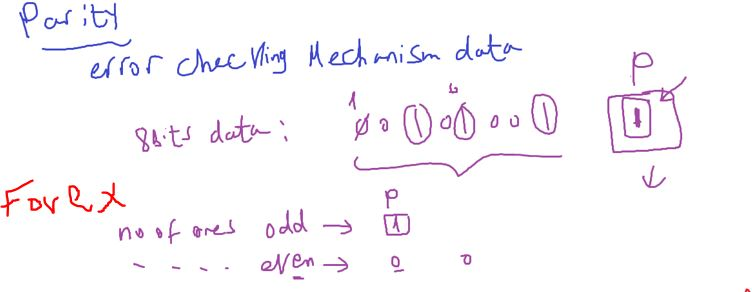

### UART

---

### Intro to communication in Embedded Systems

### Intuation

why we need communication?


- if u don't have enough pins
- a way of speacking to modules(has internal MCU) like(GLCD, CLCD, SENSORS, etc)
- Automotive Industry
  - many ECUs, each system has its own ECU
    
- Each MCU may speak more than communication language(protocol)

#### Comunication protocol specs

##### 1- Medium (Wired or Wireless)

- Wired vs Wireless
  
- Examples:
  - uart
- which i choose?
  - distance
  - speed
- Observation: even zoom has some delay because it wired network, but mobile phone call (4G) no delay sense

##### 2- Transmission Techique

- Serial
- Parallel
  

- DisAdvantages of Parallel
  

```
اي سلكه بيمر فيها كهربا بتولد مجال مغناطيسي حولها
```

- WIRE Signal Propagation delay causes clock skew (delay in transmission)

```
مفيش اي سكله زي اختها في الدنيا
```

- so parallel transmission techiques rarely used only in very small distance
  

##### 3- Receiver Transmitter Relationship

- Peer To Peer
- Master Slave
  
  

- master/slave types
  
- in multi master network (when they want to send in the same time , the master wins arbitration (خناقه) whos send and others become slave in this time)

##### 4- Synchronization

how we know when should receive/ send data

- 1- Synchronous (clock)
  
- 2- Asynchronous (Baud Rate)
  - has Baud generator unit
    

##### 5- Data Direction


- simplex(ثارع بحاره واحده)
  - TVs
  - Radios
- half duplex
  - walkie talkie
- full duplex
  - mobile phone(smart , ground mobile)

##### 6- ThroughPut


- used to compare between comm. protocols to know whos faster

###### Anyone(like comapany) can make its own protocol

protocol is a way of communication between devices

- standard protocol: Documented + defined globally

---

#### ==3 Things to know about any protocol==


---

## UART


- specs
  
- Frame Format
  
- Idle: means while No communction
- bit time = 1 / protocol freq
  - for 10 bit/sec, so bit time = 0.1 sec
- we need agreement on

  - data size
  - parity or no, if yes, High or Low
  - no. of stop bits

- ThroughPut  
  

- what is the parity?
  - simpile kind of error check mechanism for data
    
- what if 2 bits changed?
  - unfortinally will not able to know that data error happened
- how uart circuit calculate parity biy?
  

```c
// pesudo code
```

- Speed
  
- Baud Rate == Bit rate in ATmega32
  - because Baud is 1 bit
- Example to undersand Baud Rate
  

---

###### Uart Reality, and why arduino called it serial Not uart? and why is called USART in ATmega32? and why provides these all options?

- UART is NOT a standard Protocol
- is a highly flexiable communication device
- before uart communication protocol comes
- Each company implement its own sw communication called serial protocol
- until company thinks to make a hardware circuit protocol to serve these serial protocols to be a product and called it (UART)
  

---

### USART in AVR


- noise filtering includes false start bit detection
  
- Multi processor communication mode
  - master slave communication (more than 2 nodes) communicate using USART

### Registers

- UDR

```
it's a gate to 2 buffers (TXB,RXB), if you want to read/write data through this it
```


- 2 registers also share the same address

  - select one of them through a bit 7 (register select), setting this bit in the same writing operation
    

- UCK is clock bit if u select synchronous mode

##### 2 ways for Baud Rate calculation

- Table
  - 
- Equation

  - 

- No mode for slave because master whos genertare clock slave only reads it

---

#### UART functions

- 
- write register file
- then start reading data sheet and implement the functions

```c
// create a variable UCSRValue
// set required bits and
// assign it to UCSRA or UCSRB
```

```c
#include"STD_TYPES.h"
#include "BIT_MATH.h"
#include "UART_interface.h"
#include "UART_register.h"
#include "UART_config.h"
#include "UART_private.h"

void USART_voidInit()
{
	u8 Local_u8UCSRAValue = 0;	//We use this Method because u should put the total value at one time
	SET_BIT(Local_u8UCSRAValue,7);
	CLR_BIT(UCSRC,UCSRC_UPM1);
	CLR_BIT(UCSRC,UCSRC_UPM0);

	/*1 Stop bit*/
	CLR_BIT(Local_u8UCSRAValue,UCSRC_USBS);
	CLR_BIT(UCSRB,UCSRB_UCSZ2);

	/*8 data bits*/
	SET_BIT(Local_u8UCSRAValue,UCSRC_UCSZ0);
	SET_BIT(Local_u8UCSRAValue,UCSRC_UCSZ0);

	UCSRC = Local_u8UCSRAValue;

	/*Baud Rate 9600 bit/sec*/
	UBRRL = 51;

	/*Enable Transmitter and Receiver*/
	SET_BIT(UCSRB,UCSRB_TXEN);
	SET_BIT(UCSRB,UCSRB_RXEN);
}


void USART_voidSend(u8 Copy_u8Data)
{
	/*wait until transmit data buffer is empty*/
// UDRE is a flag raised when TXB i ready to loaded bu data and send
	while(GET_BIT(UCSRA,UCSRA_UDRE) == 0);
	UDR = Copy_u8Data;
}

u8 USART_voidReceive()
{
	while(GET_BIT(UCSRA,UCSRA_RXC) == 0);
	return UDR;
}

```

.
.
.
.
.
.
.
.
.

---

- USB To TTL Boards

  - PL2303 USB TTL Converter Module
  - USB to TTL UART Uploader Module CH340

- install FTDI Drivers
- https://nematicslab.com/how-to-install-ftdi-drivers/
