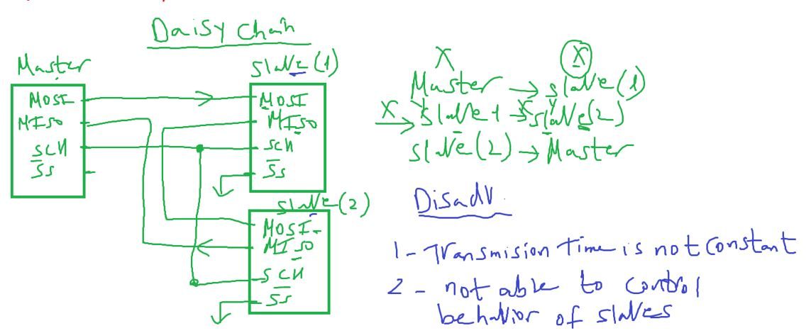

## Serial Peripheral Interface (SPI)

### SPI Hardware Interface

- MOSI: Master Out Slave Input
- MISO: Master Input Slave output
- SCK: Clock
- SS: Slave Select (Bar: Active Low)
  

Observation: SS pin for master unused pin
Master select slaves with DIO pins

Master Means whos is initiate the communication but can send/receive also

### SPI Specs

- wired
- serial (has only i wire to data tx, and other to rx data)
- synchronous(means slave doesn't need to know speed)
- master/slave relationship: Single master multi slave
- full duplex
- Tp = 100%
  - so it's high speed
  - but doesn't provide any kind of error check mechanism
    

#### So how spi works

Shift Register Concept

- Assume master sends now
  
- And Repeats this action 8 times
  

- observation: i send to slave and receive also from slave

---

#### SPI Concepts مصطلحات

##### clock polarity, Leading Edge

- Intuation, How we know that communication starts?

###### clock polarity

Idle state of clock pin(sck)

- at no communcication: state can be LOW/HIGH
- when communication starts : idle state(clock polarity) changes to low/high

###### Leading Edge

- 1st edge that lead communication to start called **Leading edge** (Rising / Falling)
- 2nd edge called **Tralling edge**.
- Observation: Leading Edge always opposite to Tralling Edge

  

##### Clock Phase

Action will happened when communication starts

- if clock phase

  - High: sending(SETUP) first
  - Low: receive (SAMPLE)first

- so We set the clock phase and clock polarity as same as the comunicated device setting
  

- so we have 4 modes
  
- use case
  <!--  -->
      - so SPI is a full duplux with half duplex functionality (because i am not intersed in the received data while sending)

##### #of slaves

##### SPI can send Broadcasting meassage?

yes but what about content of master data regitser if we have more than slave ?

- if we send broadcasting messages continuously
  - disconnect master miso pin
- if u send broadcast within communication
  - this can cause short circuit if slave1 send 0 and slave2 send 1
- here we can use additional hardware (TRI state buffer) on master DIo pin to select between slaves MISO and master MISO pin.
  while sending broadcast message

##### SPI can be simplex

yesm for sure

##### Daisy chain

it's NOT practical concept (NOT used)

- comes to make #slaves not limited to DIO pins but failed
  
- if master wants to send to slave2 , should send2 times
- if master wants to receive from slave2, receive 1 time
- if master wants to receives from slave1 , should receive 2 times

#### Daisy problems

- Transmission time is not constant
- Not able to program each slave to receive 1 or 2 or 3 as i can't control this in the communicated devices

---

### SPI Features

- master can be slave in sometime if needed and master another slave to be master

user: means the slave the will be master

---

#### SPI SWC
