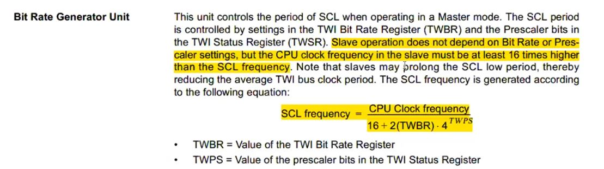

## I2C (SSI or TWI)

Two Wire Interface
Inter-Integrated Circuit
Synchronous Serial Interface

#### DIO Circuit Implementaion

##### Push-Pull connection


because push 1 or pulled 0

##### Open-drain(PMOS)/ open collector(PNP)


##### Open-drain uses

###### 1- provide connection with high power loads (because it will be isolated from high power load)


> floating MCU pin means now mcu will be disconnected to load connected to this pin.

###### 2- can implement communication bus with multiMaster

intuatively allows MCUs communicate with each other

can be done if only one MCU speaks and others listen

`what if 2 MCUs speaks in the same time this will NOT cause HW problems (because it's open-drain connection), but we should handle this arbitration(خناقه)`


oberservation: 0 here is the dominant state (البتايه `المسيطره`)

> **Dominant Bit / state**: value which is seen on the bus when at least one node writes it
> **Recessive Bit**: value which appears on the bus when when all nodes write it

---

#### I2C

##### HW Interface


##### I2C Specifications


- **Rule**: only master at a time (واحد بس يتكلم مش كله بيتكلم في نفس واحد )

##### I2C Frame Format

1- **start `condition`**:
يلا السلام عليكم هنبدا نتكلم مع خصراتكم

2- **stop `condition`**:


- Data:
  

##### How master select a specific slave to speak with him?

give it a **ID** and if the slave see his ID will know that this message for him

id == slave address
observation: max nodes of TWI protocol is 128 node

- **Note**: Always read signal always 1 (high) and write always is 0 in any communication protocols even in parallel like LCD


- In I2c After each 8 bits should someone(selected slave) respones with ACK

- Acknowledge (تمام)
  - 0: selected slave says ok
  - 1: no one response (default bus state)
- I2C packet is 9 bits
- First Packet in frame called Address Packet(contains slave address)

- Address Packet ( by master only)

###### Data

case1: write req
case2: read


- can be repeated and this can cause starvation to other slaves


- can't calculate maximum throughput because data can be repeated

##### MultiMaster Arbitration


> اللي بيفوز اللي بيعت صفر الاول مش اللي عنده اصفار اكتر

- slave has least address has the higher priority

##### How does losser naster2 know that he loss the arbitration and should retrive(ينسحب)


- SCL
- SDA

##### each master generate a its own clock so differ to each master:

bus clock will be combined between them and i2c circuit resposible to send data in low state


- master1 clock
- master2 clock
- bus clock

##### what if 2 masters send the same slave address?

arbitration will be on R/W bit
if master that send write will win
if the they both send write , arbitration will be on data scale
if they both send read , both wins and slave send data

and that's why always write signal will be 0, to be higher priority and read updated data.


### I2C Concepts

##### Repeated Start


##### Clock Stretching


- SCL
- new SCL after stretching

##### Bus Starvation


- Infinity clock stretching due to slave hardware failure(علق مثلا)

- CAN protocol provide solution to bus startvation

##### Reserved Addresses

- general call (Broadcasting)
- in this case we can not know who's does hear meassage
- because if any slave send ACK (bus state will be 0)
  

- extended addressing mode
- if you switching between 2 modes: #num of slaves = 1136

##### Speed


- select speed mode through reserved addresses

##### TWI vs I2C

- philips has Licence to I2C
- ATmel(Mcirochip now) make TWI
  

##### TWI Feature


- features can be include incorrect information
- 119 NOT 128 (execlude reserved address)

##### TWI Feature


- note:
  
- CPU Clock == System Frequency

###### How to set SCL Frequency

- we have 2 unknown variables (TWBR, TWPS), so assume 1 and get the other
- TWPS is 2 bits: so be can 0, 1, 2,3
  

  

##### TWINT Flag

- when flag raised (SCL line held to LOW)
- allows the application software to complte its `tasks` before allowing TWI transmission to continue
  - tasks like sending slave address, send new data, read data, etc
    

#### TWI Register Description Notes

-TWBR


###### TWBR_TWINT

- `the only flag that is NOT auto cleared by hardware even after ISR`
- clearing flag by write 1
  

###### TWCR_TWEA


###### TWCR_TWSTA


###### TWSR_TWS(7:3)

- لو عايز تتاكد من الاكشن اللي انت طلبته هو اللي حصل فعلا ولا لا
- each action has id from 5 bits
  

###### TWDR

- responible on any data sending on SDA also slave address that want to talk to him
  

###### TWAR_TWA(7:1)

- Node id
  

###### TWDR_Bit0


###### Interfacing the Application to the TWI in a Typical Transmission


#### Basic functionality TWI SWC

to run EEPROM App

##### enum Data Type

- Enumeration (or enum) is a user defined data type in C.
- It is mainly used to assign names to integral constants, the names make a program easy to read and maintain.


```c
#include <stdio.h>

typedef enum {
    err1, // 0
    err2 = 3, // 3
    err3, // 4
    err4, // 5
}Err_State_t;

int main()
{
  Err_State_t i2c_err;

  int x = err2;
  i2c_err = err4;

  printf("%d\n", i2c_err);
  printf("%d\n", x);
  // i2c_err.err1 // invalid syntax
}
```

- [enum in misra c rules](https://forum.misra.org.uk/archive/index.php?thread-1160.html)

##### status check

- when you check on the 5 bits status of opertion done on bus
- the value consider the 3 first 3 bits is zero so you have to mask them
- and don't shift left the 5 bits


- sendSlaveAddressWithWrite()
  

- To start any action in TWI you have to set(clear) the TWINT Flag(write 0)
- setting flag means clear
- flag raised automaticaly by hardware
- flag sets by master only to allow action on bus

  
