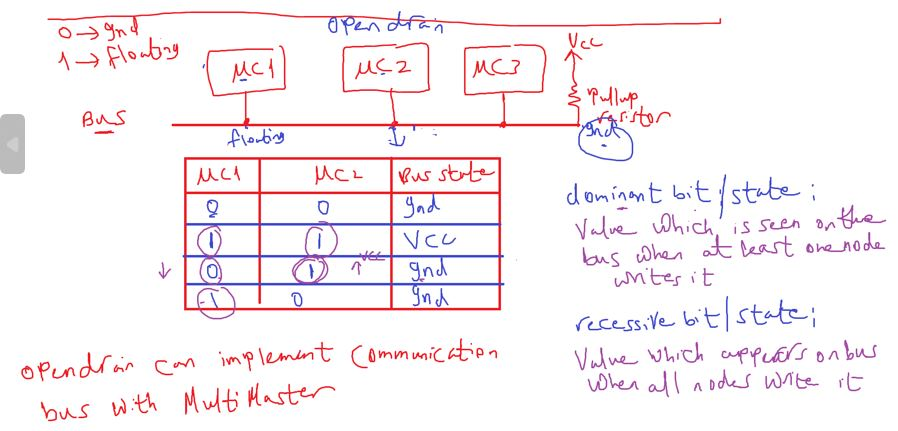

## I2C (SSI or TWI)

Two Wire Interface
Inter-Integrated Circuit
Synchronous Serial Interface

#### DIO Circuit Implementaion

##### Push-Pull connection

because push 1 or pulled 0

##### Open-drain(PMOS)/ open collector(PNP)

##### Open-drain uses

###### 1- provide connection with high power loads (because it will be isolated from high power load)

floating MCU pin means now mcu will be disconnected to load connected to this pin.

###### 2- can implement communication bus with multiMaster

intuatively allows MCUs communicate with each other

can be done if only one MCU speaks and others listen

`what if 2 MCUs speaks in the same time this will NOT cause HW problems (because it's open-drain connection), but we should this arbitration(خناقه)`

oberservation: 0 here is the dominant state (البتايه `المسيطره`)

> **Dominant Bit / state**: value which is seen on the bus when at least one node writes it
> **Recessive Bit**: value which appears on the bus when when all nodes write it

---

#### I2C

##### HW Interface

##### I2C Specifications

- **Rule**: only master at a time (واحد بس يتكلم مش كله بيتكلم في نفس واحد )

##### I2C Frame Format

1- **start `condition`**:
يلا السلام عليكم هنبدا نتكلم مع خصراتكم

2- **stop `condition`**:

- Data:
  

##### How master select a specific slave to speak with him?

give it a **ID** and if the slave see his ID will know that this message for him

id == slave address
observation: max nodes of TWI protocol is 128 node

- **Note**: Always read signal always 1 (high) and write always is 0 in any communication protocols even in parallel like LCD

- In I2c After each 8 bits should someone(selected slave) respones with ACK

- Acknowledge (تمام)
  - 0: selected slave says ok
  - 1: no one response (default bus state)
- I2C packet is 9 bits
- First Packet in frame called Address Packet(contains slave address)
