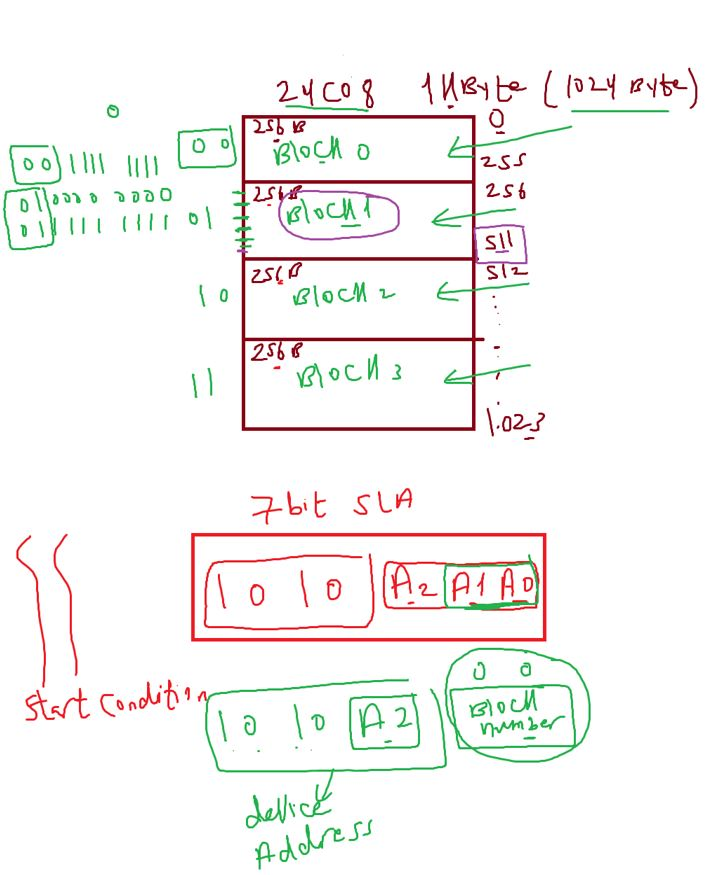
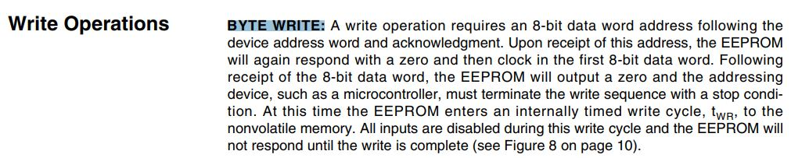

## EEPROM

- NVRAM (sw +hw)
- Brown Out Detector if detect the power reduces to 4.8
- execute ISR of this event and load data from RAM to extra Flash

ROM

- characteristics of FGM

- Processor can not access (write/erase) ROM beecause FGM require High Power but can read

###### ROM Types

- 
- permenat data: for example last temperature value before air conditioning shut down

1- 8kbit = 1 k B

- Features

  - Write Protect Pin for Hardware Data Protection
    (من الاخر لو حاولت تصلح اي حاجه في البورده وشيلت الذاكره كل حاجه تتمسح فلما تيجي تنشغلها ماتشتغلش قتضطر تروح الصبانه بردو)

- ADRRESSES
  
- 24C02
  
- 24C04
  
- 24C08
  

##### Memory organization

##### Device Addressing

##### write byte operation

##### write byte operation example

- call TWI master init func()
- eeprom write byte
  
- eeprom read byte
  
- conection
  
- SCL,SDA disconnected to DIO Peripheral they are open drain

- EEPROM Test APP
  
