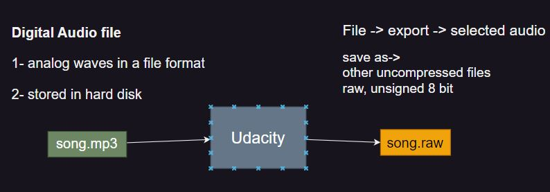

## Audio Generation

## How To generate a sound out of Microcontroller?

Intuation
what is the sound?
is a analog signal with a specific freq

human voice range is 300 to 3500 Hz
human audiable range is 20 to 20k Hz (best or maximum and minimum range)
differ from human to another acording to (age, health, etc)


1. Geting the sound
2. Storing the sound
3. Sound Playback


#### 1- Geting the sound

###### Tools:

1. [Audacity](https://www.audacityteam.org/download/)

- is free , open source tool
- record, editing, cut, (Mono, stereo)
- export data in required extension
- sampling rate control

> Nyquist channon, sampling rate at least 2 \* x(Input Signal Freq)

- So optimum sampling rate = 40k =2 \* 20k (max of audiable range) -> for a good sound quality

2. Audacity




1. **xxd.exe**

```bash
$ xxd.exe -i song.raw song.h
```

- so we will change sampling rate to be 8000Hz
- `size = 3 * 8000 = 24kB`
- but also quality reduced


---

##### Mono vs Stereo

- Mono: signal from 1 source of recording
- stereo: signal from 2 sources
- it's important to spilt the signal, and playback each one on a speaker

---

##### 2- Storing the sound in the ATmega32 Flash Memory

###### Harvard Archiecture


- Toolchains by default store data in SRAM (code writen in c)

```c
// stored in SRAM by default,
// in hardvard architecture with load, store assembly instructions
u8 data [10] = {0};
```

- Storing in flash is toolchain dependent
- our toolchain GCC for AVR (**WinAVR**) use ==PROGMEM== keyword
- or read, write assembly instructions

```c
#include <avr/pgmspace.h>
u8 data [10] PROGMEM= {0}; // stored in flash


u8 value = pgm_readbyte(data[0]);


```

#### 3- Sound Playback

we have to playback the sound with the same recording frequency

- samling rate: 8000Hz
- so we will out byte on 8-bit DAC each 125ms

```c
void ISR_OVF(void) // TIMER0
{
	static u16 counter = 0;
	u8 value  = pgm_read_byte(my_song_raw[counter]);

	DIO_u8SetPortValue(DIO_u8PORTB, value); // DAC
	counter ++;

	if(counter == 24000) // song_size
	{
        // if you want song repeat or disable interrupt
		counter = 0;
	}
}
```

#### 4- Audio Amplification

use LM386
