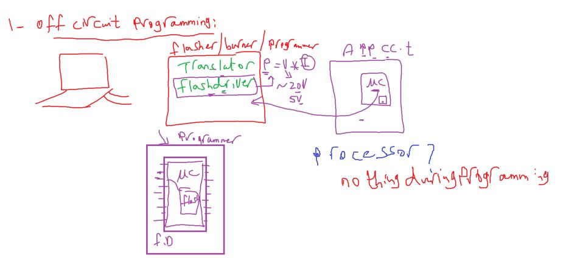
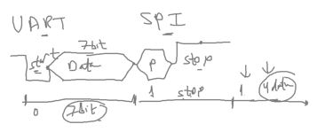
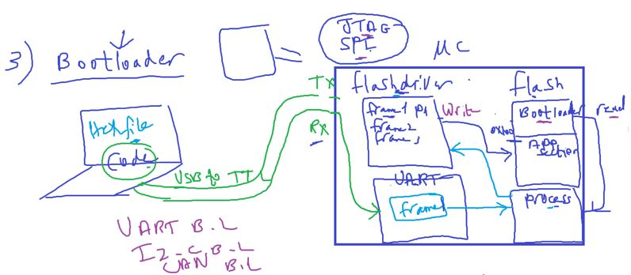
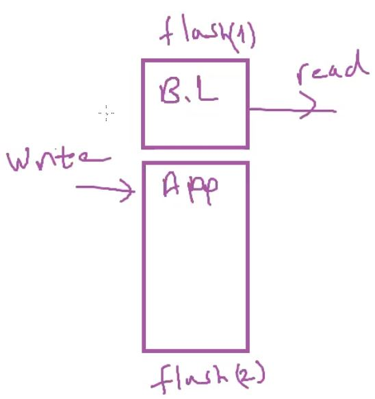
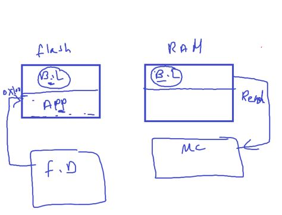

## Intro to Bootloader

The process of loading the code (.exe) from Development Target(PC) to target machine or device

#### Flashing Techniques

our target speaks with JTAG or SPI
our development device speaks USB or RS232

- Translator(Flasher or burner or programmer)
- Flash driver or interafce

  - Because flash (FGM) require high power for long time (require ~20v)
    

#### Types of Flashing Techniques

##### 1- OFF Circuit Programming

off mean off from MCU PCB

you have to take off MCU from PCB and stall it in the off circuit programming

what about maintance or bug fixing

##### 2- On Circuit Programming

Flash drivers developed to operate on 5v instead of 20v and this allows us to integrate it inside MCU

- example: USBAsp translate to SPI Protocol
  observation: if you use SPI burn the code first then connect SPI pins

- ALL MCU support JTAG as programming protocol

- translation between 2 protocols(UART, SPI)
  

##### but vehicle has more than 100 ECU if you i want to program each MCU will be headache(connection (more wires), different programmer)

#### 3- Bootloader

note: ATmega32 programmed by JTAG or SPI only
what if we want to use UART instead

Hex file format will send in UART Frame
then UART peripheral send it to Processor and processor execute Bootloader code the writes hex file to flash driver then flash driver writes on hex file in flash

- so we can have now UART B.L or CAN B.L (used in Automotive)
- Bootloader code itself loaded by MCU Programming Protocols for example (JTAG or SPI) in ATmega32

- But processor here read from flash as same as flash driver writes in it
- the fact that the size of flash is 32kB and can divide to more than 1 `IC`.
  

##### What about job of processor during programming in each technique?

- in Off and In Circuit Programming , processor does nothing
- in Bootloader, processor do everything
  - Receive data from UART
  - read bootloader from flash
  - write data to flash driver
  - order flash driver to writes code on flash
- and that's why these systems that has bootloader called (self-programmable flash)

###### Some MCUs allow processor to run from RAM

- make B.L section in flash loadable section (means copy it in RAM)
- and also these systems have 2 startup code one for Bootloader and one for Application
- to check if you want to burn code or burn a new bootloader

  
