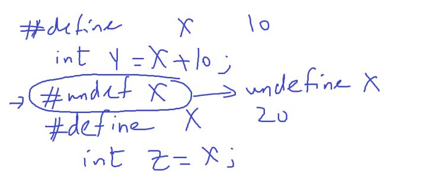

## Basics of C Language course

### Session 1

- What is Embedded System?
- Environment Setup
  - MingW Installation
  - Notepad++
- Hello World Program
- Data Types
- Naming Rules
- Operators
  - Binary Operators
  - Unary Operators

### x++ vs x = x + 1

- x++ -> inc in one instruction
- x = x + 1 -> Load Modify Store

---

### Session 2

- Lab1
- binary note or observation: (0111)~2~ = 8 , (1000)~2~ = 7

###### observation

Lab 4

shift left like multiplication / 2
shift right like division / 2

- x = 7 << 1; means x \* 2 = 14;
- x = 7 << 2; means x \* 4 = 28;

###### Assignment operators

=, +=, /=, >>= , ...

- take care: `x =+ 1`
- best practice: use x = x+1 to fail safe

###### bitwise operators

operate on binary scale

###### Relational Operators

```c
    int res = 5;
    res = x ==5; // true
    res = x !=5; // false
    res = x > 5; // false
    res = x < 5; // false
```

###### conditional statements

- if
- switch
- lab:

###### rules of statement in C

1. else if , else are optional
2. No code is available between if, else if, else
3. nested if is allowed( recommeded no more than 3 stages of nesting)
4. if u have combination of condition use brackets

###### switch statement

- syntax
- switch statment rules
  1. const must be unique
  2. const can't be a variable
  3. only be decimal value
  4. default is optional
  5. only one default is allowed
  6. default can be any where
  7. must be break to ends case or default

##### what is the advantage of switch?

use lookup table
so the answer always will be in 1 check
but if else if may be the true condition in the last else if condition so it took check or more.

###### observation

if the program requires more than 2 checks (equalilty check) use switch case

---

## Session 3

-Lab: set , clear, toggle operation on real numbers

- lab for loop
- for
- while
- do while
- break
- continue
- float comparsion
- lab: factorial iterative way

###### websites

leetcode
indiabix
codeforwin
hackerrank
codeforces
uva

---

### Session 4

- %c format specifier

```c
// bug: u have to put space before %c
    scanf(" %c", &operation);
```

- lab: simple calculator
- ternary operator
- goto
- function
  - local , global variables
- swap function : pass by value, pass by reference
- include header file

---

### Session 5

- set_bit()
- clear_bit()
- toggle_bit()
- array, pointers
- array: initialization, indexing
- array notes:
  1. length must be constant(variable length array -> c99)
- lab
- intro to sorting algorithms

---

### Session 6

- simple intro to searching algorithm
  - brute force linear search
  - binary search on array
- string - 1D array
- 2d array
- name of the array is alias for first element
- pointer
- calling by value , calling by reference(address)

##### how to return more than values with void functions?

- by pointers

###### asterisk (\*) with arrays

###### poniter to function declaration

- application of that is the `callback` or notification

```c
void func(void){
    //code
}
void (*ptrToFun) func(void) ; // like function declaration + (*ptrName)
void (*ptrToFun) func(void) = func; // func is alias to address of the first line of the func
void (*ptrToFun) func(void) = &func;
// only allowed to call it by this pointer
ptrToFunc(); // call it with another name
// Not allowed to change func through this pointer
```

### operations on pointers

- remember operation by steps
- int -> 4steps
- char -> 1step

- operations on pointers has very important applications
  - like as I/O memory.

1. increment

```cpp
int * ptr = 1000;
ptr++; // 1004 next 4 bytes (int)
```

2. decrement

```cpp
int * ptr = 1000;
ptr--; // 996
```

3. addition

```cpp
int * ptr = 1000;
ptr += 4; // 1016

char * ptr = 1000;
ptr += 4; // 1004
```

4. subtraction

```cpp
int * ptr = 1000;
ptr -= 4; // 986

```

5. subtraction pointer from pointer (NOt used)

```c
int * ptr1 = 2000;
int * ptr2 = 1000;
int x = ptr1 - ptr2; // 250
```

###### Problems of pointers

1. Dangling pointer

```c
int* func(void){
    int x = 20;
    return &x;
}

int main()
{
    // pointer that points to deacllocated memory location
    int *var = func(); // dangling pointer
}
// one way for solution to make static variable
```

2. wild pointer

```c
int *ptr;
printf("%d", *ptr); // runtime error
```

###### follow these rules to avoid these errors

```c
// to avoid these errors
//NULL: out of memory range(C88 standard)
int *ptr = NULL;
//NULL: 0 or (void*)0 (C11 standard)
int *ptr = 0;
int *ptr = (void*)0;
```

```c
void func(int *ptr)
{
    // man forget to initialize the pointer
    if(ptr == NULL)
    {
        return;
    }

}
```

---

### Session 7

- signed vs unsigned
- 1's complemenmt
- 2's complemenmt

```c
char x = 128;
// 128 -> 1000 0000
// and char is 8 bits
// then read it as signed so 1 for (-) sign, it will read -128
printf("%d", x); // -128
```

- modifiers: short , long

##### 3 rules for modifiers

1. arrangment is Not important

```c
unsigned short int == short unsigned int
```

2. Not all modifiers can bed used with all datatypes

```c
signed, unsigned -> only comes int , char
short -> int
long -> int, double
```

3. No opposite modifers with the same type

```c
short long int x ; // wrong
```

###### define our standard datatypes

- when you move to another target just edit interal implementation of these standard types
- but the main code doesn't change

```c
// for example
typedef unsigned short int u16;  // target 1
typedef unsigned int u16;   // target 2
```

- write the STD_TYPES.h file

### intro to build process

**file1.c**

1. preprocessor -> generates intermediate file file1.i
2. compiler -> generate assembly file.asm
3. assember(text replacement code) -> generate a object file file.o
4. linker -> generate from files an executable files file.exe or file.out

note: we assume that compiler generate `object file` not assembly (for short).
note: compiler generate `object file` and `symbol table`

##### symbol table is a way of communication between compiler and linker

```c
// file1.c
u8 x = 10;
u16 y = 20;
void func1(void);

int main()
{
    func1();
    func2();
    return 0;
}

void func1(void)
{

}
```

```c
// file2.c

void func2()
{
    // code
}
```

###### | file1.c symbol table |

| object  | state    |
| :-----: | :------- |
|    x    | provided |
|    y    | provided |
|  func1  | provided |
| `func2` | `needed` |

###### | file2.c symbol table |

| object  | state      |
| :-----: | :--------- |
| `func2` | `provided` |

##### linker

1. object verification
   1. Makesure that every `needed` object is `provided`
      otherwise
   ```c
   linker error: undefined reference to blabbl..
   needed but not provided
   ```
   2. makesure that every needed and provided is provided only once
      otherwise
   ```c
   linker error: multiple definition For this fucntion
   ```

##### extern keyword usecase

```c
// file1.c
u8 x = 10;
u16 y = 20;
void func1(void);

int main()
{
    func1();
    func2();
    return 0;
}

void func1(void)
{

}
```

```c
// file2.c
extern u8 x;
void func2()
{
    x = 20; // edit var in another file
}
```

###### | file1.c symbol table |

| object  | state    |
| :-----: | :------- |
|    x    | provided |
|    y    | provided |
|  func1  | provided |
| `func2` | `needed` |

###### | file2.c symbol table |

|   object   | state      |
| :--------: | :--------- |
| x (extern) | needded    |
|  `func2`   | `provided` |

- extern keyword -> to edit aglobal variable in another file

```c
extern dataType global_var;
```

##### static keyword with global variable usecase

```c
// file1.c
static u8 x = 10; // seen only in this file

int main()
{
    func2();
    return 0;
}
```

```c
// file2.c
u8 x;
void func2()
{
    x = 20;
}
```

###### observation

1. **static**
   1. local variable -> life: `program life` instead of function life
   2. global variable: scope: `file scope` instead of program scope

##### usecases

##### usecase1

```c
// file1.c
u8 x; //global
```

```c
// file2.c
u8 x;
```

```c
// file3.c
u8 x;
```

- output: linker error: multiple definition ...

##### usecase2

```c
// file1.c
static u8 x; //global
```

```c
// file2.c
static u8 x;
```

```c
// file3.c
extern u8 x;
```

- output: linker error: undefined reference ...

##### usecase3

```c
// file1.c
static u8 x; //global
```

```c
// file2.c
u8 x;
```

```c
// file3.c
extern u8 x;
```

- output: Done. generate exe
-

##### usecase4

```c
// file1.c
static u8 x; //global
```

```c
// file2.c
u8 x;
```

```c
// file3.c
extern u8 x = 30;
```

- output: Done. compiler error
- sol:

```c
extern u8 x ;
x = 30;
```

##### extern optional with the functions

```c
// file1
// extern void func2(void);
void func2(void);

// int x = 8;

int main()
{
    func2();
    return 0;
}
```

```c
// file2
#include<stdio.h>

// extern int x;
void func2(void)
{
    // x = 10;
    printf("func2 execu..\n");
    // printf("%d\n", x);
}
```

##### static functions also makes file scope

##### local vs global variables

|           | local             | global          | keyword  |
| --------- | ----------------- | --------------- | -------- |
| location  | RAM(stack)        | RAM(.data,.bss) | auto     |
| life time | function life     | program life    | auto     |
| scope     | function scope    | program scope   | auto     |
| --        | --                | --              | --       |
| location  | `RAM(.data,.bss)` | RAM(.data,.bss) | static   |
| life time | `program life`    | program life    | static   |
| scope     | function scope    | `file scope`    | static   |
| --        | --                | --              | --       |
| location  | No location       | No location     | extern   |
| life time | function life     | program life    | extern   |
| scope     | function scope    | program scope   | extern   |
| --        | --                | --              | --       |
| location  | CPU GPRs          | N/A             | register |
| life time | function life     |                 | register |
| scope     | function sope     |                 | register |

##### register

- unfortunatly if cpu unable to put the value in GPRs
- will NOT tell you

##### why and when to use register keyword

- commonly use
- it's life time is local
- small size (depend on processor register size for atmega 8 bits)

##### const with variables

- promnise not to change varaible value

```c
const u16 x = 10;
x = 20; // compiler error
```

##### const with pointers

```c
int *const ptr = &x; // can't change the ptr value
ptr = & y; // compiler error
*ptr = 10; // ok

const int * ptr = &x; // can't change value pointed to
x = 20; // compiler error

const int *const ptr = &x; // can't change value pointed to
ptr = & y; // compiler error
x = 20; // compiler error

```

---

### Session 8

- How to get the array size?
  - Answer: we can't know
  - what about sizeof()? is an operator get result in `compile time`.

```c
u16 arr[3] = {1,2,3};
u8 size = sizeof(arr) / sizeof(arr[0]);
```

### see of the sizeof fails to get array size

```c
// file1
#include<stdio.h>

void func(int *ptr);

int main()
{
    int arr[3] = {1,2,3};
    printf("%d from file1\n", sizeof(arr) / sizeof(arr[0])); // 3
    func(arr);
    return 0;
}
```

```c
// file2
#include<stdio.h>

void func(int *ptr)
{
    printf("%d from file2\n", sizeof(ptr) / sizeof(ptr[0])); // 2 or garbage
}
```

##### why we have void data type ?!

- void pointer -> void \* Name;
- sizeof(void) is compiler dependent (for ex: 1 byte)

```c
    printf("%d\n", sizeof(void)); // 1 is a compiler dependent
```

- u can cast it to int or char or float as u like.
- type casting means type change -> (required type)

```c
int * x = (int *) func(4);
// func returns a void pointer to first byte
```

- heap is a memory section in RAM, u have to `reserve before` use and `delete it after usag`e
- through system call memory manager

##### user defined data types

###### struct sytax

```c
// this is a declaration
struct employee
{
    // char name[10];
    u16 salary;
    u8 deductions;
    // u8 age;
};
// 2 ways for initialization
// way1
struct employee ali = {3000,200};

// way2
struct employee ali;
ali.salary = 3000;
ali.deductions = 200;
```

```c
// another way of declaration
struct name
{
    u16 x;
    u16 y;
} name1, name2;
```

- lab

###### struct has assignment operator

- must be same struct

```c
struct emloyee Ahmed, Amr;
Amr = Ahmed;
```

###### passing struct to a function

```c
int prog2(struct employee emp)
{
    return emp.salary + emp.bonus;
}
```

###### function return a struct

```c

struct employee scanEmployee(void)
{
    struct employee emp;
    // code
    return emp;
}
```

###### typedef struct

```c
// struct employee old name
typedef struct employee
{
    int salary ;
    int bonus ;
    int deductions ;
}employee;

// common better way
typedef struct
{
    int salary ;
    int bonus ;
    int deductions ;
}employee;

employee ahmed;
```

###### pointer to struct

- any thing has address you can make pointer to it.

```c
    employee emp1 = {100, 140, 90};
    employee* ptr= & emp1;

    printf("%d\n", ptr->salary);
```

###### array of struct

- lab

###### Bit Fields


- total size of this object `1 byte` not (3 bytes or 7 bits)
- if x is u16 instead of u8
- the size of object will be 2 bytes

- bit fields has important usecase
-

###### size of struct

packing and padding

padding == means let empty byte
packing == means don't let empty byte

```c
  typedef struct
    {
        u8 ID;
        u16 salary;
        u8 bonus;
    }employee;

    employee adel;
    printf("%d\n", sizeof(adel)); // 6 bytes
```

- talking to the compiler (compiler dependent)

```c
#pragma pack(1) // compiler directive
```

- the only keyword that starts with # and not preprocessor directive

#### union Name

- only one element of union is valid at a time

```c
union my_union
{
    u8 x;
    u8 y;
};
// size of union is 1 `Byte`
```

```c
    typedef union
    {
        u8 x;
        u16 y;
    }MyUnion;

    MyUnion obj1;

    printf("%d\n", sizeof(obj1)); // 2 byte

    obj1.x = 10;
    printf("%d\n", obj1.y); // 10
```

##### union usecase

```c
typedef union
{
    struct
    {
        u8 Bit1 : 1;
        u8 Bit2 : 1;
        u8 Bit3 : 1;
        u8 Bit4 : 1;
        u8 Bit5 : 1;
        u8 Bit6 : 1;
        u8 Bit7 : 1;
    } BitAccess;

    u8 ByteAccess;
}register_t;

register_t MemoryByte;

MemoryByte.ByteAccess = 20;
MemoryByte.BitAccess.Bit1 = 1;
```

---

### Session 9

##### building process

- preprocessor
- compiler
- assembler
- linker

```bash
// to get the intermidate file write
$ gcc -E -P filename.c -o out.i
```

##### preprocessor directives

1. \# define
2. \# undef
3. \# include
4. \# if
5. \# elif
6. \# else
7. \# endif
8. \# iddef
9. \# ifndef
10. \# warring
11. \# error

- \# include (copy and paste file)
- 2 ways to make include


- \# define


- what if

## 

- /# undef

## 

## 

## 

#### features explicitly for function like macro

##### 1- stringification

##### 2- concatination

#### conditional directives

```c
#if x==0
    printf("zero state\n");
#else
	printf("non zero state\n");
#endif
```

### usage of preprocessors

1. configurability
2. readability

### Session 10
