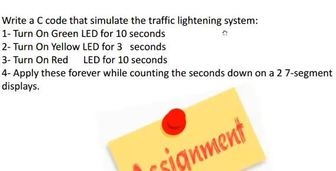
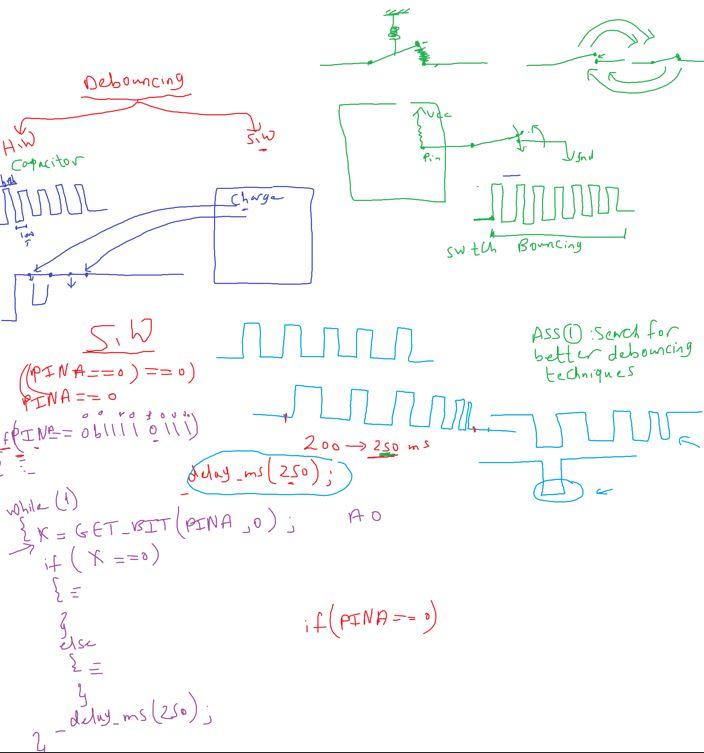

## Parrell(GPIO) Port for AVR

32 pin can be DIO (4 Ports)

- output (5V , 0V)
- input (5V , 0V)
  Each port has 3 I/O registers associated with it They are designated as

1. DDRx (Data Direction),
2. PORTx(output value),
3. PINx(input value).

##### inside GPIO circuit


PINx Read only Register

DDRx Register decide pin will be in or out
using tristate buffer

- digital buffer -> make a isolation between input and output circuits
- tristate buffer -> buffer control input to pass or not.

- I/O Synchronization feature
- when you write on PORTA register, this data goes to pin and PIN register and you can read it

###### Led Interfacing

##### Input Output Voltage Level

##### waiting (wait to see the action)

1. busy waiting
2. Timer waiting
3. OS delay

- Busy waiting
  loop 1 Million Empty Instruction
  So it's a high power consuming

```c
for(int i = 0; i < 100000; i++)
{
  // to tell compiler to ignore this loop
  asm("NOP);
}
```

what is time consuming for this for loop?
3 ways to know

- by assembly instructions: around 300 000 assembly so 300k cycle
- using ossiliscope
- using Timer

use a toolchain delay ready function

```c
#include<utils/delay.h>
_delay_ms(100);
_delay_us(100);
```

- Timer is anotehr prepherial it will responsible for counting and give you notification(by callback) that time finished

#### Why while(1) is important

- is a Infinity Loop == Super Loop

##### Do i need while(1) even if i don't need program to repeat?

- yes, to prevent the program counter(PC) to load garbage address
- by prevent the CPU to execute out of main function
  

```c
void main()
{
  DDRA = 0xff;
  PORTA = 0xff;
  while(1); // PC register stuck here
  // some toolchain put this while(1) in startup code
  // called exit routine
}
```

but when we in computer we have OS so it know when main return

```c
int main() {
  //
  return 0;
}
```

#### Seven Segment

LED as a component

1. low cost
2. low power
3. small size

LED Matrix for advertising

- Segment Displays

1. 7 Segment
2. 14 Segment
3. 16 Segment

7 segment types

- common anode
- common cathode

##### switches interfaces

switches types

1. Mechanical
2. electronic switches
   1. transistors
   2. optocouples
   3. relays
   4. Darlington pairs

#### mechanical switches

divide to many type categories

1. momentary switches
   like car window, door bell, keyboard
2. maintained switches
   self locking
   like room light, power supply switch

- pole means input
- throw means output

##### according to \# of contacts

1. SPST (`S`ingle `P`ole `S`ingle `T`hrow)
2. SPDT
3. DPST
4. DPDT
5. multipole multithrow

##### according to \# shape, trigger, action and application

- **Tactile Push Button**
  - it a momentary switch
  - may be 2 or 4 pins
- **Self Locking Push Button**
- **paddle switch**
  - can be found as maintained switch like that in air conditioning switches
  - can be found as momentray switch as that in grinders
- **Rocker Switch**
  - can be found in SPST package or SPDT package
  - has led inside it
  - used to switch power circuits
- **Toggle Switch**
  - can be found as SPST, SPDT, DPDT
  - commonly used in light control switches, joysticks
- **DIP Switch**
  - DIP (Dual Inline Package) (same size of ICs)
- **Limit switch**
  - previous switches are used to be actuated by human interaction, however this type is designed to be actuated by a moving object or a machine part
  - can be found in SPST, SPDT packages
  - commonly used in CNC machines, car doors, fridge doors
- **Rotary Switch**
  - can be considered a multi-contact switch
  - used when controlling circuit required to have many positions
  - like a ceiling fan, a multi channal radio
- **Reed Switch** (very important but not seen)
  - electromagnetic switch in which the circuit current flow is controlled by a magnetic action
  - can be found as SPST or SPDT, its poles and throws are made of ferromagnetics materials, which means they can be affected by magnetic fields, put together in a sealed envelope.
  - commonly used in laptops,car safety belt
- **Key switch**

##### switch connection to MCU

- high
- low
- floating
- pull up , pull down
- internal pull up resistor

- Ass 1
  
- Ass 2
  

##### If DDRx = 0x00; input, and PORTx = 0xff; why LED turned on?

because this activate the pullup resistor that turns on the connected led


##### problems of temporary switches

because these switches has internal spring

- switch bouncing
  Debouncing (solution of switch bouncing)

bouncing time = ~ (200 to 250 ms)

- simplest and worset solution

```c
_delay_ms(250); // waste much time
```

- [ ] search for better debouncing techiques



###### SevenSegment Multiplexing

let's say we have 2 or more 7-seg in our projects
so we need 16 pin pr more for only seven segments

###### POV(Persistence of vision) قصور الرؤية

most humans sees less than 25 fps(frame per second)
that means we can't note changes with rate less than 40 ms

- This concept widely used

  - media industry
  - advertising (while watching film in cinima but speed frames about burgur for example)

  - Home Lighting
    is a AC Signal with Freq 50Hz

real test

```c
while(1){
  // LED on
  _delay_ms(10);
  // LED off
  _delay_ms(10);
  // you may see this with mobile camera
}
```

best POV
50 to 70 hz

- (< 50 hz): flickering
- (> 70 hz): ghosting (شبح)

for example for we choose 50hz and we have 2 SSD

for example for we choose 50hz and we have 4 SSD


but we notice with icreasing the number of 7 segments
the light intensity with decrease (as we turn for 5ms and turn off for 15ms)

- Assignment 2 : 2 Multiplexed seven segments

1. display your birth day last 2 number
2. counting up and dowm
3. display number 50, and use sw1 to increment and sw2 to decrement
   if we pressed for big press seven segment in/decrement faster

---

resuable/ portable software
