## Introduction to RTOS

#### Timing Concepts

##### 1- Determinism

##### 2- Responsiveness

## 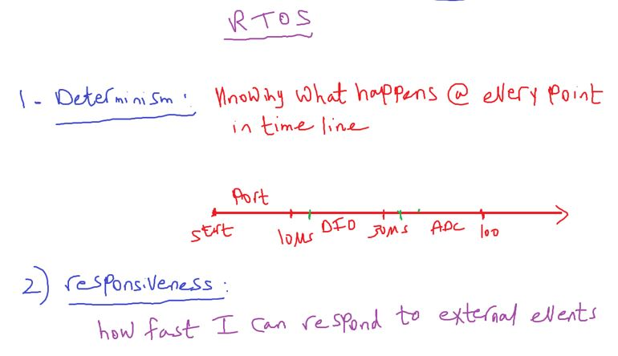

---

#### 1- Super Loop system

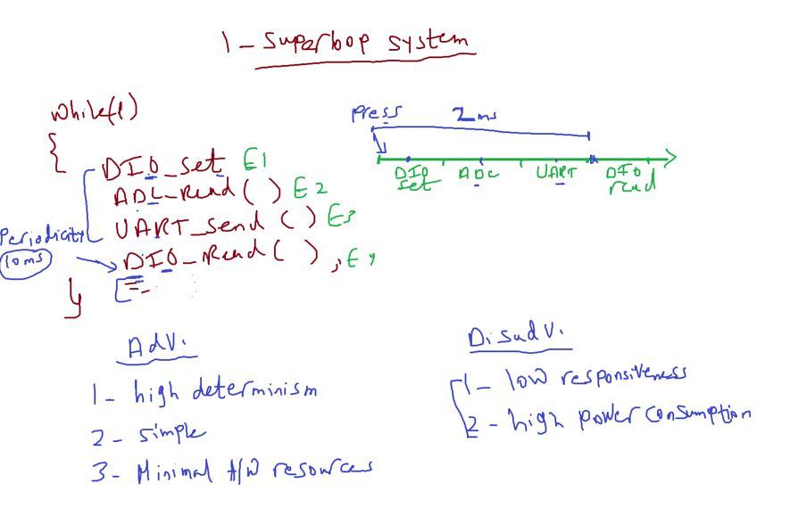

###### 1- Adv

- high determinism
- simple system in development
- minimal h/w resources
  - no additional peripheral like timer and interrupt to manage execution time and periodicity

###### 2- DisAdv

- low responsiveness , no priority
- high power consumption

  - each task or function and default periodicity
  - for example dio_read was switch take 10ms by default and may be assign periodicty to 200ms to get a new reading so it will be high power consumption to be 10ms

- note: empty while(1) take least power consumption (most peripherals is off)

---

#### 2- Foreground/background system

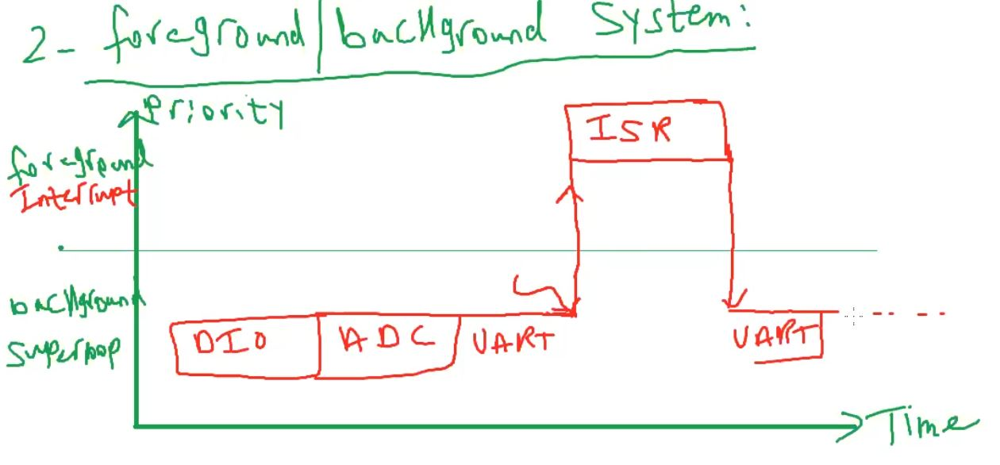
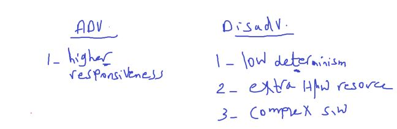

- Low determinsim (`because we don't know where event fires or ISR executes`)
- extra hw resource(Interrupt Controller )
- complex system (think in priority and nesting if exists, ISR_notification)

#### 3- RTOS

here's we try to be `high` responsive(by using ISR as notification only) and `high` deterministic(by knowing periodicity, execution time of each task)

#### RTOS Intiuation

- `RTOS` = Real Time + Operating System
- Operating System
  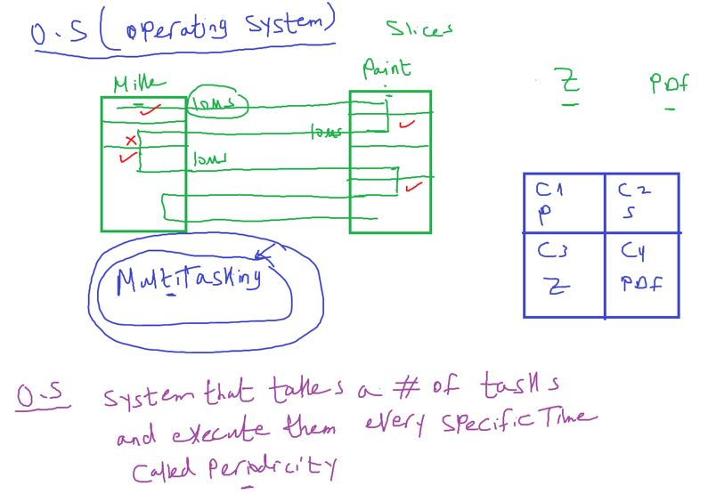

- Real Time
  Is windows Real time OS??
  ff : firefox browser
  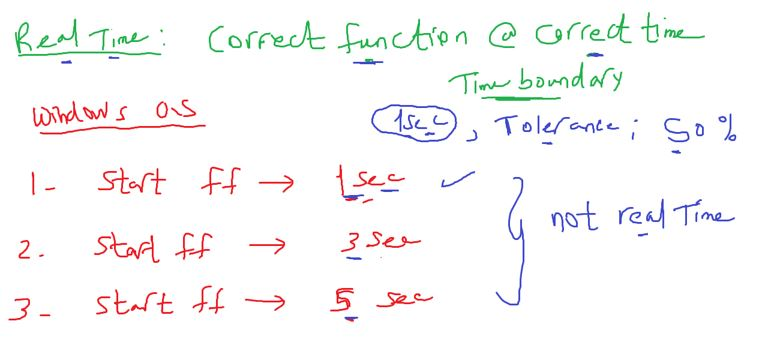

- tolerance should be less than 70% of execution time

#### Real Time Types

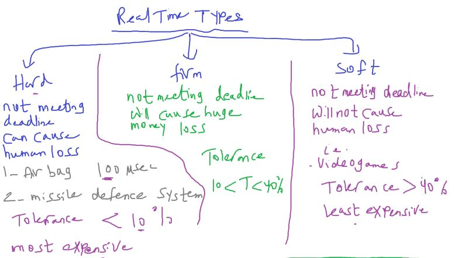

- Hard
  - Airbag
  - missile defense system
- Firm
  - BORSA
- Soft
  - Video games

##### RTOS vs Soft OS Layer Architecture

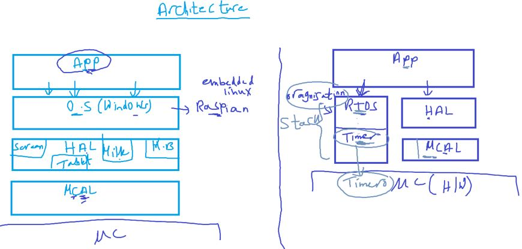

- RTOS divide to 2 parts (organization , Timer)
- stack is a vertical layer has horizontal layers
  - and always calls from top

### RTOS Compositions

#### Task

- What is the Task?

  1- Job that has to be done `independently` of the other tasks of the system

- Example on how the dependency of the task could be?
  Blink led when switch pressed
- super loop: blink led when sw pressed
- Foreground/background system: EXTI interrupt and blink led in ISR.
- RTOS:

- To know the task is independent or NOT ?

  - increase requirements if you need to change task, task was NOT independent
    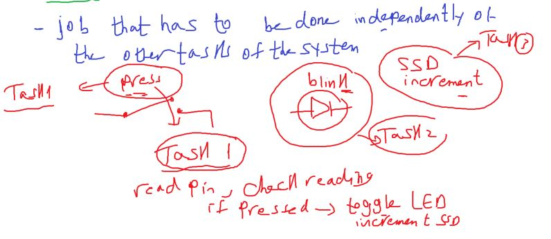

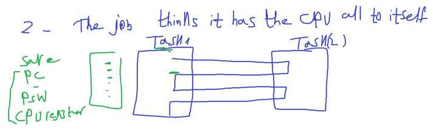

##### Task Physically

- C Function + Timing Characteristics + Context + Storage
- Timing Characteristics:
  - periodicity
  - execution time
  - deadline
  - max blockage time like time out
  - ...
- Context switching of RTOS
  - PC, PSW, SP, CPU register
- Context switching for functions
- Context switching for interrupts

- Storage: TCB (Task Control Block)
  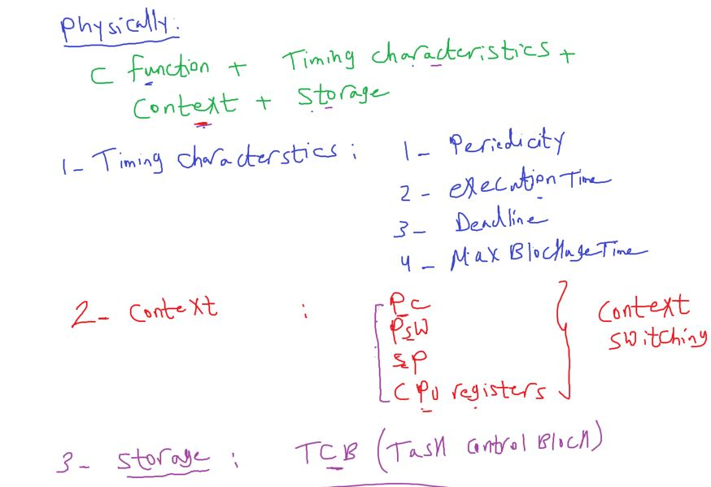

##### We will implememt some of RTOS Concepts

our implementation include
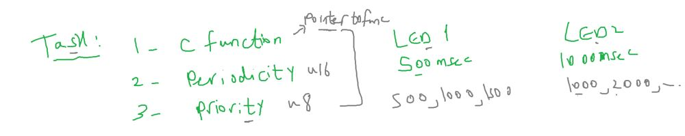

- Task data structure
  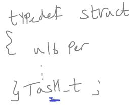

- our RTOS API
  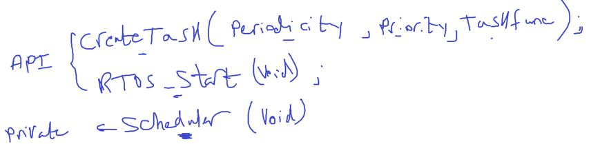

- our RTOS stack Architecture
  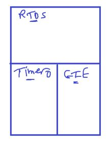

- example we have 3 tasks
- what is the suitable `system tick` ?
- or what time should i set to timer to generate Interrupt?
  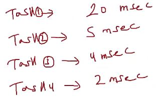
- choose the Greast Common factor(الرقم اللي بيقبل القسمه عليهم كلهم)
  - Ans: choose 1ms
- Another example
  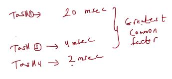
  - Ans: choose 2ms

#### How to set timer0 to generate interrupt each 1 second?

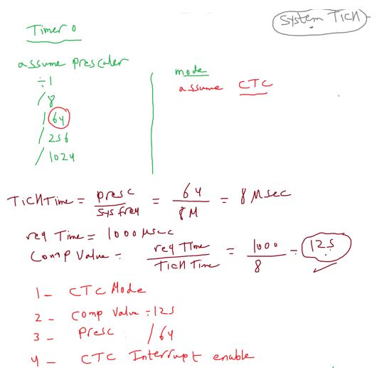

```c
static void voidScheduler(void); // it's a private function so don't write Component Name
```

- Rtos_Start

```c
void RTOS_voidStart(void) {
	TIMER0_u8SetCallBack(&voidScheduler);
	GIE_voidEnable();
	TIMER0_voidInit();
}
```

- we will create tasks statically not dynamically (in Run time)

  - better to be dynamically to save memory

- we will create a array of tasks globally to use it in schedular and create task functions

- how to initialize a array of struct

```c
task_t System_Tasks[TASK_NUM] = {{NULL}}
```

#### RTOS 1 Assignments

**1-** in this example task periodicity is 8ms, and in some case when static counter in Scheduler function runs in Timer0 ISR overflow this task runs after 13ms instead of 8ms

- for simplicity we assumed that counter overflow on 20
- but u8 overflow on 255, u16 overflow on 65536
- 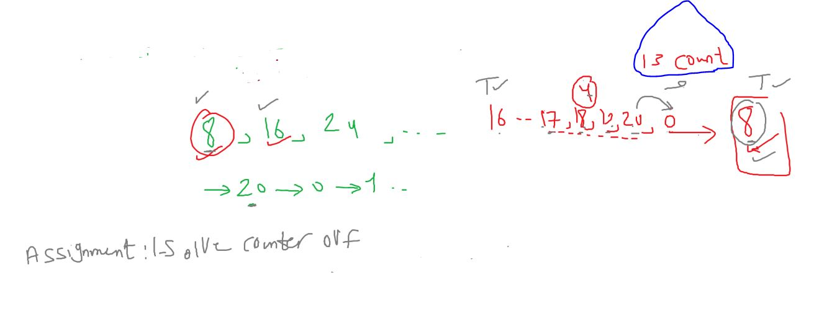

**2-**
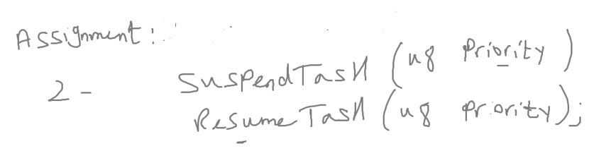

- suspend means task enters state which make schedular stop calling this task even if its periodicity comes
- assume task ID is it's priority
- to test these functions connect 2 btns one for suspend and one for resume
