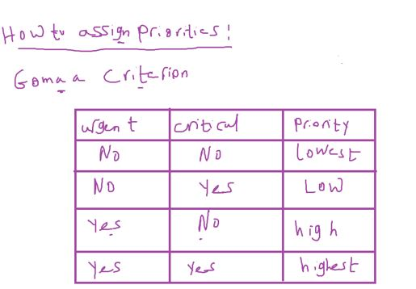

## Introduction to RTOS

#### Timing Concepts

##### 1- Determinism

##### 2- Responsiveness

## 

---

#### 1- Super Loop system


###### 1- Adv

- high determinism
- simple system in development
- minimal h/w resources
  - no additional peripheral like timer and interrupt to manage execution time and periodicity

###### 2- DisAdv

- low responsiveness , no priority
- high power consumption

  - each task or function and default periodicity
  - for example dio_read was switch take 10ms by default and may be assign periodicty to 200ms to get a new reading so it will be high power consumption to be 10ms

- note: empty while(1) take least power consumption (most peripherals is off)

---

#### 2- Foreground/background system


- Low determinsim (`because we don't know where event fires or ISR executes`)
- extra hw resource(Interrupt Controller )
- complex system (think in priority and nesting if exists, ISR_notification)

#### 3- RTOS

here's we try to be `high` responsive(by using ISR as notification only) and `high` deterministic(by knowing periodicity, execution time of each task)

#### RTOS Intiuation

- `RTOS` = Real Time + Operating System
- Operating System
  

- Real Time
  Is windows Real time OS??
  ff : firefox browser
  

- tolerance should be less than 70% of execution time

#### Real Time Types


- Hard
  - Airbag
  - missile defense system
- Firm
  - BORSA
- Soft
  - Video games

##### RTOS vs Soft OS Layer Architecture


- RTOS divide to 2 parts (organization , Timer)
- stack is a vertical layer has horizontal layers
  - and always calls from top

### RTOS Compositions

#### Task

- What is the Task?

  1- Job that has to be done `independently` of the other tasks of the system

- Example on how the dependency of the task could be?
  Blink led when switch pressed
- super loop: blink led when sw pressed
- Foreground/background system: EXTI interrupt and blink led in ISR.
- RTOS:

- To know the task is independent or NOT ?

  - increase requirements if you need to change task, task was NOT independent
    


##### Task Physically

- C Function + Timing Characteristics + Context + Storage
- Timing Characteristics:
  - periodicity
  - execution time
  - deadline
  - max blockage time like time out
  - ...
- Context switching of RTOS
  - PC, PSW, SP, CPU register
- Context switching for functions
- Context switching for interrupts

- Storage: TCB (Task Control Block)
  

##### We will implememt some of RTOS Concepts

our implementation include


- Task data structure
  

- our RTOS API
  

- our RTOS stack Architecture
  

- example we have 3 tasks
- what is the suitable `system tick` ?
- or what time should i set to timer to generate Interrupt?
  
- choose the Greast Common factor(الرقم اللي بيقبل القسمه عليهم كلهم)
  - Ans: choose 1ms
- Another example
  
  - Ans: choose 2ms

#### How to set timer0 to generate interrupt each 1 second?


```c
static void voidScheduler(void); // it's a private function so don't write Component Name
```

- Rtos_Start

```c
void RTOS_voidStart(void) {
	TIMER0_u8SetCallBack(&voidScheduler);
	GIE_voidEnable();
	TIMER0_voidInit();
}
```

- we will create tasks statically not dynamically (in Run time)

  - better to be dynamically to save memory

- we will create a array of tasks globally to use it in schedular and create task functions

- how to initialize a array of struct

```c
task_t System_Tasks[TASK_NUM] = {{NULL}}
```

#### RTOS 1 Assignments

**1-** in this example task periodicity is 8ms, and in some case when static counter in Scheduler function runs in Timer0 ISR overflow this task runs after 13ms instead of 8ms

- For simplicity we assumed that counter overflow on 20
- but u8 overflow on 255, u16 overflow on 65536


**2-**


- suspend means task enters state which make schedular stop calling this task even if its periodicity comes
- assume task ID is it's priority
- to test these functions connect 2 btns one for suspend and one for resume

- our RTOS doesn't suuport same tasks priority
- so if task created with a previous priority i shouldn't create it
- and handle it by return error status

```c
u8 RTOS_voidCreateTask(u8 Copy_u8Priority, u16 Copy_u16Periodicity, void(*Copy_pvTaskFunc)(void))
{
	u8 Local_u8ErrorState = OK;
  /*
  Note:
  Error: SystemTasks[Copy_u8Priority] != NULL
  you shouldn't check struct is null or not check on any struct elemet
  */
	if(SystemTasks[Copy_u8Priority].TaskFunc == NULL)
	{
		SystemTasks[Copy_u8Priority].Periodicity = Copy_u16Periodicity;
		SystemTasks[Copy_u8Priority].TaskFunc = Copy_pvTaskFunc;
		SystemTasks[Copy_u8Priority].state = TASK_STATE_RESUMED;
	}
	else
	{
    /*priority is reserved before, task NOT created*/
		Local_u8ErrorState = NOK;
	}
	return Local_u8ErrorState;
}
```

###### Task Deletion

- task deleted so we can create another task with the same priority

```C
void RTOS_voidDeleteTask(u8 Copy_u8Priority)
{
	SystemTasks[Copy_u8Priority].TaskFunc = NULL;
}
```

##### CPU Load

Example to illustrate CPU Load Intuation


- CPU at Tick no.3
- CPU at Tick no.5
- CPU at Tick no.10

###### What is the CPU Load


- CPU should be less than 70%

###### To enhance CPU Load


1-Decrease task execution time(by optimization code)
2-increase tick time
`3`- task splitting

why you started all tasks from the same tick
shift first tick for each task(First Delay)

###### CPU Load after adding First Delay for tasks


###### First delay concept implementation


```C
// add variable in task data structure for firstDelay information

static void voidScheduler(void)
{
	u8 Local_u8TaskCounter;
	/*Loop on all tasks to check their Periodicity*/
	for(Local_u8TaskCounter = 0; Local_u8TaskCounter < TASK_NUM; Local_u8TaskCounter++)
	{
		if(SystemTasks[Local_u8TaskCounter].state == TASK_STATE_RESUMED)
		{
			if(SystemTasks[Local_u8TaskCounter].FirstDelay == 0)
			{
				/*Invoke the task function*/
				if(SystemTasks[Local_u8TaskCounter].TaskFunc != NULL )
				{
					SystemTasks[Local_u8TaskCounter].TaskFunc();

          /* Assign first delay parameter to periodicity*/
				  SystemTasks[Local_u8TaskCounter].FirstDelay = SystemTasks[Local_u8TaskCounter].Periodicity - 1;
				}
			}
			else
			{
				/*Decrement the first delay*/
				SystemTasks[Local_u8TaskCounter].FirstDelay --;
			}
		}
	}
}
```

#### Task State Machine

- Dorment
- only one task running
- other here may be another task or Interrupt (used as notifiaction only in RTOS FOR example resumetask)


#### RTOS Composition

1. ==Task==
2. ==schedular==
3. ==Kernal==

##### schedular

1. Algorithms (Brain): (decide which task should executed now)
2. Dispatcher (Muscles): (executes algorithms decision)
   , execute a **task context switching**

- Any RTOS Scheduler should contain of brain and Muscles
- we implememt only schedular algorithm with Dispatcher
- Dispatcher may require to write assembly


##### scheduling Algorithms

- priority based
- FCFS(first Come first serve)
- shortest job first(SJF)
- shortest remaining time(SRT)
  هنا بسأل فاضلك وقت اد اي وتخلص
  لان ممكن التاسك اتقطعك قبل كده وفاضل فيها شويه صغيرين وتخلص
- round robin (time slicing)


- **`freeRTOS schedular` is priority based and when priorities equals runs round robin**

#### Kernal

OS means Kernal and Kernal means OS

composed of objects and services
objects like:
services like:


#### Kernal Types

ISR makes higher priority task ready

may be task higher priority becomes ready from running task before interrupted(preempted)
or through changeTaskPriority kernal service called in ISR

- **Observation**: The common and famous is preemtive to allow and apply priority concept


- observation: Preemptive kernal not only calls schedular at each periodicity
- calls it also at when task moved from suspended/waiting state to ready state
- at each task creation
- at every ISR
- when task moved to suspended state
- and so on

##### priority


- example on dynamic priority: airbag at vehicle starting doesn't have higher priority

###### Assigning priorities

- note: who is assign tasks priority?
  

- how to assign priorities?
  The easiest way
  

#### OS Types

1- General: Linux, windows, MAC, Android, IOS
2- For Embedded Systems: Embeded Linux(Raspian, YOCTO)
3- Real time : FreeRTOS, MCOSII(Open Source , Not Free), OSEK(Autosar req)

Free means free to use in product and sell

---

### Free RTOS

Created by: Real Time Engineers (`LTD`)

developed for a decade
because it for free and porting on many MCUs, also testing

##### FreeRTOS Features:

1. Preemptive or cooperwative
2. Notifiaction Mechanism
3. Intertask evevnt synchronisation
4. Task communication
5. Sw Timers
6. Event Group (group of events occurs)
7. Semaphore, Mutex

- protect a Hardware shared between tasks in the same time.
- for example protect LCD from more than task use it in the same time.

###### Very Important RTOS Reference

- µC/OS, The Real-Time Kernel
  - CH2:Real-Time Systems Concepts
- Mastering the FreeRTOS™ Real Time Kernel(Best Reference to learn FreeRTOS)
