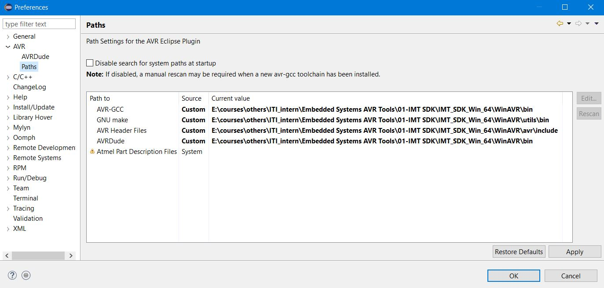
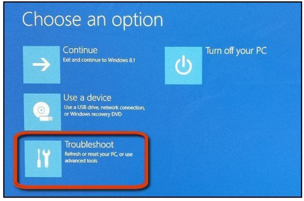
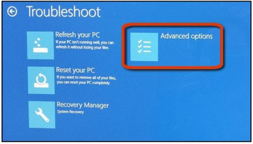
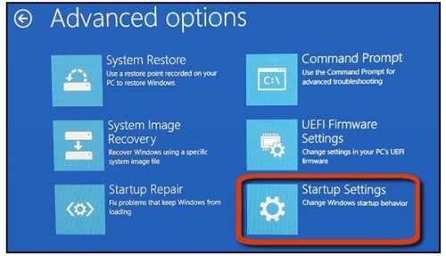
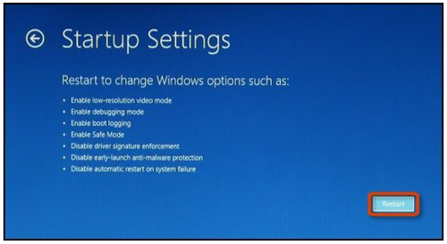
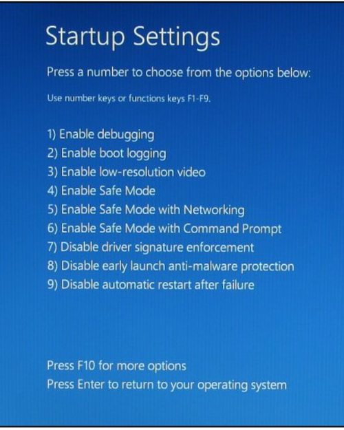
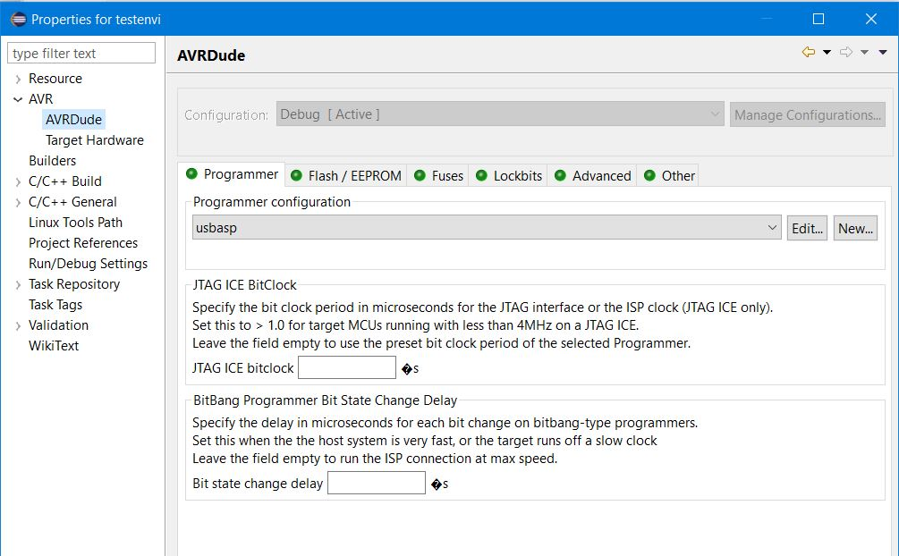
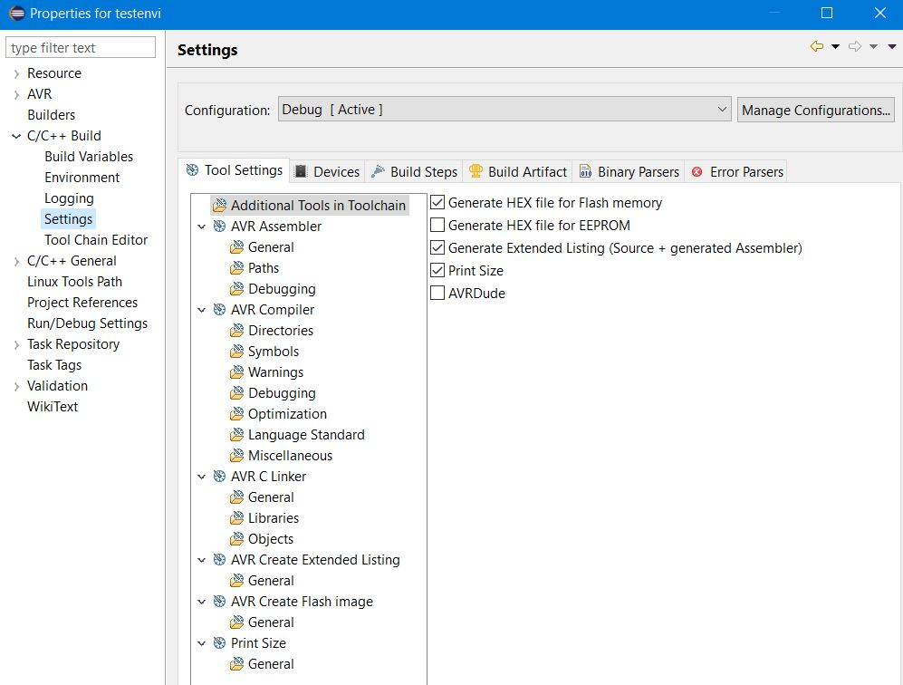
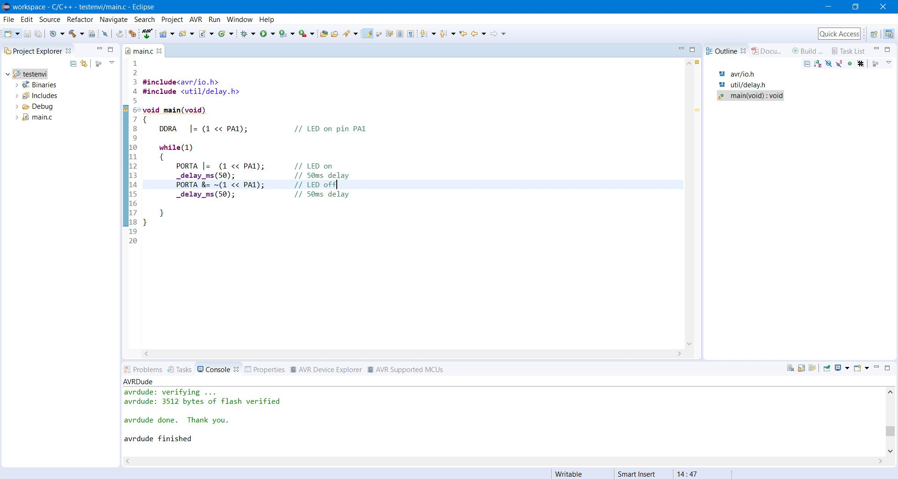
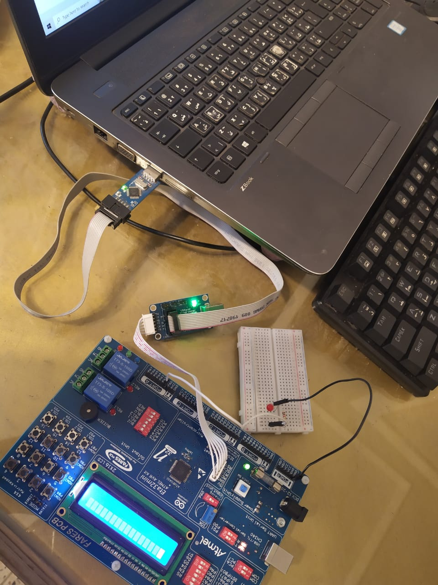

## Embedded System Course using atmega32 MCU

### Contents

- **C programming Language**
- **Embedded System Concepts**
- **MCU Interfacing AVR**
- **Automotive Bus Technology**
- **Tooling**
- **Testing**

### Environment Setup

==Eclipse for AVR on Windows 10==

##### IMT_SDK tools for avr, arm

- Don't choose workspace folder in C: Partition

###### Toolchain(WinAVR) Paths

- go to window -> preferences -> AVR -> paths

  - Set `AVR-GCC` ,`GNU make`, `AVR Header Files`, `AVRDude`.
  - `note`: if u change the workspace repeat this step again

  

##### usbasp programmer setup

`before installing driver`, we shall disable the "driver signature check" feature for windows 8 and 10 only to allow us to install driver correctly

###### one way to disable signature check [click](https://sps-support.honeywell.com/s/article/How-to-Disable-Driver-Signature-Enforcement-in-Windows-10)

1. `Hold down` the **shift key** while you click the "**Restart**" option in windows start menu
2. select the "Troubleshoot" title on the choose an option screen appears
   
3. select advanced options
   

4. click startup settings
   
5. click the "restart" button to restart your PC into the startup settings screen
   
6. Type "7" or F7 at the startup settings screen to activate the "Disable driver signaturte enforcement" option
   

- then check -> device manager -> other ports -> usbasp
- update the usbasp from usbasp driver manually (libusb_1.2.4.0)

###### Project Properties

- click right on project in eclipse IDE
- choose properties -> AVR -> AVRDude
  - then add usbasp and rename it usbasp or anything
    
- choose AVR -> Target Hardware -> Load from MCU

  - `MCU Type`: Atmega32 , `Freq`: 8000000

- From C/C++ Build -> setting

  - [x] generate hex file for flash memory
  - [x] print size

    

##### turn on LED

### Projects

- **Smart Home**

#### other resources

- [Standard C library for AVR-GCC](https://www.nongnu.org/avr-libc/user-manual/index.html)

- download AVR Toolchain [link](https://sourceforge.net/projects/winavr/)
- http://www.tuxgraphics.org/electronics/200904/avr-c-programming.shtml
  https://haarer.github.io/eclipse/avr/toolchain/2018/01/31/setting-up-eclipse-for-avr-development.html
